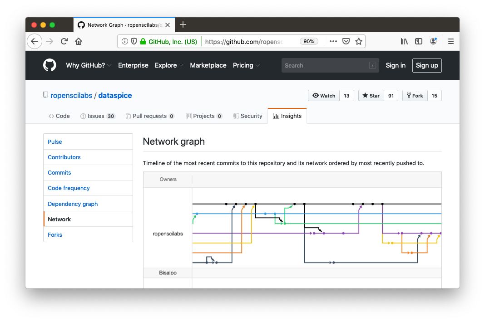
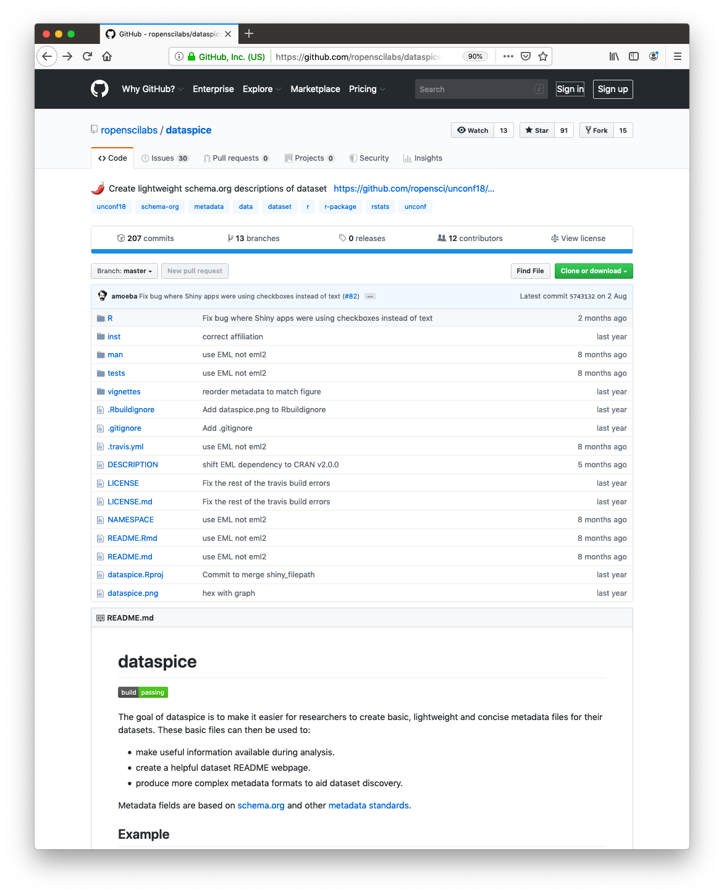
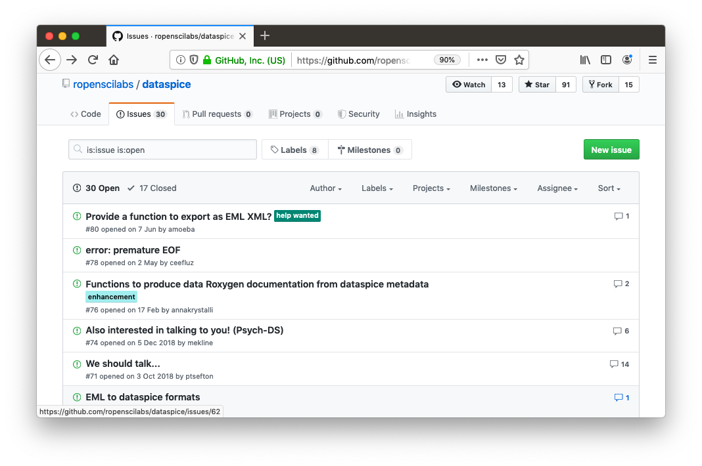
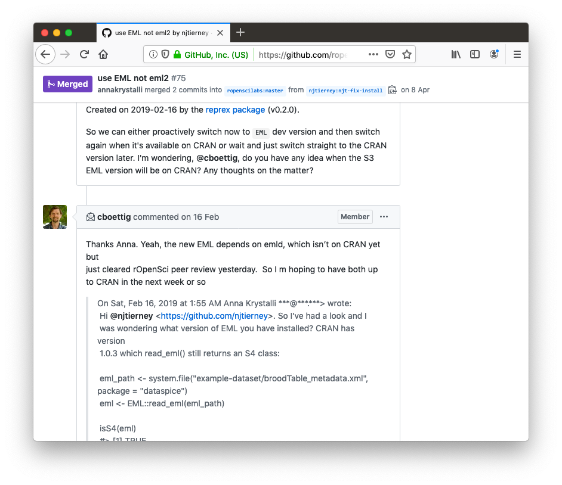
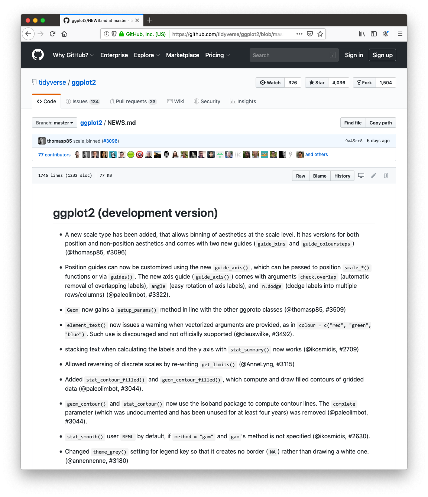
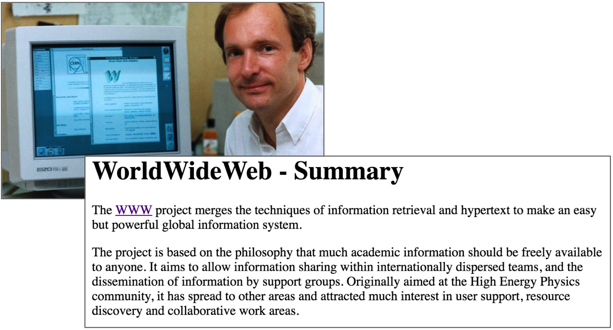
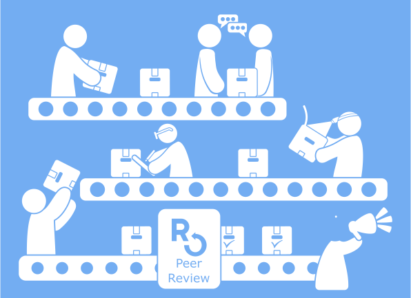
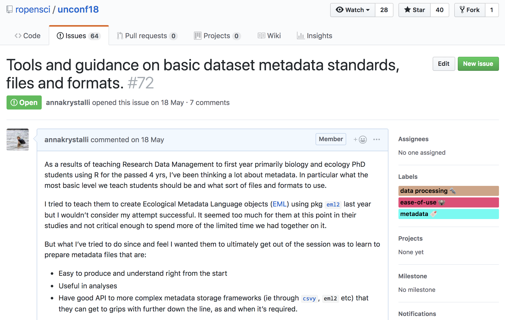
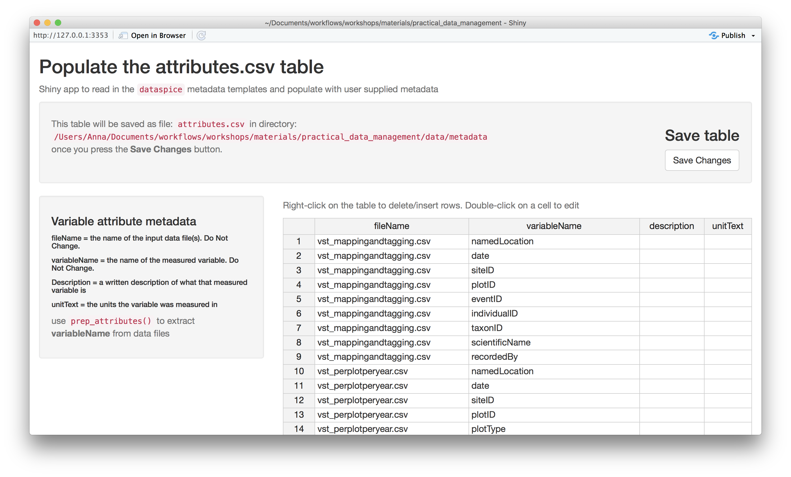
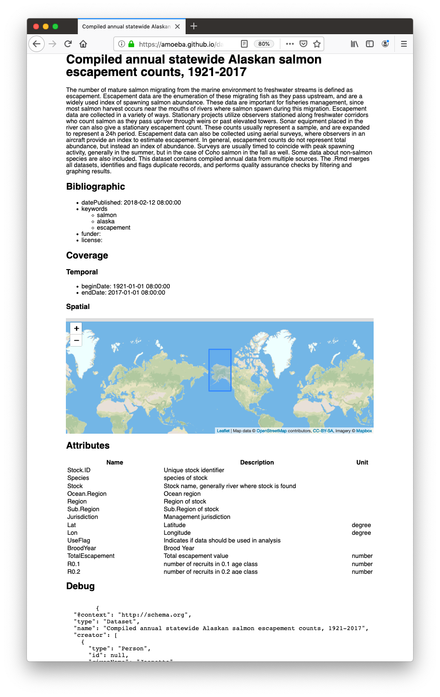

```{r xaringan-themer, include = FALSE}
library(xaringanthemer)

duo_accent(
  primary_color = "#442379", secondary_color = "#47F2F2",
  title_slide_text_color = "white", text_bold_color = "#F9FF58" ,
  text_color = "#D4FF5A", link_color = "#F308AD",
  inverse_text_color = "#F308AD", inverse_header_color = "#F308AD",
  header_font_google = google_font("Space Mono", "400"),
  text_font_google   = google_font("Montserrat", "300", "300i"),
  code_font_google   = google_font("Source Code Pro"),
  title_slide_background_image = "https://media2.giphy.com/media/eCwAEs05phtK/giphy.gif?cid=790b7611273eba8f4372b56af02d1757756e030aa0d55970&rid=giphy.gif", background_image = "../network-slide.jpg",
  background_size = "cover",  outfile = "assets/css/bes_hackathon-xaringan-themer.css"
)
```

# `r emo::ji("wave")` Hello

### me: **Dr Anna Krystalli**

- **Research Software Engineer**, _University of Sheffield_
    + twitter **@annakrystalli**
    + github **@annakrystalli**
    + email **a.krystalli[at]sheffield.ac.uk**
    
- **Editor [rOpenSci](http://onboarding.ropensci.org/)**

- **Co-organiser: [Sheffield R Users group](https://www.meetup.com/SheffieldR-Sheffield-R-Users-Group/)**


<br>

### slides: [**bit.ly/bes_hack19**](http://bit.ly/bes_hack19)

---
class: middle, center
# I love hackathons!

---
class: middle, center
# I love hackathons!

# `r emo::ji("thinking")`


---
class: middle, center
# I love hackathons!

# `r emo::ji("bulb")`


---
background-image: url("https://media2.giphy.com/media/eCwAEs05phtK/giphy.gif?cid=790b7611273eba8f4372b56af02d1757756e030aa0d55970&rid=giphy.gif")
class: middle, center, inverse

# Why I love hackathons!  `r emo::ji("heart")`

---
background-image: url("https://media2.giphy.com/media/eCwAEs05phtK/giphy.gif?cid=790b7611273eba8f4372b56af02d1757756e030aa0d55970&rid=giphy.gif")
class: middle, center, inverse
# Why I love opensource! `r emo::ji("heart")`

---
background-image: url("assets/repository-fork.png")
class: inverse

--
.pull-left[
<br>
<br>
<br>
<br>
<br>
<br>

## **Woah, It's evolution...**
]

.pull-right[
<br>
<br>
<br>
<br>
<br>
<br>


]

---
> #### [**_Macroecological and macroevolutionary patterns emerge in the universe of GNU/Linux operating systems_**](https://doi.org/10.1111/ecog.03424)
> doi:10.1111/ecog.03424
 
.pull-left[


]

--

.pull-right[


]

---
> #### [**_Macroecological and macroevolutionary patterns emerge in the universe of GNU/Linux operating systems_**](https://doi.org/10.1111/ecog.03424)
> doi:10.1111/ecog.03424

.center[

]

---
class: inverse, middle, center

# Storytime: 
## the story of firefox

---
background-image: url("assets/moz_00_early_internet.png")

---
background-image: url("assets/moz_01_netscape.png")

---
background-image: url("assets/moz_02_radiation.png")
---
background-image: url("assets/moz_03_community.png")
---
background-image: url("assets/moz_04_firefox.png")
---
background-image: url("assets/moz_05_firefox.png")
---
background-image: url("assets/moz_06_break_monopoly.png")

---
class: inverse, middle, center

# Storytime: 
## the story of gapminder
---
background-image: url("assets/hanslibdata.png")
background-size: cover
class: inverse

# **gapminder.org: 2006** 

### .bg-white-transp[[liberating stories from data](https://youtu.be/hVimVzgtD6w?t=15m3s)]

---
background-image: url("https://media2.giphy.com/media/eCwAEs05phtK/giphy.gif?cid=790b7611273eba8f4372b56af02d1757756e030aa0d55970&rid=giphy.gif")
class: inverse

# **Gapminder today**

```{r, fig.show = "animate", message=FALSE, warning=FALSE}
library(ggplot2)

p <- ggplot(gapminder::gapminder, aes(gdpPercap, lifeExp, size = pop, color = continent, frame = year)) +
  geom_point() + scale_x_log10() + theme_bw()
```

```{r, message=FALSE, warning=FALSE, fig.height=4}
plotly::ggplotly(p)
```
---
## Collaboration == 

.pull-left[


- ### **Organisation**

]

.pull-right[

]
---

## Collaboration == 

.pull-left[


- ### **Organisation**

- ### **Communication**
 
]

.pull-right[



]
---
## Collaboration == 

.pull-left[


- ### **Organisation**

- ### **Communication**

- ### **Vulnerability**

]

.pull-right[

]
---
## Collaboration == 

.pull-left[


- ### **Organisation**

- ### **Communication**

- ### **Vulnerability**

- ### **Respect & attribution**
]

.pull-right[

]
---
background-image: url("https://media2.giphy.com/media/eCwAEs05phtK/giphy.gif?cid=790b7611273eba8f4372b56af02d1757756e030aa0d55970&rid=giphy.gif")
class: middle, center, inverse
# Why I love open science! `r emo::ji("heart")`

---
background-image: url("https://upload.wikimedia.org/wikipedia/commons/5/5d/The_history_of_the_Royal_Society_of_London%2C_for_the_improving_of_natural_knowledge_Fleuron_T131281-9.png")
class: inverse


# Open science is old

.pull-right[]

---
class: middle, center

## A lot has changed since the 1600s

---
background-image: url("assets/problem-infographic.jpg")

---
background-image: url("https://media2.giphy.com/media/CTX0ivSQbI78A/giphy.gif?cid=790b76111ee5344292dfa478efa904ce0232b2b62f73586d&rid=giphy.gif")

---
## **The internet was built for open science**


---
## **The internet was built for open science**


---
background-image: url("https://media3.giphy.com/media/j5KUmGQGlQRlU2VQWY/giphy.gif?cid=790b76114ebae412d67568afd4e09f7cd41b14ccef624cdf&rid=giphy.gif")

### **Ooops, that's embarassing!**

.pull-left[

<br>
<br>
<br>


]

.pull-right[

]

---
background-image: url("https://media1.giphy.com/media/BWTZOE4vnj3gs/giphy.gif?cid=790b761105c665c045cf431bde7e8419e02f3f6314ac0d32&rid=giphy.gif")
class: inverse

### **Open Science 2.0 to the rescue**


---
background-image: url("assets/ro_community_fade.jpg")
background-size: cover
class: split-two, inverse


# rOpenSci

.pull-left[


<br>
<br>
<br>




.center[


]
]

.pull-right[

<br>
<br>

> ### Transforming science through open data and software

]

---
background-image: url("https://media2.giphy.com/media/eCwAEs05phtK/giphy.gif?cid=790b7611273eba8f4372b56af02d1757756e030aa0d55970&rid=giphy.gif")
class: middle, center, inverse
# Why I love hackathons! `r emo::ji("heart")`


---

# Space for:

- ## **taking time out to work on a fresh challenge**
- ## **learning from and getting more done by banding together**


---
background-image: url("assets/nbn_composite.png")
class: inverse

## **NBN** Sheffield R Users Group hack


---
class: inverse, middle, center

# Storytime: 
## the story of dataspice


---
# [rOpenSci Unconf 18](http://unconf18.ropensci.org/)
#### May 21 - 22, 2018. Seattle


---    

---
# rOpenSci Unconf mission


> bringing together scientists, developers, and open data enthusiasts from academia, industry, government, and non-profits to get together for a few days and hack on various projects.

<br>

#### Ideas for projects submitted through GitHub [**issues**](https://github.com/ropensci/unconf18/issues) in the [**runconf18** repo](https://github.com/ropensci/unconf18)

---
## issue [#72](https://github.com/ropensci/unconf18/issues/72) `r emo::ji("raising_hand_woman")`




---


# Metadata team!
------------

Luckily, a **whole bunch of other awesome folks** were also thinking about these topics and interested in working on them! `r emo::ji("star_struck")`

(in alphabetical order):

-   [Carl Boettiger](https://github.com/cboettig)
-   [Scott Chamberlain](https://github.com/sckott)
-   [Auriel Fournier](https://github.com/aurielfournier): #[41](https://github.com/ropensci/unconf18/issues/41)
-   [Kelly Hondula](https://github.com/khondula)
-   [Anna Krystalli](https://github.com/annakrystalli)
-   [Bryce Mecum](https://github.com/amoeba)
-   [Maëlle Salmon](https://github.com/maelle)
-   [Kate Webbink](https://github.com/magpiedin): #[52](https://github.com/ropensci/unconf18/issues/52)
-   [Kara Woo](https://github.com/karawoo): #[68](https://github.com/ropensci/unconf18/issues/68)


---


### rOpenSciLabs R `r emo::ji("package")` 

> # [**`dataspice`**](https://github.com/ropenscilabs/dataspice) 
> makes it easier for researchers to **create basic, lightweight and concise metadata files for their datasets**. 


--

### Features

- Metadata fields are **based on [schema.org](http://schema.org/Dataset)**

--
- Metadata **collected in `csv` files**


--

- Helper functions and shinyapps to **extract and edit metadata files**.

--

- Ability to produce **structured json-ld metadata file** & dataset **README webpage**.
 
    
<br> 

---


## `dataspice` workflow


---
## `edit_attributes()`



---
.pull-left[
## `build_site()`
]
.pull-right[

]
---
background-image: url("assets/Hacktoberfest-19-bgr.png")
class: inverse, center

### **[hacktoberfest.digitalocean.com](https://hacktoberfest.digitalocean.com/)**


---
background-image: url("https://media2.giphy.com/media/eCwAEs05phtK/giphy.gif?cid=790b7611273eba8f4372b56af02d1757756e030aa0d55970&rid=giphy.gif")
class: inverse, center, middle

# Happy Hacking

## slides: [**bit.ly/bes_hack19**](http://bit.ly/bes_hack19)


---
# Acknowledgements


- slides made using `r emo::ji("package")` [xaringan](https://github.com/yihui/xaringan) & [xaringanthemer](https://github.com/gadenbuie/xaringanthemer)

- backround-slide: Image by <a href="https://pixabay.com/users/TheDigitalArtist-202249/?utm_source=link-attribution&amp;utm_medium=referral&amp;utm_campaign=image&amp;utm_content=3357642">Pete Linforth</a> from <a href="https://pixabay.com/?utm_source=link-attribution&amp;utm_medium=referral&amp;utm_campaign=image&amp;utm_content=3357642">Pixabay</a>

- slide background no. 12-18:  Mozilla and Working Open <https://www.youtube.com/watch?v=quKdaqlR_9w>
- slide background no. 20:  The best stats you've ever seen | Hans Rosling <https://youtu.be/hVimVzgtD6w?t=15m3s>
- slide background no. 29: Jill Cirasella. Graphics: Les Larue. License: Creative Commons: Attribution, Non-Commercial
