```{r setup, include=FALSE}
options(htmltools.dir.version = FALSE)
```


# `r emo::ji("wave")` Hello

### me: **Dr Anna Krystalli**

- **Research Software Engineer**, _University of Sheffield_
    + twitter **@annakrystalli**
    + github **@annakrystalli**
    + email **a.krystalli[at]sheffield.ac.uk**
    
- **Editor [rOpenSci](http://onboarding.ropensci.org/)**

- **Software Sustainability Institute Fellow 2019**

<br>

### slides: **bit.ly/bes_rse**


---
class: bg-main2 split-70 hide-slide-number

.column.slide-in-left[
.sliderbox.vmiddle.shade_main.center[
# .font_large[Motivation]]]
.column[
]

---
class: middle, center

# The paper is the advertisement

> “an article about computational result is advertising, not scholarship. The **actual scholarship is the full software environment, code and data, that produced the result.**”

*John Claerbout paraphrased in [Buckheit and Donoho (1995)](https://statweb.stanford.edu/~wavelab/Wavelab_850/wavelab.pdf)*

--

<br>
<br>

### Yet, our main focus is on the advertisement.

---
class: bg-main3

# Research increasingly computational

--

.font_large[
- 92% of academics use research software

- 69% say their research won't be practical without it

- 56% develop their own software (21% with no formal training)
]

<br>

_S.J. Hettrick et al, UK Research Software Survey 2014, [DOI:10.5281/zenodo.1183562](https://zenodo.org/record/1183562)._


---
class: bg-main1, middle, center

# Consequences

---
class: center

# Reproducibility crisis


.img-fill[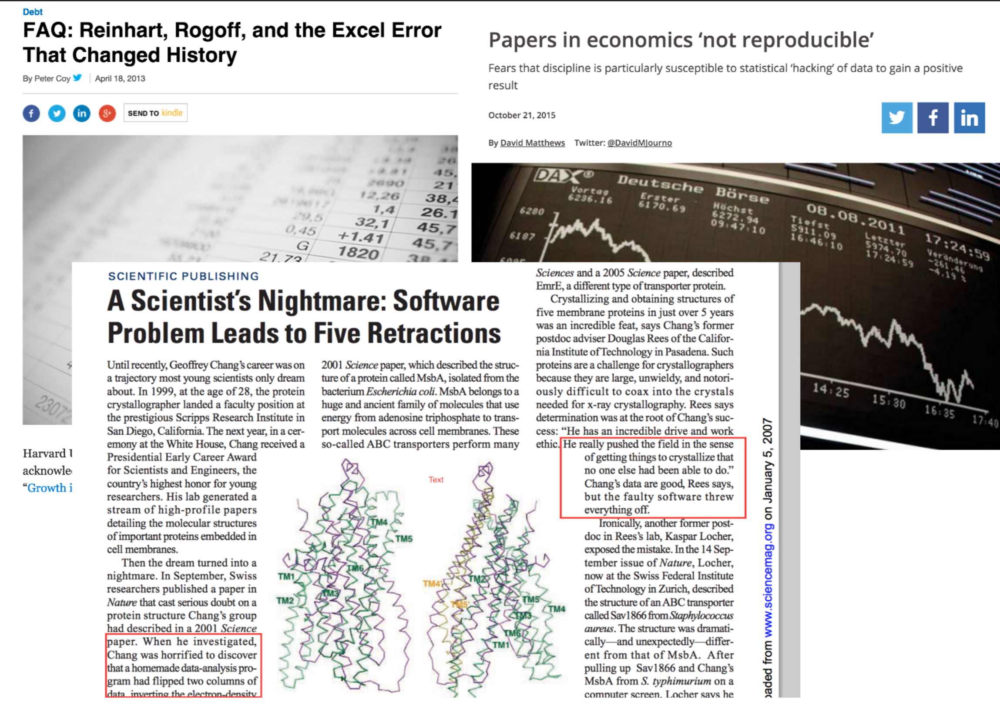]

---
class: center
background-image: url("https://media0.giphy.com/media/TS0HT0Km06WmQ/giphy.gif?cid=790b76115d1e0a44616f45567759dc42&rid=giphy.gif")
background-size: cover

# .bg-white[ Reinventing the wheel]

.bg-white[In often complex and inefficient ways!]


---
background-image: url("https://media2.giphy.com/media/7QOd9u8qQ4Hio/giphy.gif?cid=790b76115d2075bd565342382eb865f4&rid=giphy.gif")
background-size: contain

# Missed opportunities


---
# The birth of RSE

.img-cover[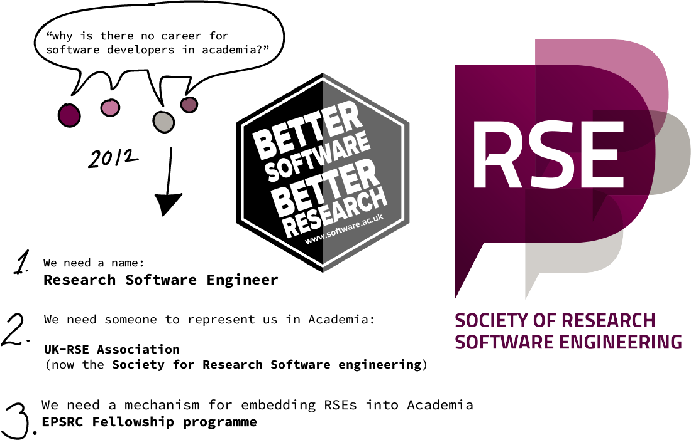]

---
class: bg-main2 split-70 hide-slide-number
background-image: url("https://cdn-images-1.medium.com/max/1600/1*v-AmdN95tAiNrpO9EMc86g.jpeg")
background-size: cover

.column.slide-in-left[
.sliderbox.vmiddle.shade_main.center[
# .font_large[Who are RSEs?]]]
.column[
]

.bottom_abs.font_small[CC-BY Antonia Cozacu, Jan Philipp Dietrich, de-RSE e.V.]
---
background-image: url("assets/detail-illustration.png")
background-position: right
background-size: contain

# .bg-white-transp[Software Engineering Practices]


- **Version Control**

- **Testing**

- **Continuous Integration**

- **Documentation**

--

<br>
<br>
<br>

### User focused


---
background-image: url("https://yoast.com/app/uploads/2017/06/Open_Source_FI.jpg")
background-size: cover
class: bg-main4

# Open Source Ethos *


.font_large[
- .bg-brown[**Transparent materials**]

- .bg-brown[**Ability to clone, adapt and collaborate**]

- .bg-brown[**Sustainability through community**]

- .bg-brown[**Clear record of contributions**]
]

_\* personal opinion_

.bottom_abs.font_small[image source: https://yoast.com/interview-with-joost-on-open-source/]
---
background-image: url("assets/domains.png")
background-position: center

# Background in Research


```{r, echo=FALSE, out.width='100%', eval=FALSE}
set.seed(2)
backgrounds <- data.frame(word = c("Marine Macroecology", "Physics", "Maths", "Arts", "Civil Engineering", "Computer Science", "Computer Architecture"),
                              freq = 1)
wordcloud2::wordcloud2(backgrounds, size = 0.3, fontFamily="Courier")
```


---
class: middle, center

# Where we live (@ Sheffield)

.figb90[]

---
class: bg-main1, middle, center

# In summary

---
class: bg-main3

.image_speech[]

.slide-in-bottom[ 
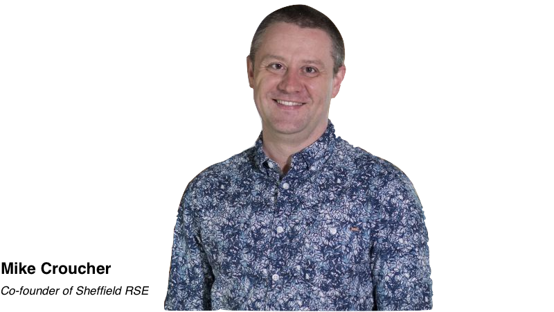
]


---
class: bg-main2 split-70 hide-slide-number

.column.slide-in-left[
.sliderbox.vmiddle.shade_main.center[
# .font_large[What can they do for U?]]]
.column[
]

---
class: bg-main4, middle, center

# Areas of expertise

.font_large[

High Performance computing

Code optimisation

Code & Data packaging

Software development

Training

Community building

]

---
class: split-33 with-thick-border

.column.bg-main1[.content[.pad10px[
.center[

# .font_small[**Bessemer Cluster**]

.image_profile[]

### **Will Furnass** 

Working with the central IT department’s infrastructure and research computing teams to help set up a new HPC cluster

<br>

.font_small[
**Funding:** University of Sheffield Central IT
]

]]]]

.column[

.content.nopadding[
.img-fill[]
.img-fill[
<a title="Chemical Engineer [Public domain], via Wikimedia Commons" href="https://commons.wikimedia.org/wiki/File:Bessemer_5180.JPG"></a>
]
]]

---
class: split-33 with-thick-border

.column.bg-main1[.content[.pad10px[
.center[

# .font_small[**Rumour Analysis Service**]

.image_profile[]

### **Twin Karmakharm** 

Open-source web-based rumour analysis tool that can continuously learn from journalists.

<br>

.font_small[
**Funding:** Digital News Initiative Fund (Google)
]

]]]]

.column[

.content.nopadding[
.img-fill[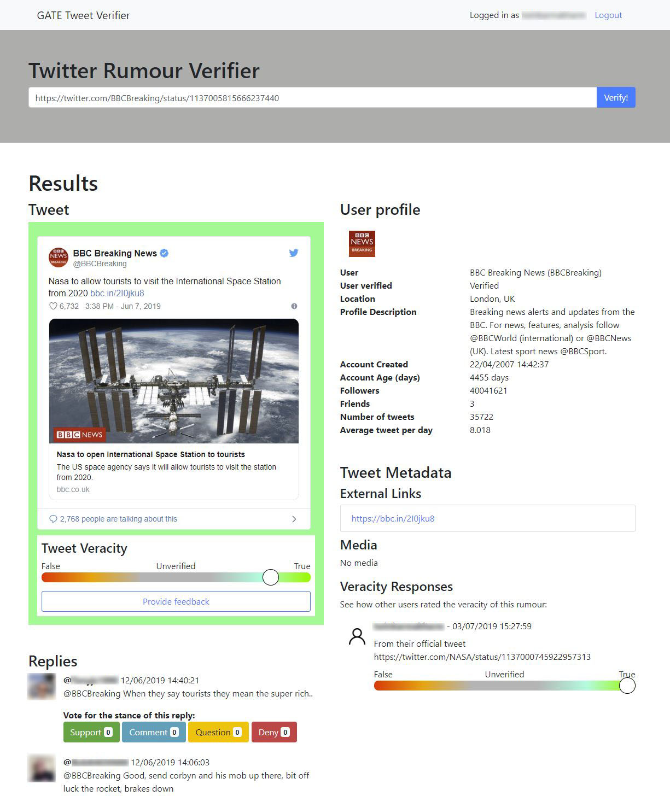]]]

---
class: split-33 with-thick-border

.column.bg-main1[.content[.pad10px[
.center[

# .font_small[**Immune system simulations**]

.image_profile[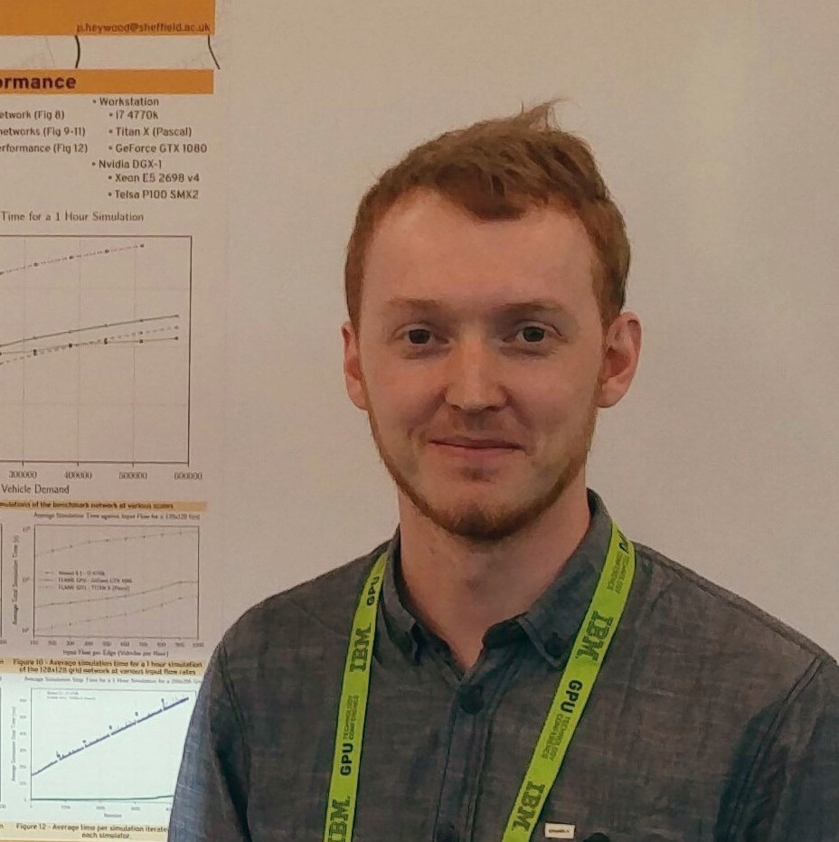]

### **Peter Heywood** 

Graphics Processing Unit (GPU) accelerated immune system simulations for the evaluation of alternate TB vaccine administration policies

<br>

.font_small[
**Funding:** European Research Council (ERC) under EU's Horizon 2020.
]

]]]]

.column[

.content.nopadding[
.img-fill[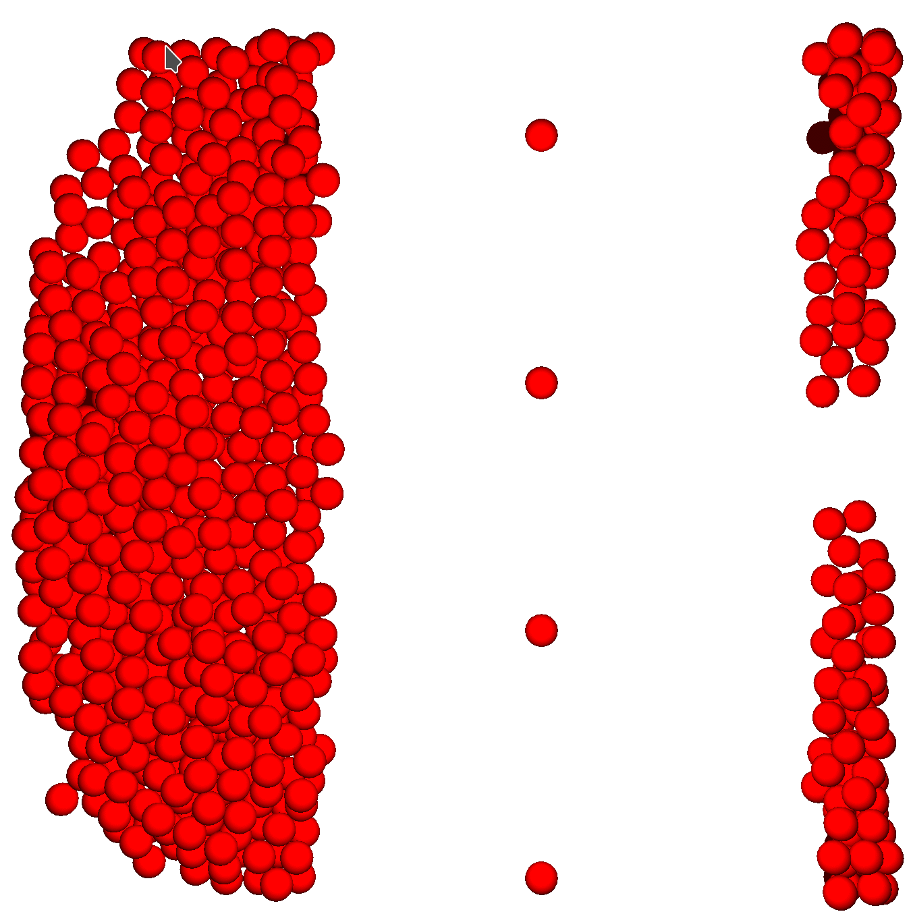]]]


---
class: split-33 with-thick-border

.column.bg-main1[.content[.pad10px[
.center[

# .font_small[**Flame GPU 2.0**]

.image_profile[]

### **Mozhgan Kabiri Chimeh** 

Developing v2.0 of Flame GPU a framework for writing agent-based models deployed on GPUs

<br>

.font_small[
**Funding:** EPSRC fellowship “Accelerating Scientific Discovery with Accelerated Computing”.
]

]]]]

.column[

.content.nopadding[
.img-fill[]


<iframe width="560" height="315" src="https://www.youtube.com/embed/u1LBLSlMUFo?start=97" frameborder="0" allow="accelerometer; autoplay; encrypted-media; gyroscope; picture-in-picture" allowfullscreen></iframe>
]

_First developed by Sheffield RSE Co-Founder Paul Richmond_
]


---
class: split-33 with-thick-border

.column.bg-main1[.content[.pad10px[
.center[

# .font_small[**Sedmaps web app**]

.image_profile[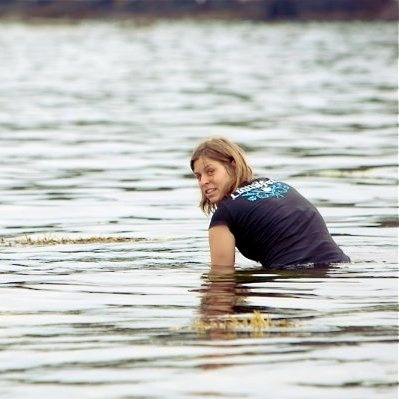]

### **Anna Krystalli** 

Access, visualise, summarise and extract raster maps of the north-west European Shelf sedimentary environment.

<br>

.font_small[
**Funding:** NERC through the Marine Ecosystems Research Programme
]

]]]]

.column[

.content.nopadding[
.img-fill[
<video src="assets/sedmaps_demo.mp4" width=100% controls autoplay></video>
]]

**https://sheffield-university.shinyapps.io/sedmap_shiny/**

.font_small[Wilson, R. J., Speirs, D. C., Sabatino, A., and Heath, M. R.: 
***A synthetic map of the north-west European Shelf sedimentary environment for applications in marine science***, 
Earth Syst. Sci. Data, 10, 109-130, <https://doi.org/10.5194/essd-10-109-2018>, 2018
]
]


---
class: split-33 with-thick-border

.column.bg-main1[.content[.pad10px[
.center[

# .font_small[**SeabirddietDB**]

.image_profile[]

### **Anna Krystalli** 

Seabird diet data product prepared for depositing in KNB + as R package

<br>

.font_small[
**Funding:** NERC through the Marine Ecosystems Research Programme
]

]]]]

.column[

.content.nopadding[

```{r, eval=FALSE}
seabirddietDB::seabirddiet
```

```{r, echo=FALSE}
tibble::as_tibble(seabirddietDB::seabirddiet)
```


.font_small[_Dataset prepared by R. Nager, J. Grecian and A. Olin_]

]]


---
class: split-33 with-thick-border

.column.bg-main1[.content[.pad10px[
.center[

# .font_small[**SeabirddietDB**]

.image_profile[]

### **Anna Krystalli** 

Seabird diet data product prepared for depositing in KNB + as R package

<br>

.font_small[
**Funding:** NERC through the Marine Ecosystems Research Programme
]

]]]]

.column[

.content.nopadding[

```{r, message=FALSE, warning=FALSE, out.width='100%'}
seabirddietDB::sbd_plot_predators(year = 1973)
```


.font_small[_Dataset prepared by R. Nager, J. Grecian and A. Olin_]

]]


---
class: bg-main2 split-70 hide-slide-number

.column.slide-in-left[
.sliderbox.vmiddle.shade_main.center[
# .font_large[Capacity Building]]]
.column[
]

---
class: middle center


<blockquote class="twitter-tweet" data-lang="en"><p lang="en" dir="ltr">Here we go with <a href="https://twitter.com/gvwilson?ref_src=twsrc%5Etfw">@gvwilson</a> : the gulf between the computing scientific &quot;elite&quot; and those emailing spreadsheets is growing, and that&#39;s bad.</p>&mdash; Ian Hawke (@IanHawke) <a href="https://twitter.com/IanHawke/status/664081682480373760?ref_src=twsrc%5Etfw">November 10, 2015</a></blockquote>
<script async src="https://platform.twitter.com/widgets.js" charset="utf-8"></script>

--

# RSE skills are a benefit to all!

---
class: split-two bg-main4 middle center

.column[.content[
[.figb90[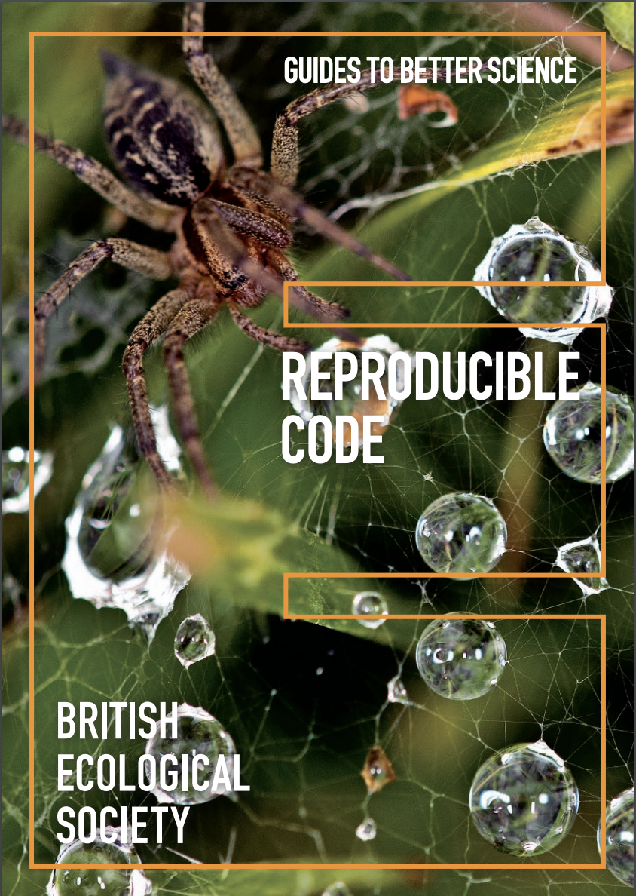]](https://www.britishecologicalsociety.org/wp-content/uploads/2019/06/BES-Guide-Reproducible-Code-2019.pdf)
]]


.column[.content[
[.figb90[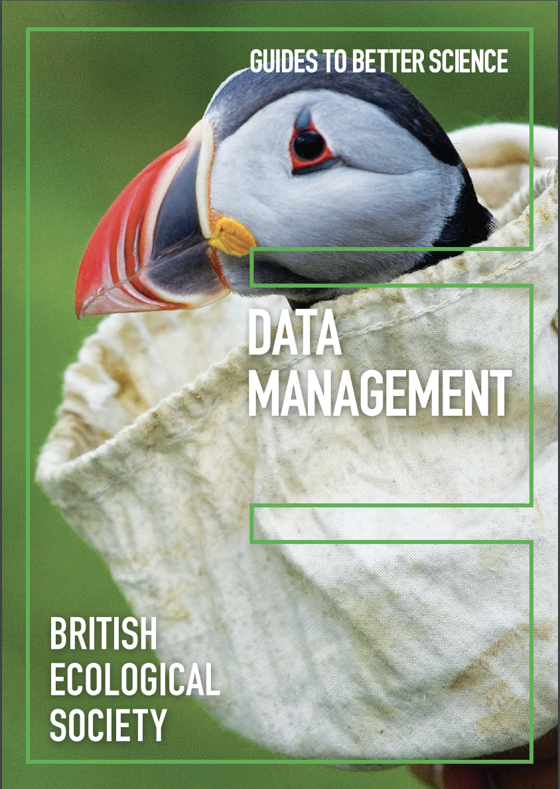]](https://www.britishecologicalsociety.org/wp-content/uploads/2019/06/BES-Guide-Data-Management-2019.pdf)
]]


---
class: bg-main1, middle, center

# Training


---
class: split-two

.column[.content[


<br>

#### Training community teaching foundational coding and data science skills to researchers worldwide

<br>

University of Sheffield is Member Organisation

]]

.column.bg-black[.content[

.figb90[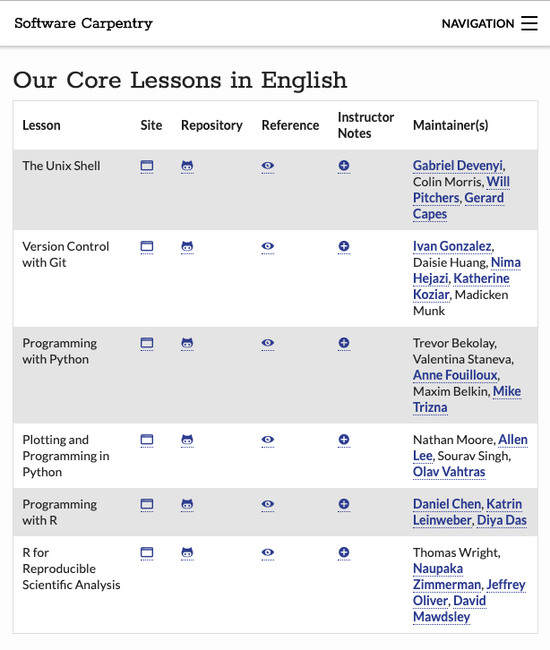]

]]
---

# Bespoke training

### [ACCE DTP Data & Project management](https://annakrystalli.me/rrresearch/)

_2 day course for 1st year ACCE DTP postgraduates since 2015_

<br>

--

###[Reproducible research with `rrtools`](https://annakrystalli.me/rrtools-repro-research/)

_North Western Universities R Day 2018_

<br>


### [Practical Data management](https://github.com/annakrystalli/dataspice-tutorial)

_Summer School on Reproducibility in Computational Sciences 2018_


---
class: bg-main1, middle, center

# Support

---
background-image: url("https://media2.giphy.com/media/5YiRHZtcSeiEyOpSV7/giphy.gif?cid=790b76115d2070523958673849c75d9e&rid=giphy.gif")
background-size: cover
class: bg-main1

# Get your lab in order

<br>

--

## Get help with:


--


- .font_large[**Organising your research group's digital assets**]

--

- .font_large[**Developing protocols**]

--

- .font_large[**Developing templates & checklists**]

---
background-image: url("assets/code-c.png")
background-size: contain
background-position: right

# Code Clinics

<br>

.font_small.bg-white-transp.strong[


### Are you...

  - Thinking of ways to improve your code?
  
  - Want to automate a task (e.g: series of scripts)?
  
  - Unsure of which software tools to use for your project?
  
  - You have a lot of data and need help organising, storing, accessing or visualising it?
  
  - Need some advice on optimising your code?
  
  - Want to know whether your code could run faster on multiple cores or GPUs?
  
  - Want to re-write your code written in one language (e.g: Excel) in another language such as Python?
  
  - Need help with version control?
  
  - Want to know more about making your code open and/or citable?

**We can help!**


]


---
class: bg-main1, middle, center

# Community

---
class: split-three with-border

.row.bg-main1[.content.vmiddle[

# Hackathons

<br>

_Fun and informal spaces for practice and Peer-to-Peer Learning_

]]

.row.bg-main4[.content.vmiddle[

# ReproHack Series

<br>

.font_large[**Hands on reproducibility hackathons**]

]]


.row.bg-black[.content.nopadding[


.figb[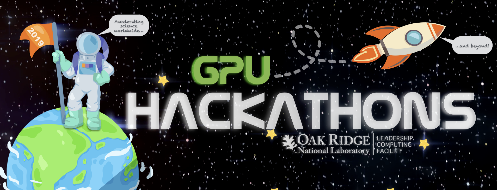]

]]


---
class: split-two center with-thick-border

.column.bg-main1[.content[

### Sheffield R Users Group

<blockquote class="twitter-tweet" data-lang="en"><p lang="en" dir="ltr">Great evening at <a href="https://twitter.com/Sheffield_R_?ref_src=twsrc%5Etfw">@Sheffield_R_</a> meet up hearing about phylogenetic methods with <a href="https://twitter.com/ChrisCooney101?ref_src=twsrc%5Etfw">@ChrisCooney101</a> and computer learning with Yichen He, both from our lab group (<a href="https://twitter.com/MacrobirdEvol?ref_src=twsrc%5Etfw">@MacrobirdEvol</a>).<br><br>Great bird-y science, and great coding 😊 <a href="https://twitter.com/hashtag/rstats?src=hash&amp;ref_src=twsrc%5Etfw">#rstats</a> 🐦 <a href="https://t.co/4d9H7zHb9Q">pic.twitter.com/4d9H7zHb9Q</a></p>&mdash; Emma Hughes (@EHughes27) <a href="https://twitter.com/EHughes27/status/1059888635745656832?ref_src=twsrc%5Etfw">November 6, 2018</a></blockquote>
<script async src="https://platform.twitter.com/widgets.js" charset="utf-8"></script>

]]
 
.column[.content[
 
### Women in HPC
  

  
.fig90[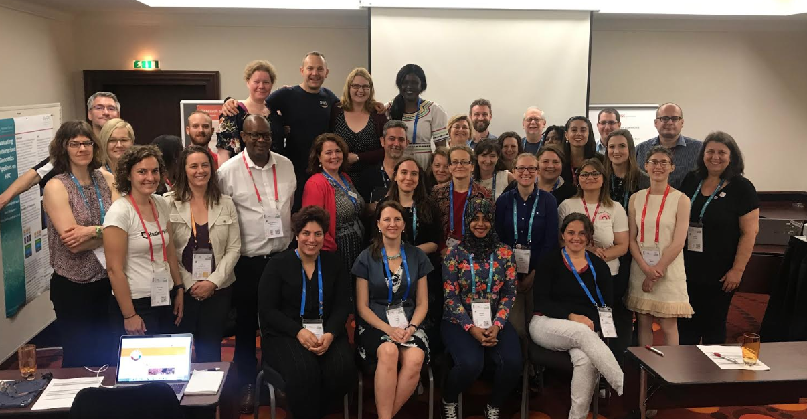]
  
]]


---
class: bg-main2 split-70 hide-slide-number

.column.slide-in-left[
.sliderbox.vmiddle.shade_main.center[
# .font_large[What's possible]]]
.column[
]

---
background-image: url("assets/hanslibdata.png")
background-size: cover
class: bg-main1

# gapminder.org: 2006 

### .bg-white-transp[[liberating stories from data](https://youtu.be/hVimVzgtD6w?t=15m3s)]


---
class: bg-main1

# Gapminder today

```{r, fig.show = "animate", message=FALSE, warning=FALSE}
library(ggplot2)

p <- ggplot(gapminder::gapminder, aes(gdpPercap, lifeExp, size = pop, color = continent, frame = year)) +
  geom_point() + scale_x_log10() + theme_bw()
```

```{r, message=FALSE, warning=FALSE, fig.height=4}
plotly::ggplotly(p)
```


---
background-image: url("https://github.com/ropensci/roweb2/blob/master/themes/ropensci/static/img/community-scroll/c6.jpg?raw=true")
background-size: cover
class: split-two


.column.bg-ro.center[.content[
# rOpenSci

***


<br>

> ### Transforming science through open data and software

<br>


]]


.column.bg-ro-transp[.content.vmiddle[


- **Technical infrastructure: peer-reviewed, community-contributed R scientific software tools.**


- Creating social infrastructure through a welcoming and diverse community


- Making the right data, tools and best practices more discoverable


- Building capacity of software users and developers.


- Promoting advocacy for a culture of data sharing and reusable software.

.fig90[]

]]


---
class: bg-main1, middle, center

# tl;dr

---
class: bg-main3 center

# .font_large[We can have nice things!]

--

### More robust, innovative, efficient & impactful research that's accessible to more people


---
class: bg-main1, middle, center

# .font_large[Thanks for listening! `r emo::ji("wave")`]

