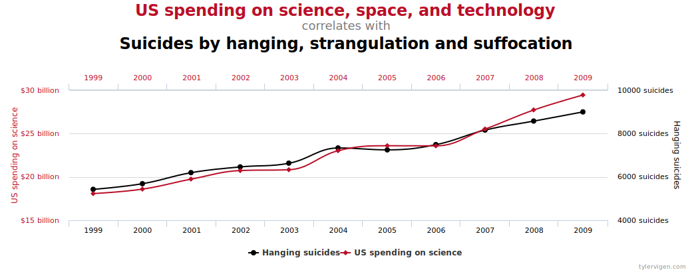
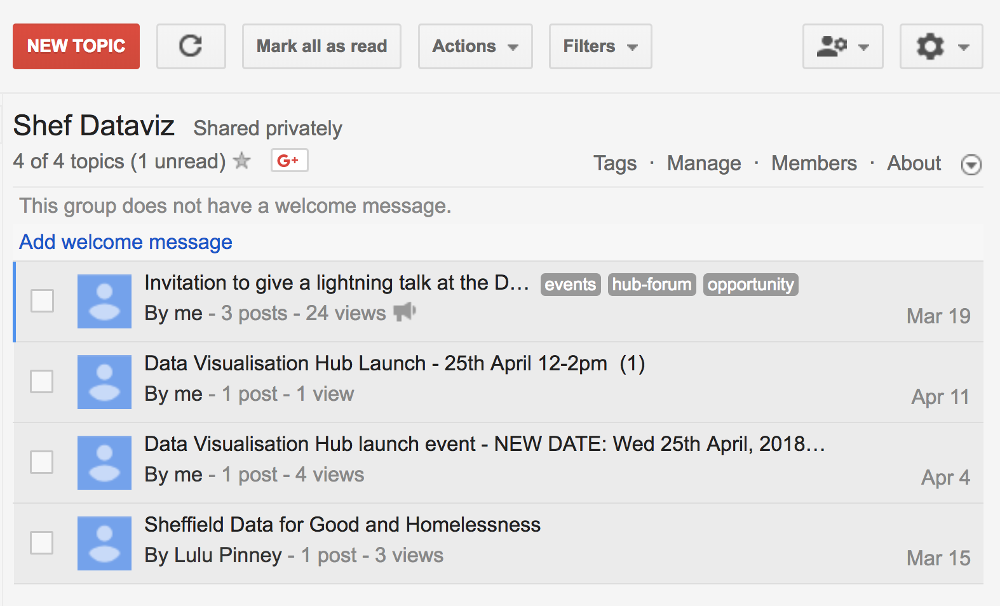
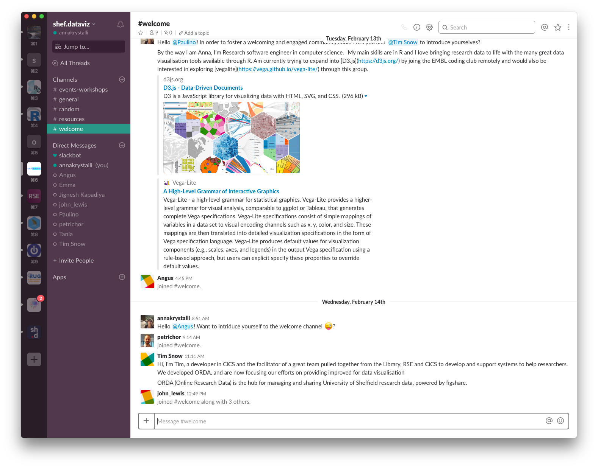
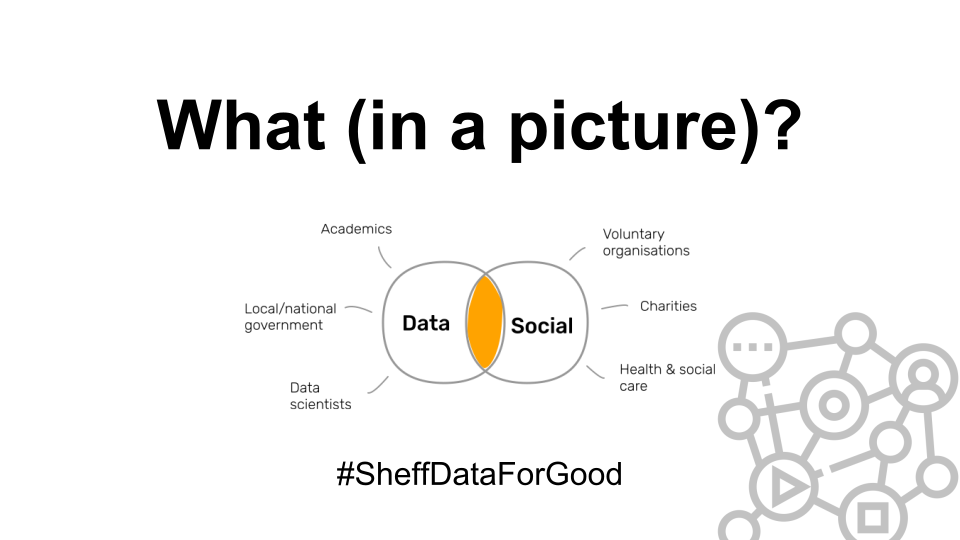

<link href="//fonts.googleapis.com/css?family=Bree+Serif|Cabin+Sketch|Fredericka+the+Great|Tajawal" rel="stylesheet">

## dataviz.shef {data-background="https://s.cdpn.io/79/light-beams.jpg"}

### "Our plans and hopes for the Data Visualisation Hub"

<br>

#### Anna Krystalli

<small>Research Software Engineering, TUoS</small>

##### 7th June 2018
######

```{r, echo=FALSE, warning=FALSE, message=FALSE}
library(googlesheets)
library(tidyverse)
survey <- gs_url("https://docs.google.com/spreadsheets/d/1WsHUeGBZOKLkBnRJujybqrzeoTSO34ym2cG5-JfoQZE", visibility = "private") %>% gs_read()


```


# Background {data-background="http://www.karenchance.com/background_e.jpg" data-background-repeat="repeat"}

## Why data visualtion? {data-background="assets/storytelling-inv.jpg"}

<br>

> - Data visualisation `r emo::ji("arrow_right")` an integral part of research communication

> - Exciting new open source `r emo::ji("bar_chart")` `r emo::ji("chart_with_upwards_trend")` `r emo::ji("chart_with_downwards_trend")` technologies are revolutionising **the potential for dataviz as an impactful research output.**

> - Little support for training in best practice and tooling


## gapminder.org: 

#### liberating stories from data

<iframe width="560" height="315" src="https://www.youtube.com/embed/hVimVzgtD6w?start=903" frameborder="0" allow="autoplay; encrypted-media" allowfullscreen></iframe>

## gapminder.org: 

#### liberating stories from data

<iframe src="https://www.gapminder.org/tools/?embedded=true#$chart-type=bubbles" style="width: 100%; height: 500px; margin: 0 0 0 0; border: 1px solid grey;" allowfullscreen></iframe>


## gapmider at our fingertips

```{r, fig.show = "animate", message=FALSE, warning=FALSE}
library(ggplot2)

p <- ggplot(gapminder::gapminder, aes(gdpPercap, lifeExp, size = pop, color = continent, frame = year)) +
  geom_point() + scale_x_log10() + theme_bw()
```

```{r, message=FALSE, warning=FALSE, fig.height=4}
plotly::ggplotly(p)
```

## with power comes great responsibility



<http://www.tylervigen.com/spurious-correlations>

## Calling Bulls__t 

##### Data Reasoning in a Digital World: Syllabus

<br>

<small>
**[Week 6. Data visualization](http://callingbullshit.org/syllabus.html#Visual).** Data graphics can be **powerful tools for understanding information**, but they can also be **powerful tools for misleading audiences**. We explore the many ways that data graphics can steer viewers toward misleading conclusions.


- Edward Tufte (1983) _The Visual Display of Quantitative Information_ Chapters 2 (Graphical integrity) and 5 (Chartjunk: vibrations, grids, and ducks).

- Tools and tricks: [Misleading axes](http://callingbullshit.org/tools/tools_misleading_axes.html)

- Tools and tricks: [Proportional Ink](http://callingbullshit.org/tools/tools_proportional_ink.html)

</small>

## Enter dataviz.shef {data-background="https://s.cdpn.io/79/light-beams.jpg"}

A joint initiative between: 

- **The University Library**

- **Corporate Information and Computing Services (CICS)** 

- **Research Software Engineering (RSE)**

<br>

> - soon joined forces with the [Oxford Interactive Data Network](https://idn.it.ox.ac.uk/)

## dataviz.shef goal:

<br>

> Promote and build community around data visualisation at the University of Sheffield

## The team


## previous members


## {data-background="assets/orda.png"}

## {data-background="assets/orda-viz.png"}

## Visualisation Showcase goals

<br>

> - Help promote researchers' reposited data

> - Promote data visualisation as impactful research outputs

## Path to achieving them {data-transition="fade-in}

<br>

> Q: How do we help our researchers make the most of their data and modern data visualisation tools?

## Path to achieving them {data-transition="fade-in}

<br>

> Q: How do we help our researchers make the most of their data and modern data visualisation tools?

<br>

### Let's ask them!

# TUoS Data Visualisation Survey {data-background="assets/survey-form.png"}

```{r, echo = F}
theme_lab <- function () { 
  theme_grey(base_size = 11.5, base_family = "Helvetica") %+replace% 
    theme(
      # remove the plot background and border
      plot.background = element_blank(),
      panel.background = element_blank(),
      panel.border = element_blank(),
      # make the legend and strip background transparent
      legend.background = element_rect(fill = "transparent", colour = NA),
      legend.key = element_rect(fill = "transparent", colour = NA),
      strip.background = element_rect(fill = "transparent", colour = NA),
      # add light, dotted major grid lines only
      panel.grid.major = element_line(linetype = "dotted", colour = "lightcyan3", size = 0.3),
      panel.grid.minor = element_blank(),
      # remove the axis tick marks and hide axis lines
      axis.ticks = element_blank(),
      axis.line = element_line(color = "#FFFFFF", size = 0.3),
      # modify the bottom margins of the title and subtitle
      plot.title = element_text(size = 18, colour = "black", hjust = 0, face = "bold",
                                #margin = margin(b = 4)
                                ),
      plot.subtitle = element_text(size = 12, colour = "black", face = "bold", hjust = 0, 
                                   # margin = margin(b = 10)
                                   ),
      # add padding to the caption
      plot.caption = element_text(size = 10, colour = "#212121", hjust = 1, 
                                  #margin = margin(t = 15)
                                  ),
      # change to Helvetica for axes titles, tick labels, legend title and legend key, and strip text
      axis.title = element_text(family = "Helvetica", size = 11, colour = "#757575", face = "plain", hjust = 1),
      axis.text = element_text(family = "Helvetica", size = 10, colour = "#757575", face = "plain"),
      legend.title = element_text(size = 12, colour = "#757575"),
      legend.text = element_text(size = 10, colour = "#757575"),
      strip.text = element_text(family = "Helvetica", size = 12, colour = "#757575", face = "plain")
    )
}

cap_first <- function(X){
    simple_cap <- function(x) {
        x <- trimws(x)
        s <- strsplit(x, " ")[[1]]
        out <- paste(toupper(substring(s, 1,1)), substring(s, 2),
                     sep="", collapse=" ")
        out <- gsub("And", "and", out)
        out <- gsub("&", "and", out)
        out <- gsub("Of", "of", out)
        out
    }
    sapply(X, simple_cap, USE.NAMES = F) 
}

```


In Dec 2107, we launched a University Wide Survey on data visualisation.


## Position

```{r, echo = F}

survey %>%  mutate(Position = factor(cap_first(Position), 
                                    cap_first(c("Postgraduate student", "Postdoctoral researcher", 
                                      "Research Associate", "Lecturer", "Senior Lecturer", "Professor", 
                                      "Other")))) %>%
    count(position = Position) %>% mutate(pct = prop.table(n) * 100) %>%
    ggplot(aes(x = position, y = n, color = position, fill = position)) +
    geom_bar(stat = 'identity', position = 'dodge') + 
     geom_text(aes(y = pct + .5,    # nudge above top of bar
                  label = paste0(sprintf("%0.1f", round(pct, digits = 1)), '%')),    # prettify
              position = position_dodge(width = .9), 
              size = 4) +
  theme(axis.title.x=element_blank(),
        axis.text.x=element_blank(),
        axis.ticks.x=element_blank())
```

## Analysis Frameworks


```{r, echo=FALSE}
survey %>% rename(frameworks = `What analysis frameworks are you familiar with`) %>%
    select(frameworks) %>% 
    separate_rows(frameworks) %>% mutate(frameworks = cap_first(frameworks)) %>%
    filter(!frameworks %in% c("Is", "An", "Analysis", "Framework", "")) %>%
    group_by(frameworks) %>%
    count() %>% arrange(n) %>% ungroup() %>%
    mutate(frameworks = factor(frameworks, levels = frameworks)) %>%
    # plot
    ggplot(aes(x = n, y = frameworks)) + 
    geom_segment(aes(x = 0, xend = n, 
    y = frameworks, 
    yend = frameworks), colour = "gray28") + 
    geom_point(colour = "steelblue", 
    size = 3, alpha = 0.8) +
    labs(title = "", subtitle = "What analysis frameworks are you familiar with?", 
    caption = paste0("Source: TUoS Data Visualisation Survey |  n = ", nrow(survey)), x = NULL, y = NULL, 
    fill = NULL) + theme_lab() #+
    #theme(panel.grid.major = element_blank(), 
          #axis.text.y = element_text(hjust = 0))


```


## Current Data Visualisation tools

```{r, echo = F}
survey %>% rename(current = `Which (if any) tools do you already use to produce visualisations?`) %>%
    select(current) %>% 
    separate_rows(current, sep = ",") %>% mutate(current = cap_first(current)) %>%
    filter(!current %in% c("Is", "an", "analysis", "framework", "")) %>%
    group_by(current) %>%
    count() %>% arrange(n) %>% ungroup() %>%
    mutate(current = factor(current, levels = current)) %>%
    # plot
    ggplot(aes(x = n, y = current)) + 
    geom_segment(aes(x = 0, xend = n, 
    y = current, 
    yend = current), colour = "gray28") + 
    geom_point(colour = "steelblue", 
    size = 3, alpha = 0.8) +
    labs(title = "", subtitle = "Which (if any) tools do you already use to produce visualisations?", 
    caption = paste0("Source: TUoS Data Visualisation Survey |  n = ", nrow(survey)), x = NULL, y = NULL) + 
    theme_lab() 

```


## Aspirational Data Visualisation tools

```{r, echo = F}
library(stringr)
survey %>% rename(current = `Which (if any) tools technologies would you be interested in learning more about?`) %>%
    select(current) %>% 
    separate_rows(current, sep = ",") %>% 
    mutate(current = gsub("I Am Interested In Learning About Visualizations But Don't Know What Each Programme offers. ",
                          "", cap_first(current))) %>%
    filter(!current %in% c("Is", "an", "analysis", "framework", "")) %>%
    group_by(current) %>%
    count() %>% arrange(n) %>% ungroup() %>%
    mutate(current = factor(current, levels = current)) %>%
    # plot
    ggplot(aes(x = n, y = current)) + 
    geom_segment(aes(x = 0, xend = n, 
    y = current, 
    yend = current), colour = "gray28") + 
    geom_point(colour = "steelblue", 
    size = 3, alpha = 0.8) +
  scale_y_discrete(labels = function(x) str_wrap(x, width = 70)) +
    labs(title = "", subtitle = str_wrap("Which (if any) tools/technologies would you be interested in learning more about?", width = 50),
    caption = paste0("Source: TUoS Data Visualisation Survey |  n = ", nrow(survey)), x = NULL, y = NULL) + 
    theme_lab() 

```


## Experience

```{r, echo = F, warning=FALSE, message=FALSE}

survey %>%  mutate(experience = factor(`How experienced are you in producing visualisations?`, 
                   levels = as.character(1:10))) %>%
    select(experience) %>% 
    #group_by(experience) %>%
    count(experience = experience) %>% mutate(pct = prop.table(n) * 100) %>%
    ggplot(aes(x = experience, y = n, color = experience, fill = experience)) +
    geom_bar(stat = 'identity', position = 'dodge') + 
     geom_text(aes(y = pct + .5,    # nudge above top of bar
                  label = paste0(sprintf("%0.1f", round(pct, digits = 1)), '%')),    # prettify
              position = position_dodge(width = .9), 
              size = 4) +
    labs(subtitle = "How experienced are you in producing visualisations?") +
    theme_lab() + 
  theme(axis.title.x=element_blank(),
        axis.title.y=element_blank(),
        axis.text.x=element_text(face = "bold", size = 14),
        legend.position="none",
        axis.ticks.x=element_blank()) 
```


## Main take aways

> - Still a lot of Excel use

> - R and Python top of researchers aspirations

> - Broad interest in a variety of more niche tools

> - Skill, expertise and level of interest are distributed

## Proposed action

> Develop capacity through **community**

<iframe src="https://giphy.com/embed/i04wdjzz8xfyM" width="480" height="480" frameBorder="0" class="giphy-embed" allowFullScreen></iframe><p><a href="https://giphy.com/gifs/network-i04wdjzz8xfyM">via GIPHY</a></p>


## Develop community of practice

<br>

`r emo::ji("raised_hands")` `r emo::ji("woman_technologist")` `r emo::ji("handshake")` `r emo::ji("man_scientist")`  `r emo::ji("woman_student")` `r emo::ji("handshake")` `r emo::ji("man_teacher")` `r emo::ji("man_technologist")` `r emo::ji("handshake")` `r emo::ji("woman_scientist")`  `r emo::ji("man_student")` `r emo::ji("woman_teacher")` `r emo::ji("raised_hands")` `r emo::ji("dancing_women")`


<br>


#### Support through:

> - **Documentation** on dataviz best practice and use of tools 
> - **Communication** channels
> - Capacity building opportunities through **Events**

# Documentation {data-background="http://brazoslawyers.com/wp-content/uploads/2015/01/Dollarphotoclub_52871584.jpg" .inverted}

## OxShef

#### Main home of best practice and tooling documentation

> - **OxShef: Charts** <http://oxshef-charts.netlify.com/index.html>

> - **OxShef: Tools** <http://oxshef-charts.netlify.com/index.html>

> - twitter: **@oxshef_dataviz**


> Full credits for work so far to [Martin Hadley](https://twitter.com/martinjhnhadley) of The [University of Oxford  IDN](https://idn.it.ox.ac.uk/)]


## {data-background-iframe="http://oxshef-charts.netlify.com/index.html"}


## {data-background-iframe="http://oxshef-tools.netlify.com/index.html"}


## Chart **type** vs **tool** matrix

> - Comprehensive list of chart types

> - Resources for developing the **same charts using different tools.**

> - Initial focus on **`R`** and **`Python`** but open for expansion


## dataviz.shef: Data Visualisation Hub website

> - Information on community events and activities

> - Documentation specific to the ORDA Data Visualisation showcase

## {data-background-iframe="http://dataviz.shef.ac.uk/"}


## Open Source Documentation

> - All materials are CC-BY

> - All materials are open for contribution on GitHub


# Communication {data-background="https://www.telegraph.co.uk/content/dam/technology/Spark/btconnectingbritain/Bolshevik-telephone-switchboard.jpg?imwidth=1400" .inverted}

##

<div class="container">

<div class="col">

### [Google group](https://groups.google.com/a/sheffield.ac.uk/forum/?hl=en#!forum/shef_dataviz-group)



<small>

> - low volume announcements

</small>

</div>

<div class="col">

### [Slack community](https://join.slack.com/t/shef-dataviz/signup)



<small>

> - free sharing

> - good for sharing useful links, blogs, tutorials, questions and chat.

> - say **hello** ```r emo::ji("wave")``` in the ***#welcome*** **channel!**

</small>
</div>
</div>

## Data Visualisation Hub Blog {data-background-iframe="http://dataviz.shef.ac.uk/blog/"}


# Events {data-background="https://s3.amazonaws.com/eclincher.wp.upload/wp-content/uploads/2017/11/30053226/how-to-build-online-communities-on-social-media.jpeg"}


## Launch {data-background-iframe="http://dataviz.shef.ac.uk/launch/hub-launch-schedule/"}


## Workshops

Instructor and/or peer to peer led.

### Upcoming

- Data Visualisation in `R` using [`ggplot2`](http://ggplot2.tidyverse.org/) (Jun-Jul)

<br>

### Wishlist

> - Data Visualisation in `Python` using [**`altair`**](https://github.com/altair-viz/altair)

> - Data Visualisation in [**`vegalite`**](https://vega.github.io/vega-lite/)

> - Interactive Data Visualisation in [**`Shiny`**](https://shiny.rstudio.com/) (`R`) & [**`Dash`**](https://plot.ly/products/dash/) (`Python`)

> - Interactive mapping with [**`Leaflet`**](https://rstudio.github.io/leaflet/)


## Symposia


<div class="container">

<div class="col">


</div>

<div class="col">


</div>
</div>
<small>

[_The Missing Link in Publishing: Interactive Data Visualisation_](https://idn.it.ox.ac.uk/event/missing-link-publishing-interactive-data-visualisation) 
_4th December 2017, University of Oxford_

</small>

## Hackathons

#### [NBN R Users Group hack:](http://sheffieldr.github.io/nbn-hack/)

<blockquote class="twitter-tweet" data-lang="en"><p lang="en" dir="ltr"><a href="https://twitter.com/Sheffield_R_?ref_src=twsrc%5Etfw">@Sheffield_R_</a> <a href="https://twitter.com/NBNTrust?ref_src=twsrc%5Etfw">@NBNTrust</a> <a href="https://twitter.com/hashtag/BiodiversityHack?src=hash&amp;ref_src=twsrc%5Etfw">#BiodiversityHack</a> is go! First stage: data dive &amp; brainstorm! <a href="https://twitter.com/hashtag/rstats?src=hash&amp;ref_src=twsrc%5Etfw">#rstats</a> <a href="https://twitter.com/hashtag/openscience?src=hash&amp;ref_src=twsrc%5Etfw">#openscience</a> <a href="https://t.co/0N9Re8roM5">pic.twitter.com/0N9Re8roM5</a></p>&mdash; annakrystalli (@annakrystalli) <a href="https://twitter.com/annakrystalli/status/704723751007604737?ref_src=twsrc%5Etfw">March 1, 2016</a></blockquote>
<script async src="https://platform.twitter.com/widgets.js" charset="utf-8"></script>


## Coding clubs

<blockquote class="twitter-tweet" data-lang="en"><p lang="en" dir="ltr">Soooooo cool to be joining <a href="https://twitter.com/tbyhdgs?ref_src=twsrc%5Etfw">@tbyhdgs</a> and <a href="https://twitter.com/embl?ref_src=twsrc%5Etfw">@embl</a> Heidelberg <a href="https://twitter.com/hashtag/BioIT?src=hash&amp;ref_src=twsrc%5Etfw">#BioIT</a> coding club remotely to work through D3.js <br><br>😃😃😃😃 <a href="https://t.co/2bIxSrScMo">pic.twitter.com/2bIxSrScMo</a></p>&mdash; annakrystalli (@annakrystalli) <a href="https://twitter.com/annakrystalli/status/959097031628414976?ref_src=twsrc%5Etfw">February 1, 2018</a></blockquote>
<script async src="https://platform.twitter.com/widgets.js" charset="utf-8"></script>

## Meetups

#### Sheffield Data For Good

Bringing together the data and social expertise in Sheffield to help tackle the city’s social problems




## Success is in the network {data-background="https://raw.githubusercontent.com/acabunoc/open-source-strangeloop-2016/gh-pages/img/mentorship_14.jpg"}


# Get involved!

##

> - Share your data visualisations on ORDA showcase

> - Join the google group &/or slack community

> - Contribute to the blog

> - Contribute to the documentation

> - Get in touch with ideas for training, coding clubs, hackathons

> dataviz.shef.ac.uk

> - #### a.krystalli[at]sheffield.ac.uk