```{r setup, include=FALSE}
options(htmltools.dir.version = FALSE)
```

```{r xaringan-themer, include = FALSE}
library(xaringanthemer)

duo_accent(
  primary_color = "#459FFE", secondary_color = "#F308AD",
  title_slide_text_color = "white", text_bold_color = "#FCF624" ,
  text_color = "white", link_color = "#F308AD",
  inverse_text_color = "#F308AD", inverse_header_color = "#F308AD",
  header_font_google = google_font("Space Mono", "400"),
  text_font_google   = google_font("Montserrat", "300", "300i"),
  code_font_google   = google_font("Source Code Pro"),
  title_slide_background_image = "../Hacktoberfest-19-bgr.png",
  background_image = "../hacktober19_slide.png",
  background_size = "cover", outfile = "assets/css/hacktoberfest-xaringan-themer.css"
)
```


# Overview

- ### Setting up git & GitHub through R

- ### Working with git in Rstudio

- ### Practical: Forking and making a Pull Request!

---
# Prerequisites

### You will need:

- Git [installed](https://carpentries.github.io/workshop-template/#git)
- A [GitHub](https://github.com/) account
- Your account registered with [Hacktoberfest](https://hacktoberfest.digitalocean.com/)* (optional: for your PR to count)
- to be connected to the Internet! Select **_TheCloud** and follow instructions to get connected.

---

# Git, Github & Rstudio

#### Before: git only through the terminal `r emo::ji("cry")` or external GUI

--

### Now: Rstudio + `usethis` `r emo::ji("package")` == `r emo::ji("heart")` `Git` & `GitHub` `r emo::ji("star_struck")`

.center[

]

---
# Configure git & GitHub

### Configure git

**Set your configuration**

Use your github username and and the email you used to sign-up on GitHub

```{r, eval=FALSE}
usethis::use_git_config(
    user.name = "Jane",
    user.email = "jane@example.org")
```

---
### Configure GitHub authentication

#### Get GITHUB Personal Authorisation Token

```{r, eval=F}
usethis::browse_github_pat()
```


---

### Store in `.Renviron` file

```{r, eval=F}
usethis::edit_r_environ()
```


---
# Initialise git


### Initialise **Rstudio project** with Git by **just checking a box!**

It's now **a repository**


Forgot to? use `usethis::use_git()`


---
# Git panel

### Integrated graphical user interface


.center[

]

---
# Git Rstudio workflow

.pull-left[
#### view file status


#### stage files

]

.pull-right[
#### commit changes

]
---

# Share on GitHub

#### Create repo


```{r, eval=FALSE}
usethis::use_github(protocol = "https")
```


#### Push further changes


---
class: inverse, center, middle

# #Evolottery

### Welcome to the evolutionary lottery of skull and beak morphology

Sign up for Hacktoberfest so the pull request counts towards your tally!

---


## **#EvoLottery**


#### **Beak and skull shapes in birds of prey (“raptors”) are strongly coupled and largely controlled by size.** 

.pull-left[

- In this exercise, each participant will **fork a GitHub repo**, and **contribute a file** required to simulate the *evolutionary trajectory of an imaginary species' body size*.

- We'll use **GitHub to collate all species files** and **plot** them all up together at the end! We'll also **discover the skull and beak shapes** associated with each simulated species size.
]

.pull-right[

]
---
class: inverse, center, middle

# GO! `r emo::ji("checkered_flag")`

---


## **GitHub:** 
**start with a repo**

#### [bit.ly/evolottery](http://bit.ly/evolottery)


---
class: inverse, center, middle

# Fork repo

---

## **GitHub:** 
make your **own copy of the repository** on GitHub

- fork are linked and traceable

 


---

## **GitHub:** 
GitHub makes a **copy into your account**

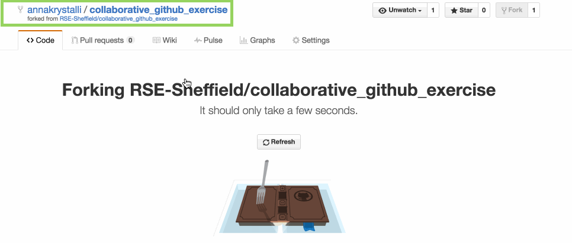
 


---

## **GitHub:** 
**clone it: copy repo link** to create Rstudio project
    
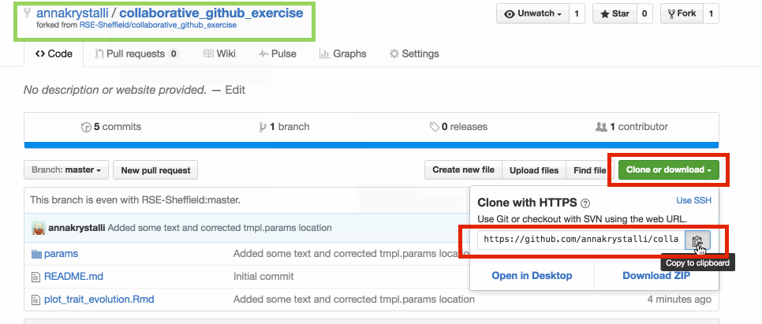


---
class: inverse, center, middle

# Clone project in Rstudio

---

## **rstudio:** 
Create **new project**

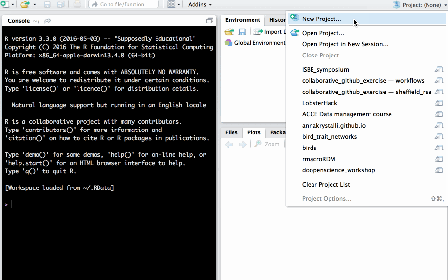


---

## **rstudio:** 
Checkout from **version control repository**

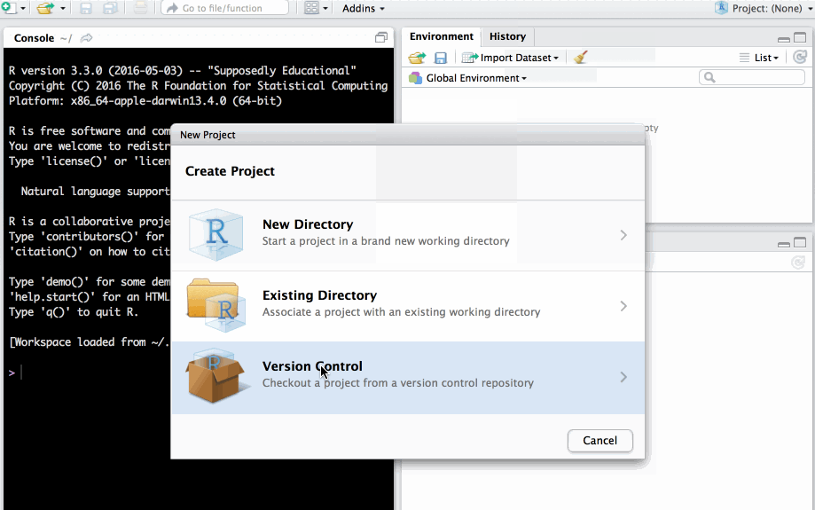


---

## **rstudio:** 
Clone project from a **git** repository

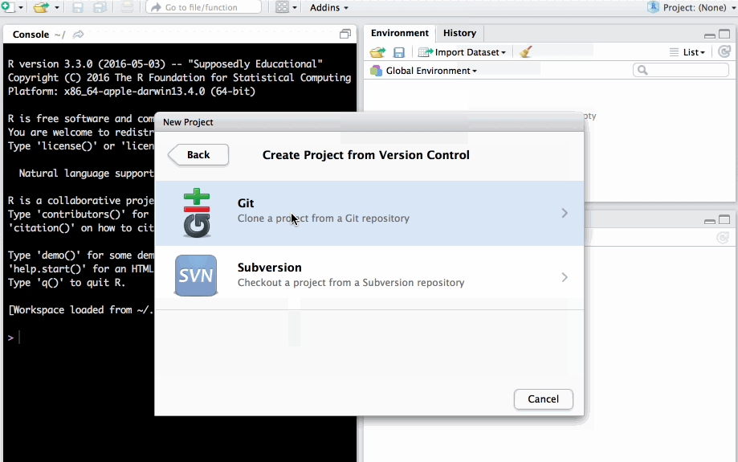


---

## **rstudio:** 
Paste **repo link copied from GitHub** into **Repository URL** field. Click **`Create Project`**. 

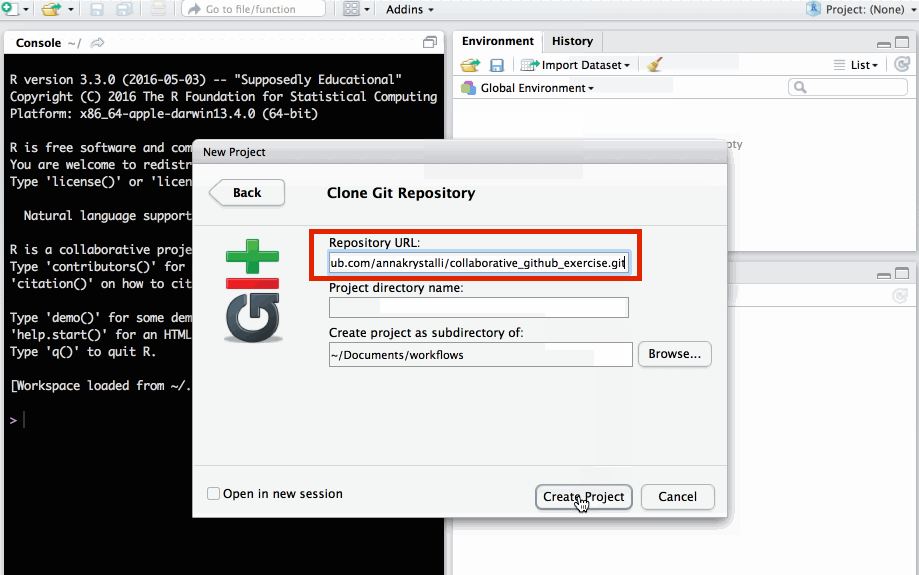


---

## **rstudio:** 
Rstudio project now **contains all files from the GitHub repo.**

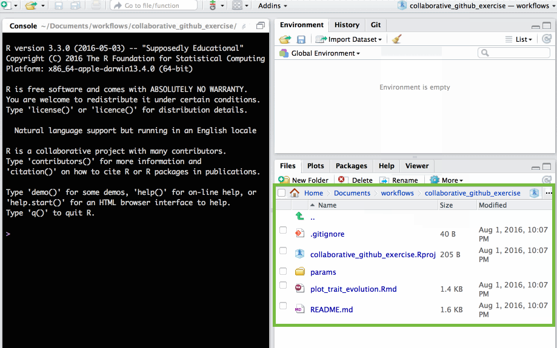


---
class: inverse, center, middle

# Make a change to the repo

---

## **rstudio:** 
open **`params/params_tmpl.R`**

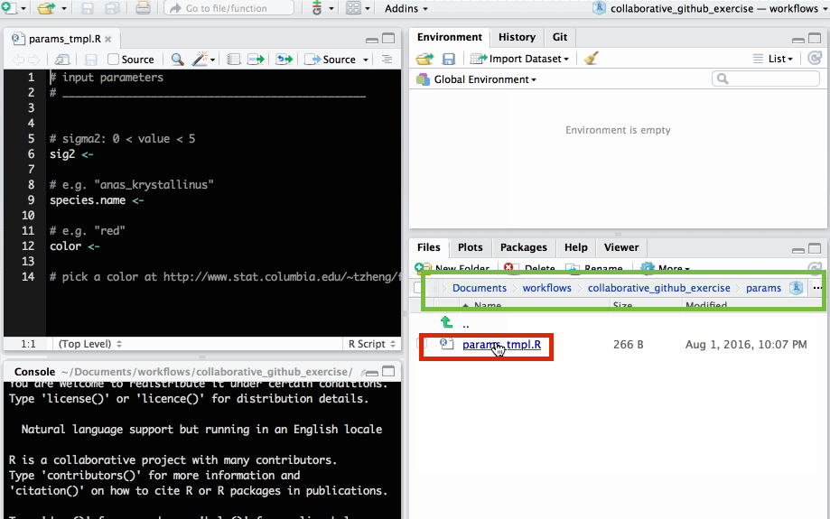


---

## **rstudio:** 

<div class="inverse"><strong>SAVE AS NEW <code>.R</code> script in <code>params/</code> folder</strong></div> 

Use species name of your choice to name new file. Please **!!DO NOT OVERWRITE `params/params_tmpl.R`!!**.

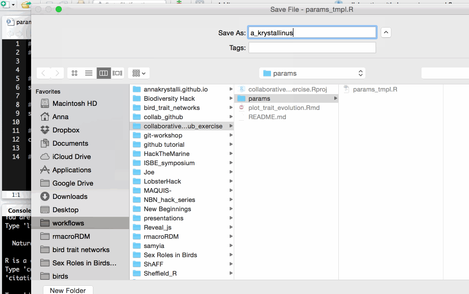


---

## **rstudio:** 
edit file with parameters of your choice and save.

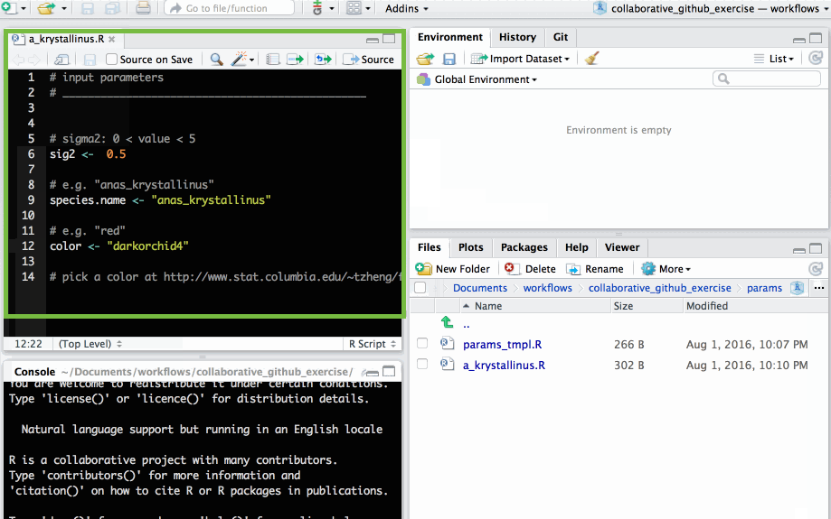


---

### The parameters each participants need to supply are:

**NB: remember to save the changes to your file**


- **`sig2`:** A numeric value greater than 0 but smaller than 5

- **`species.name`:** a character string e.g. `"anas_krystallinus"`. Try to create a species name out of your name!

- **`color`:**  a character string e.g. `"red"`, `"#FFFFFF"` (Check out list of [**colours in R**](http://www.stat.columbia.edu/~tzheng/files/Rcolor.pdf))


---
class: inverse, center, middle

# Commit changes locally to git

---

## **rstudio:** 
in the *git* tab, select the **new file** you created and click **`Commit`**.
### !! Please **ONLY COMMIT YOUR NEW FILE** !!

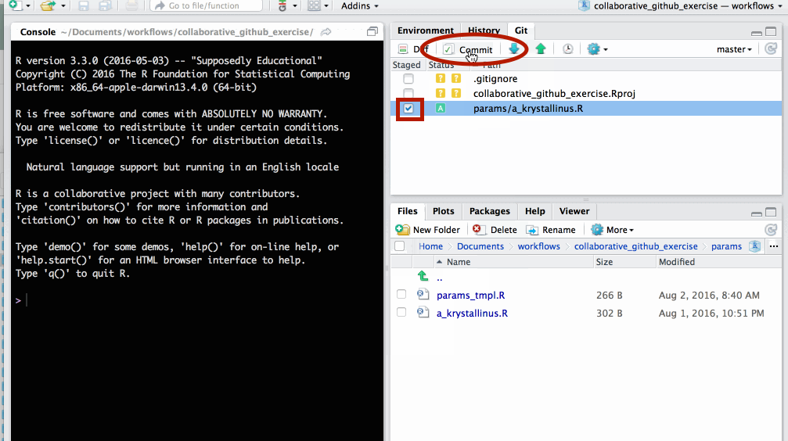


---

## **rstudio:** 
write an informative commit message and click **`Commit`**  

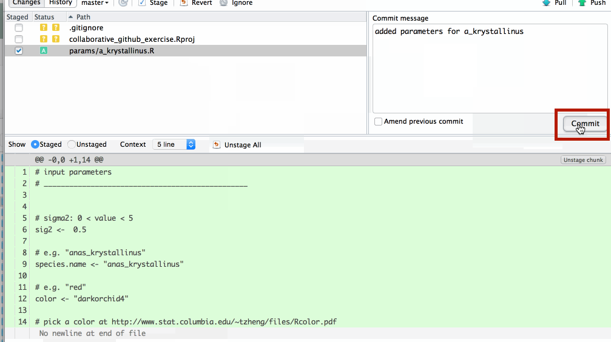


---

## **rstudio:** 
your new file has now been commited  

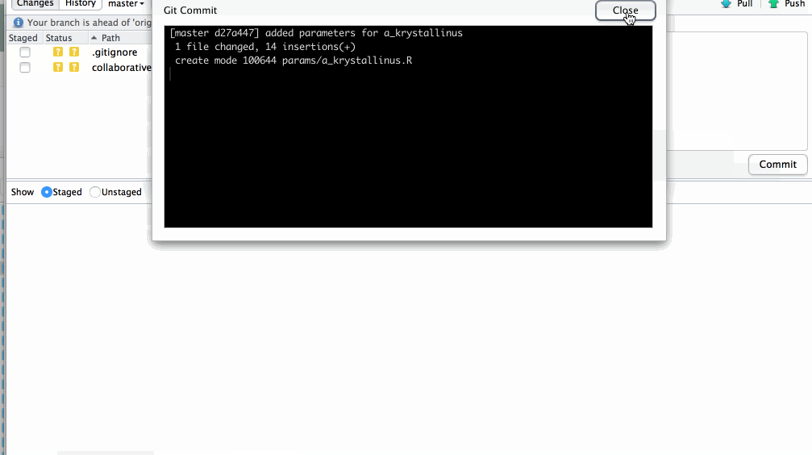


---
class: inverse, center, middle

# Push changes to GitHub

---

## **rstudio:** 
on the *git* tab click ⇧  to **push changes to GitHub**

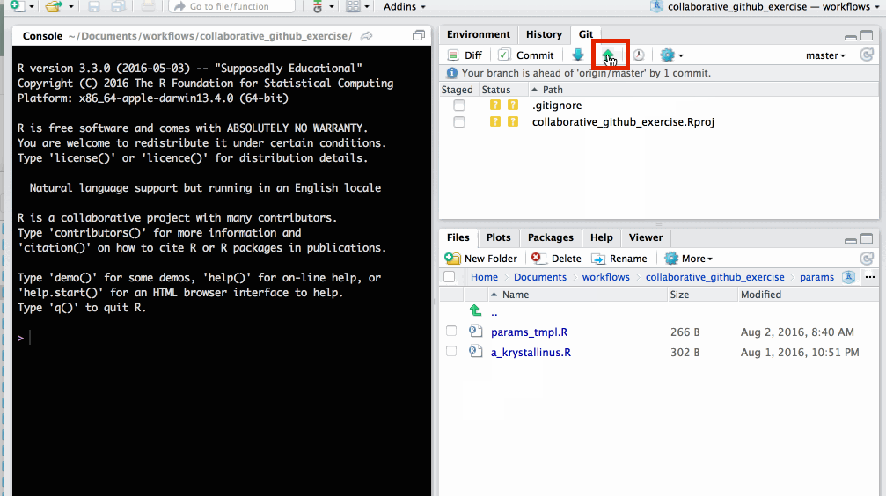


---

## **rstudio:** 
changes have now been updated in the **GitHub repo**

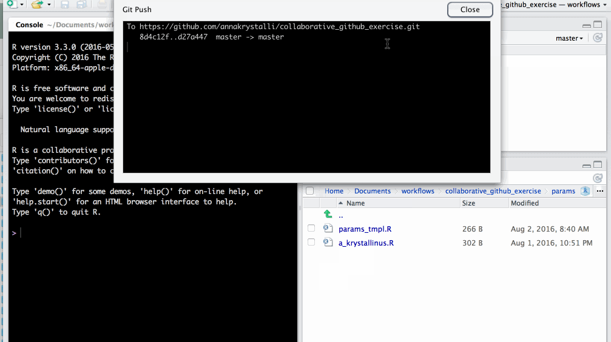


---
class: inverse, center, middle

# Create pull request

---

## **GitHub:** 
in your repository, create **`new pull request`** 
to merge fork to master repo (ie the original repo you forked)

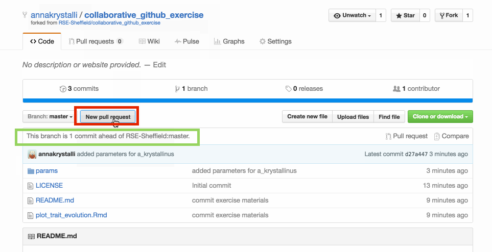


---

## **GitHub:** 
GitHub checks whether your requested merge creates any coflicts. 
If all is good, click on **`Create pull request`**

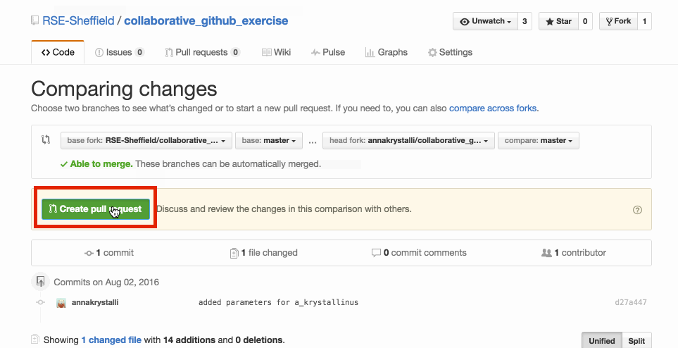


---

## **GitHub:** 
write an informative message explaining your changes to the master repo administrators. Click on **`Create pull request`**

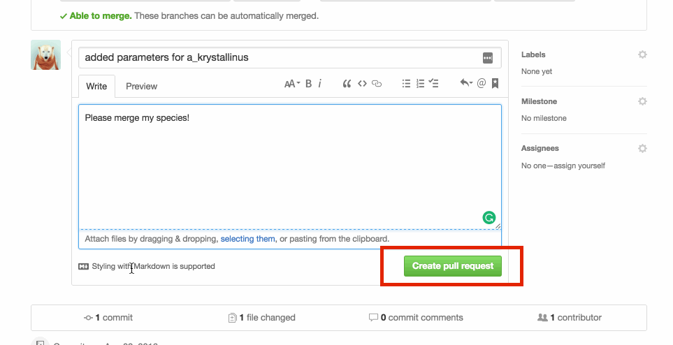


---

## **GitHub:** 
check original repo to see **your merged changes**

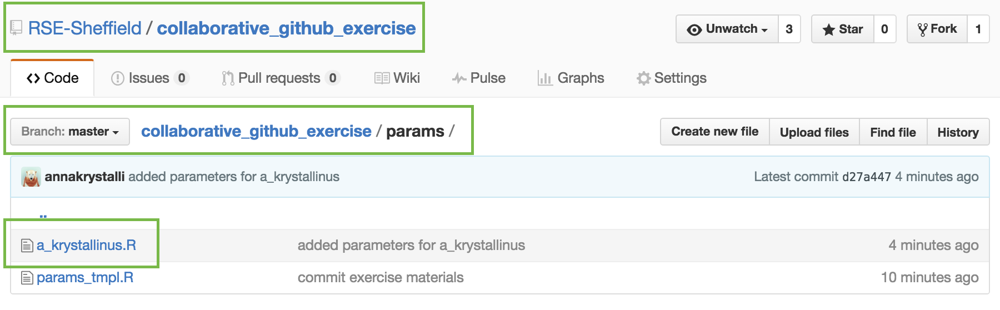


---

## Check out the merged and [plotted contributions!](https://rse.shef.ac.uk/collaborative_github_exercise/plot_trait_evolution.html) 

---
background-image: assets/hacktober19_slide.png

# Go forth and make PRs!

You need **3 more** to get your snazzy t-shirt!

### Join us at a `r emo::ji("woman_technologist")` `r emo::ji("man_technologist")` session!

**Meeting room 1, the Diamond, 5:30 pm to 8:00 pm**
_The University of Sheffield, 32 Leavygreave Rd, S3 7RD_ 
- 8th October
- 15th October
- 22nd October
- 29th October

Hack together and get support from a member of the [Sheffield Research Software Engineering](https://rse.shef.ac.uk/) team if you get stuck!
