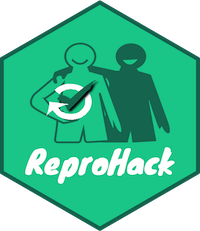
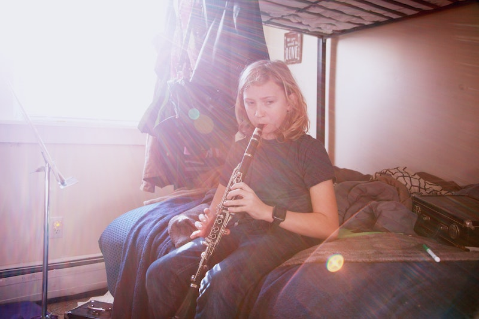
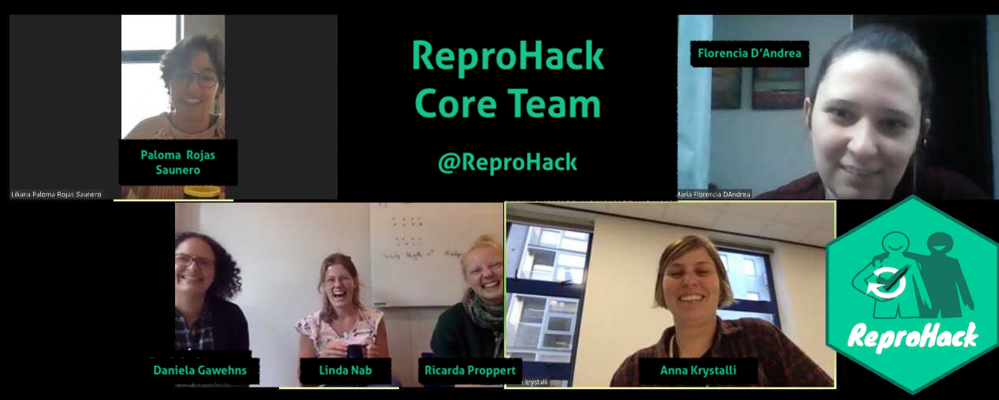
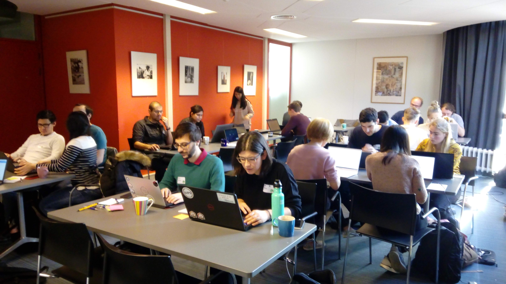
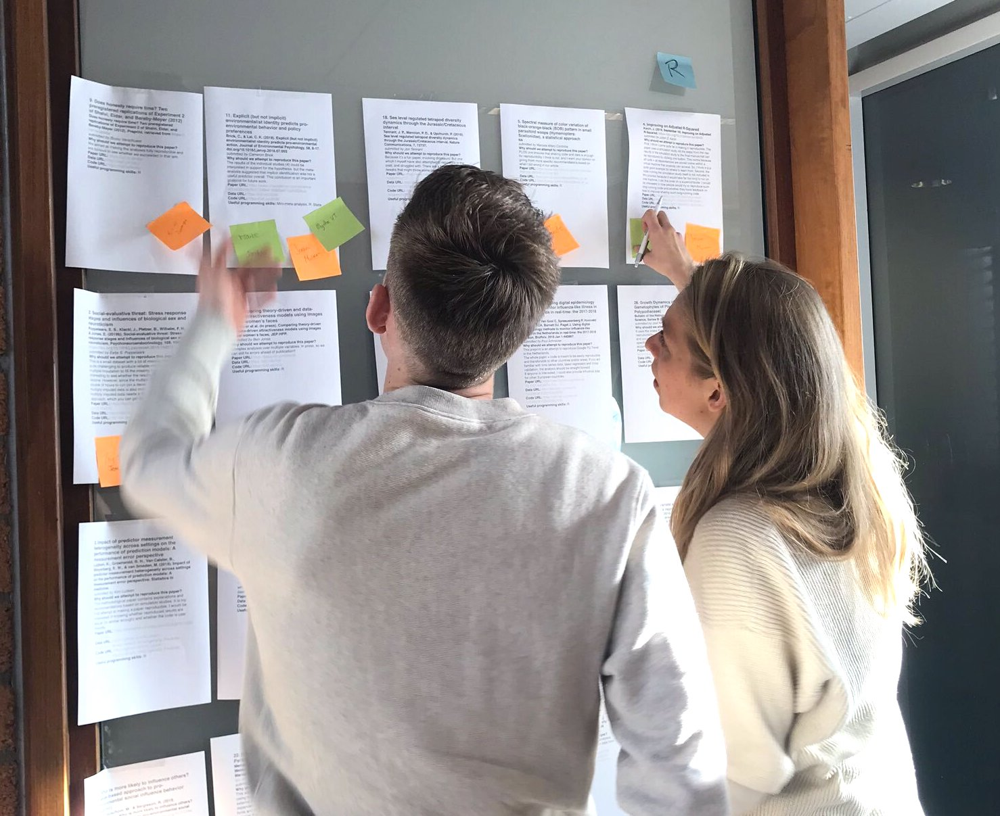
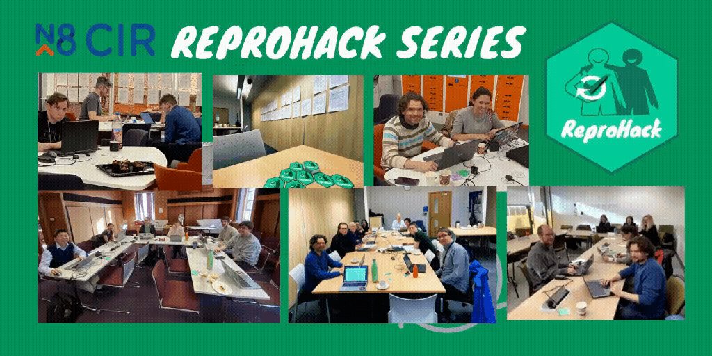
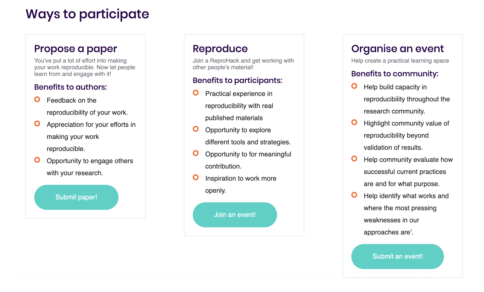

background-image: url(assets/backgrounds/ro-sticker-background.jpg)
background-size: contain

```{r, echo=FALSE, out.width="20%"}

```


# ReproHacks: 
### Practicing reproducibility makes better

<br>

### _Anna Krystalli_ <i class="fab fa-twitter "></i> @annakrystalli
.white[
_TUoS Open Research Conversation: Reproducibility and Preregistration_
]

```{r setup, include=FALSE}
knitr::opts_chunk$set(echo = FALSE,
                  out.width = "90%",
                  fig.height = 6,
                  dev = "svg",
                  message = FALSE,
                  warning = FALSE)
library(magrittr)
library(dplyr)
library(xaringanthemer)
```

```{r xaringan-themer, include = FALSE}
library(xaringanthemer)

#neg_color <- "#f25a22"
#pos_color <- "#03CC99"
neg_color <- "#fc8d62"
pos_color <- "#1b9e77"
text_font_google = google_font("Lato", "300", "300i")

#primary_color = "#2D896B"
#secondary_color = "#46CC97"
style_duo_accent(primary_color = pos_color, secondary_color = neg_color,
  header_font_google = google_font("Fira Sans", "700"),
  text_font_google   = text_font_google,
  code_font_google   = google_font("Source Code Pro"),
  title_slide_text_color = "#edf9f6",
  background_color = "#edf9f6",
  black_color = "#2a332c",
  title_slide_background_image = "assets/background.jpg",
  colors = c(
  red = "#f34213",
  purple = "#3e2f5b",
  orange = "#ff8811",
  darkgreen = "#2e6351",
  white = "#FFFFFF"
),
  outfile = "assets/css/user2020-xaringan-themer.css"
)
```

---


# `r emo::ji("wave")` Hello

### me: **Dr Anna Krystalli**

- **Research Software Engineer**, _University of Sheffield_
    + twitter **@annakrystalli**
    + github **@annakrystalli**
    + email **a.krystalli[at]sheffield.ac.uk**
    
- **Editor [rOpenSci](http://onboarding.ropensci.org/)**

- **Co-organiser:** [Sheffield R Users group](https://www.meetup.com/SheffieldR-Sheffield-R-Users-Group/)

---
layout: true

.left.footnote[<i class="fab fa-twitter "></i> @annakrystalli]

---
class: inverse, center, middle

# Background


???

Let's start with a bit of background

---

.pull-left[


]

.pull-right[

]

???

- I'm sure most by now have heard about the reproducibility crisis.
- I don't want to go into to much detail about the many and varied drivers of the crises and discussions about the implications.
- but one thing that most would agree on is that the publication sustem as it stands is not fit for validating modern research which is increasingly underlaid by more and complex computational workflows

---

# The paper is the advertisement

> “an article about a computational result is advertising, not scholarship. The **actual scholarship is the full software environment, code and data, that produced the result.**”

*John Claerbout paraphrased in [Buckheit and Donoho (1995)](https://statweb.stanford.edu/~wavelab/Wavelab_850/wavelab.pdf)*

--

### Why is our whole system geared towards **reviewing, publishing, distributing, archiving** the advertisement?


???

I feel our problem is well captured by the following quote by John Claerbout, referenced in a paepr by Buckheit and Donoho
---

## Progress: calls for reproducibility as minimum standard

> #### **Reproducibility** has the potential to serve as a **minimum standard for judging scientific claims** when full independent replication of a study is not possible.

 <br>


.center[
```{r}
knitr::include_graphics("assets/repro-spectrum.jpg")
```
]
.img-attr[Reproducible Research in Computational Science
_ROGER D. PENG, SCIENCE 02 DEC 2011 : 1226-1227_
]
<br>

???

We have been making progress though, with computational reproducibility, _the ability to reproduce a result from the original code and data_ being put forward as a minimum standard for validating research findings

---
class: inverse, center, middle

.box[
## Benefit #1
]

### transparency as a means of verification

--


## Benefit #2


### transparency as a means of supercharging research cycle


???

- This points to the recognition that a certain level of compuatational transparency is necessary for verifying the validity of research findings

- It also offers and additional superpower. Making underlying materials openly available means it's much easier to build on previous research, effectively supercharging the research cycle.

---
class: center, middle

# So how are we doing?


```{r}
knitr::include_graphics("assets/repro-spectrum.jpg")
```


.img-attr[Reproducible Research in Computational Science
_ROGER D. PENG, SCIENCE 02 DEC 2011 : 1226-1227_
]

???

- Now, this recognition is an important first step but what does it mean in practice?

- How far have we actually come?

- Well that's actually a really hard question to answer because, despite an increase in the publication of more research code and data (by no means sufficient yet), there is still no systematic review of such materials to confirm that research is indeed reproducible
---
background-image: url(assets/annie-spratt-fallen-tree.jpg)
background-size: cover
class: center, middle

--

.bg-white[

# If a paper claims to be reproducible but nobody checks it, is it really reproducible?

]

???

This makes me think of that only philosophical question:

> If a tree falls in the woods and no one is there to hear it, does it make a sound?

> So, if a paper claims to be reproducible but no-one is there to check it, is it actually reproducible?

---
class: center 

```{r, out.width="60%"}

```

# Practice


???

This lack of systematic review leads to an additional problem, that there is no opportunity to practice and get feedback on the reproducibility of our research

Now anyone that has ever tried to learn an instrument, a sport or any other activity knows that far more important to success than any talent or natural ability is practice. Without an opportunity to practice we are really stuck in theoretical discussions of reproducibility

---

# Reprohack

#### One day reproducibility hackathons

***

--

- ### How reproducible are papers?

--

- ### How can we provide a sandbox environment to practice reproducibility?

???

So these were really the key issues that the ReproHack project sought to address:


- How reproducible are papers with associated published code and data?

- How can we provide a sandbox environment where both authors and reviewers can practice reproducibility?


---

# ReproHack History

#### OpenCon Satellite: Berlin, 2016

#### OpenCon Satellite: London, 2017

--
 
<br>

Inspired by Owen Petchey's [Reproducible Research in Ecology, Evolution, Behaviour, and Environmental Studies](https://github.com/opetchey/RREEBES) course, 

- Reproduce published results from raw data
- Over a few months and a number of sessions

--

### **ReproHack mission:  Reproduce paper in a day from code and data**

???

Let's start with a bit of ReproHack history

So I’ll start with some ReproHack history:

They were originally run as part of Opencon satellite events

 and were inspired by Owen Petchey’s Reproducible Research course 
where students attempt to recreate published results from raw data, 
And they do this over a few months and multiple sessions. 

We wanted to condense that activity into one day so 

set the challenge to be,  to reproduce results from published data AND code.

---

### Software Sustainability Institute Fellowship 2019


.pull-left[

]

--

.pull-right[

```{r}
knitr::include_graphics("assets/me-reprohack.png")
```

```{r}
knitr::include_graphics("https://github.com/reprohack/reprohack-2019-06-27/blob/master/CCmcrlogo.png?raw=true")
```

]

???

Not much happened since then until
 this year when I joined the 2019 Software Sustainability Institute Fellows cohort 

and my proposal was to 
resurrect and 
further develop, 
And run a series of ReproHacks

The first one being at Carpentry Connect Manchester

---

## ReproHacks since the Fellowship


- ### [Leiden ReproHack](https://reprohacknl.github.io/ReproHack/)

- ### [N8 CIR Northern Tour ReproHack Series](https://n8cir.org.uk/news/reprohacks/) (x5)

- ### [N8 CIR Remote ReproHack](https://n8cir.org.uk/events/remote-reprohack/)

- ### [LatinR ReproHack](https://latin-r.com/blog/reprohack-en)

- ### [UCL ReproHack for Open Access week](https://blogs.ucl.ac.uk/open-access/2020/11/17/open-access-week-the-first-reprohack-%E2%99%BB-ucl/)

???

Since the Fellowship, there's been a number of events run both by myself and the ReproHack community

- Leiden ReproHack: lead to formation of core team

- N8 CIR Northern Tour ReproHack Series] A series of (x5) events across Northern UK universities

- [N8 CIR Remote ReproHack](https://n8cir.org.uk/events/remote-reprohack/): Cancellation of the Manchester event due to COVID lead to the first remote event

- [LatinR ReproHack](https://latin-r.com/blog/reprohack-en): lead nicely to a remote event at last year's Latin R, where we ran the first event fully in Spanish!

- [UCL ReproHack for Open Access week](https://blogs.ucl.ac.uk/open-access/2020/11/17/open-access-week-the-first-reprohack-%E2%99%BB-ucl/): In October, community members ran the first week long event for open access week

---

## Reprohack Core Team

```{r, out.width="100%"}

```


???

Before moving on I'd just like to give props and thanks to the ReproHack core team which have been instrumental in the development of the project and the running of all these events
---
class: inverse, middle, center

# How does it work?

---

## Call for papers

.pull-left[


<blockquote class="twitter-tweet"><p lang="en" dir="ltr">✨Do you champion <a href="https://twitter.com/hashtag/reproducible?src=hash&amp;ref_src=twsrc%5Etfw">#reproducible</a> <a href="https://twitter.com/hashtag/research?src=hash&amp;ref_src=twsrc%5Etfw">#research</a>? <br>✨Do you have a reproducible paper with open code and data?<br><br>The <a href="https://twitter.com/SoftwareSaved?ref_src=twsrc%5Etfw">@SoftwareSaved</a> <a href="https://twitter.com/hashtag/ReproHack?src=hash&amp;ref_src=twsrc%5Etfw">#ReproHack</a> series needs you! 🚀<br><br>Help others learn &amp; engage with your work by submitting it to our 1-day Reproducibility hackathons!<a href="https://t.co/PssdXqwl8Z">https://t.co/PssdXqwl8Z</a></p>&mdash; annakrystalli (@annakrystalli) <a href="https://twitter.com/annakrystalli/status/1138769695513952260?ref_src=twsrc%5Etfw">June 12, 2019</a></blockquote> <script async src="https://platform.twitter.com/widgets.js" charset="utf-8"></script>
]

--

.pull-right.middle[

```{r, out.width="100%"}
knitr::include_graphics("assets/rh-paper_list.png")
```

]


???

In the current format, leading up to the event, 

we have a call for papers 

where we encourage authors to submit their papers for reproduction.

We like this because it means authors get engaged from the start

And this hopefully results in a nice paper list  for participants to work with on the day

---
background-image: url("assets/on_the_day-bg.jpg")
background-size: cover

# On the day


- ###  Select paper and form groups

- ### Work with materials and reproduce 

- ### Discuss 

- ### Feed back to authors

???

On the day, we start with a bit of an introduction in which we stress that:

 - Reproducibility is hard!
- Authors are incredibly brave to invite us into their work
- So we set the tone to invite only constructive feedback.


Participants are then free to review and select papers they wish to work on and attempt to reproduce them

At some point we regroup to share progress and close with a final share out.

Most importantly, we ask participants to feed their experiences back to the authors

---
class: inverse, center, middle

# Tips for Reproducing & Reviewing


```{r, echo=FALSE, out.width="70%"}

```


???

Now I'll just go over a few of the tips we give participants for reviewing
---

## Selecting Papers

.pull-left[
- **Information submitted by authors:**

  - Languages / tools used
  
  - Why you should attempt the paper.
  
- **No. attempts <i class="fas fa-recycle "></i>** No. times reproduction has been attempted

- **Mean Repro Score <i class="fas fa-check-circle "></i>** Mean reproducibility score (out of 10)

    - lower == harder!
]


.pull-right[
```{r, echo=FALSE}

```
]


---
class:center, middle

# Review as an auditor `r emo::ji("bookmark_tabs")`

???

Then we ask ask participants to review using a few hats, first that of an auditor, and we ask them to reflect on anumber of acharacteristics of the materials
---

.pull-left[

# Access

- How **easy** was it to **gain** access to the materials?

- Did you manage to download all the files you needed?

]


.pull-right[

# Installation

- How **easy / automated** was **installation**?

- Did you have any problems?

- How did you solve them?

]

---
--- 

.pull-left[


# Data

- Were **data clearly separated from code and other items**?

- Were **large data files deposited in a trustworthy data repository** and referred to using a **persistent identifier**?

- Were **data documented** ...somehow...

]


.pull-right[

# Documentation

Was there **adequate documentation** describing:
- how to **install** necessary software including non-standard dependencies?

- how to **use** materials to reproduce the paper?

- how to **cite** the materials, ideally in a form that can be copy and pasted?

]


---

.pull-left[

# Analysis

- **Were you able to fully reproduce** the paper? `r emo::ji("white_check_mark")`

- **How automated** was the process of reproducing the paper?

- **How easy was it to link** analysis **code** to:
   - the **plots** it generates
   - **sections in the manuscript** in which it is described and results reported
]

--

.pull-right[

<br>

### If the analysis was not fully reproducible `r emo::ji("no_entry_sign")`
 - Were there **missing dependencies?**
 
 - Was the **computational environment not adequately described** / captured?
 
 - Was there **bugs** in the code?
 
 - Did **code run but results (e.g. model outputs, tables, figures) differ** to those published? By **how much?**
]

---
class: center

# Review as a user `r emo::ji("video_game")`


.pull-left[

### New User

```{r, echo=FALSE, out.width="80%"}
knitr::include_graphics("https://25.media.tumblr.com/30906cccedfe97a3d5450a23359ca298/tumblr_ml72i2eL6t1rsudnqo1_500.gif")
```


]


--

.pull-right[

### Invested User

```{r, echo=FALSE, out.width="80%"}
knitr::include_graphics("https://media.giphy.com/media/9K2nFglCAQClO/source.gif")
```


]


???

Then we also ask them to review as a potential user and in particular as two important users

- First as a new user, and here the unfamiliarity of the material is actually a superpower and can unearth important gaps in the documentation or difficulties in usability of the materials

- The second is as an invested user, someone who really wants to use the materials themselves. This can unearth useful usability features or ADDITIONAL USECASES
---


## Feedback as a community member

.pull-left[

#### Acknowledge author effort

#### Give feedback in good faith

#### Focus on community benefits and system level solutions


```{r, echo=FALSE, out.width="100%"}
knitr::include_graphics("assets/1728_TURI_Book sprint_11 community_040619.jpg")
```

]


--

.pull-right[

> #### _Help build convention on what form a Reproducible paper should take and how we should be able to use it_


]

???

Finally we also stress the importance of reviewing as a community member.


There is a lot wrong with our publication system and the authors that submit their work for others to learn form are not one of them!


Overall, this is an opportunity for the whole community to learn and help define these materials should look like and what form would make them fit for the purposes we need and want them to.
---
class: inverse, center, middle

# What did we learn?

```{r}
source(here::here("R/reprohack-feedback.R"))
feedback <- readr::read_csv(here::here("data", "reprohack_n8_feedback_raw.csv")) %>%
  recode_feedback()


feedback_long <- feedback %>%
    dplyr::mutate(paper_title = factor(.data$paper_title)) %>%
    dplyr::select(-.data$which_paper_did_you_attempt) %>%
    tidyr::pivot_longer(where(is.character) , names_to = "question", values_to = "text") %>%
    tidytext::unnest_tokens( word, text) %>%
    #tidytext::unnest_tokens( word, text, token = "ngrams", n = 2) %>%
    dplyr::anti_join(tidytext::stop_words) %>%
    #dplyr::mutate(num = !is.na(as.numeric(.data$word)))
    dplyr::filter(is.na(as.numeric(.data$word)))


neg_color <- "#f25a22"
pos_color <- "#03CC99"
```


---
## N8 CIR ReproHack Series Stats

- ### 38 papers submitted so far

- ### Total of ~ 70 participants

- ### 39 completed reviews over 27 papers


---

## Review Scores

```{r reproscores, fig.height=4, fig.width=6}
set.seed(20200701)

hist_data <- feedback %>%
  tidyr::pivot_longer(cols = contains("score"), 
                      names_to = "score_question", 
                      values_to = "score") %>%
  dplyr::group_by(score_question, paper_title) %>%
  dplyr::summarise(mean_score = mean(score)) %>%
  dplyr::ungroup() %>%
  dplyr::mutate(score_question = stringr::str_to_title(score_question) %>% 
                  stringr::str_replace("_score", "") %>%
                  factor(levels = c("Repro", "Docs", "Transparency", "Reuse")))
  

sum_stat_df <- hist_data %>%
  dplyr::group_by(score_question) %>%
  dplyr::summarise(
  mean = mean(mean_score),
  median = median(mean_score))


hist_data %>%
ggplot(aes(x = mean_score)) +
    geom_histogram(
      #color = neg_color, fill = pos_color, 
                   binwidth = 1)  +
  geom_vline(aes(xintercept = mean, group = score_question), 
             data = sum_stat_df, show.legend = TRUE) +
  facet_wrap(~score_question) +
  theme_minimal() +
  labs(title = NULL) +
    theme_xaringan()

```


---


## What would improve reproducibility?

- ### Better documentation

- ### More complete description / capture of computational environment

## What was their favourite aspect of reproducible materials?

- ### Literate programming

???

The most low hanging fruit across the board was better documentation. FAuthors familiarity with materials means they make a lot of assumptions about users prior knowledge that reviews shine a light on. This can be from basics on specifying how materials are laid out to what software needs to be installed to run the code

The second most common problem is poorly specified computational environments. The simplest way to get round this would be to atleast provide session information with the most robust being providing an executable computational environment for the analysis, for example in a docker container

FInally we found that participants really enjoyed working with literate programming documents where text, code and outputs are laid out togetther in a single executable document

---


.pull-left[

### Opportunity for peer skill sharing

- CCMcr: Contributing to open source

- Leiden: Synching GitHub repositories with Zenodo

- Remote Reprohack: Docker school
]

--


.pull-right[

## Fit for purpose

<blockquote class="twitter-tweet" data-conversation="none"><p lang="en" dir="ltr">On the way home, <a href="https://twitter.com/df3n5?ref_src=twsrc%5Etfw">@df3n5</a> said quite rightly, if all [code-producing/data-analysing] researchers would take part in at least one <a href="https://twitter.com/ReproHack?ref_src=twsrc%5Etfw">@ReproHack</a>, the code reproducibility and quality of documentation would generally soar!</p>&mdash; Durham University Advanced Research Computing (@ARC_DU) <a href="https://twitter.com/ARC_DU/status/1219897416536797185?ref_src=twsrc%5Etfw">January 22, 2020</a></blockquote> <script async src="https://platform.twitter.com/widgets.js" charset="utf-8"></script>

]

???

We also found the events provided excellent opportunity for skill sharing

And importantly participants found they were fit for purpose. I couldn't agree with this tweet more that providing the space for working with real materials will have a real impact on the reproducibility of published work going forward
---

## ReproHacks are fun

```{r}

```

???

Crucially though the events are fun!

Participants really enjoyed the low pressure friendly and collaborative environments, felt they learnt a lot and found being able to reproduce others work extremely satisfying!

---
class: inverse, center, middle

# On the future of Reviewing


???

Before I close I just want to offer a few thoughts on the future of reviewing

---
background-image: url(assets/imagine_review.png)
background-size: contain
class: middle, center

--

```{r, out.width="65%"}
knitr::include_graphics("assets/ropensci_icon_lettering_color.png")
```


???

And I want to start with these hypothetical scenarios that could transpire from having the underlying materials available during review.

-  In the first, reviewers are able to correct minor typos they found
- In the second, they are able to contribute to the research and become collaborators
- And the 3rd is a bot of a joke but I'm sure has crossed many authors mind during review!

Now these might seem far fetched but I see these sort of interactions all the time, during RrOpenSci reviews of packages aiming to help reserachers work more effectively with scientific code and data.
---

## On the scope of reproducibility

.pull-left[
- #### Reproducibility _ad infinitum_ 

  + `r emo::ji("x")` **UNREALISTIC**

]

???

On the scope of reproducibility ,honesty I feel reproducibity ad infinitum is unrealistic at this point
---

## On the scope of reproducibility

.pull-left[

- #### Reproducibility _ad infinitum_ 

  + `r emo::ji("x")` **UNREALISTIC**

- #### Reproducibility for 2-3 years post-publication 

  + `r emo::ji("white_check_mark")` **MORE REALISTIC**

  + Checked as part of publication process, e.g. CODE CHECK <https://codecheck.org.uk/> [](https://zenodo.org/record/3865491#.XwL4VZNKhfU)

]

.pull-right[

```{r, out.height="500"}
knitr::include_graphics("assets/codecheck.pdf")
```

]

???

However, I believe having an expectation that work be reproducible for a given time period, say 2-3 years post publication is reasonable

ANd this should be checked during the publication process.

A project that's done a lot more work on this is codecheck whose checkers produce a reproducibilty report which accompanies the publication. The community needs the skill and capacity to perform these though and this is where we see reprohacks fitting in

---
## On the scope of reusability

### Openness can help:

- surface useful parts of code.

- facilitate user feedback and contribution

--

### MAINTENANCE?!

---
class: inverse, middle, center

...in the meantime

### take any opportunity to practice!

???

In the meantime we need to take every opportunity to practice and while I hope in the long term the need for ReproHacks will be obsolete, at the minute they offer a great opportunity to practice
---
background-image: url(assets/reprohack_many_ways.png)
background-size: cover


???

There are many ways to ReproHack and I've mentioned two of these alreay, but what I'd really like is for research groups to start reproducing and reviewing their work before publication to start normalising the process and developing the necessary skills
---
background-image: url(assets/reprohack_hub.png)
background-size: cover

--

.center[
```{r, out.width="30%"}

```

```{r}

```

]

???

With the help of N8 funding we are currently building a hub to centralise all reprohack activites and we hope this will make running reprohacks much easier for anyone interested.

---
## Interested in ReproHacking?


### [reprohack/reprohack-hq](https://github.com/reprohack/reprohack-hq) GH repository

#### Chat to us:

[](https://reprohack-autoinvite.herokuapp.com/)


### Host your own event!

### Submit your own papers!

---
class: inverse, center, middle

## `r emo::ji("wave")` Thanks for `r emo::ji("eyes")`

<br>

# `r emo::ji("question")`

---

## Resources

- [**The Turing Way**](https://the-turing-way.netlify.com/introduction/introduction): a lightly opinionated guide to reproducible data science.

- [**Statistical Analyses and Reproducible Research**](https://biostats.bepress.com/bioconductor/paper2/): Gentleman and Temple Lang's introduction of the concept of Research Compendia

- [**Packaging data analytical work reproducibly using R (and friends)**](https://peerj.com/preprints/3192/): how researchers can improve the reproducibility of their work using research compendia based on R packages and related tools

- [How to Read a Research Compendium](https://arxiv.org/pdf/1806.09525.pdf): Introduction to existing conventions for research compendia and suggestions on how to utilise their shared properties in a structured reading process.

- [Reproducible Research in R with rrtools](https://annakrystalli.me/rrtools-repro-research/): Workshop: Create a research compendium around materials associated with a published paper (text, data and code) using `rrtools`.  
  - [**Example Compendium**](https://github.com/annakrystalli/rrcompendiumDTB): Demo Research compendium.


---

# Acknowledgements

Images throughout the slides watermarked with **Scriberia** were created by [Scriberia](https://www.scriberia.co.uk/) for The Turing Way community and is used under a CC-BY licence 
- _The Turing Way Community, & Scriberia. (2019, July 11). Illustrations from the Turing Way book dashes. Zenodo. http://doi.org/10.5281/zenodo.3332808_


<span>Photo on slide #24 by <a href="https://unsplash.com/@anniespratt?utm_source=unsplash&amp;utm_medium=referral&amp;utm_content=creditCopyText">Annie Spratt</a> on <a href="https://unsplash.com/s/photos/fallen-tree?utm_source=unsplash&amp;utm_medium=referral&amp;utm_content=creditCopyText">Unsplash</a></span>

<span>Photo on slide #25 <a href="https://unsplash.com/@sharonmccutcheon?utm_source=unsplash&amp;utm_medium=referral&amp;utm_content=creditCopyText">Sharon McCutcheon</a> on <a href="https://unsplash.com/s/photos/practice-instrument?utm_source=unsplash&amp;utm_medium=referral&amp;utm_content=creditCopyText">Unsplash</a></span>


