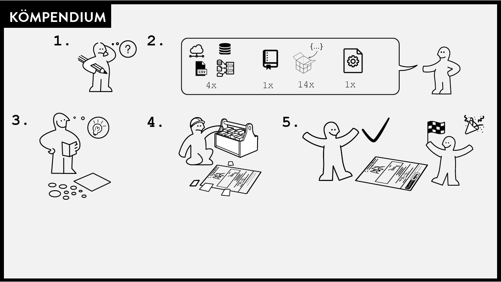
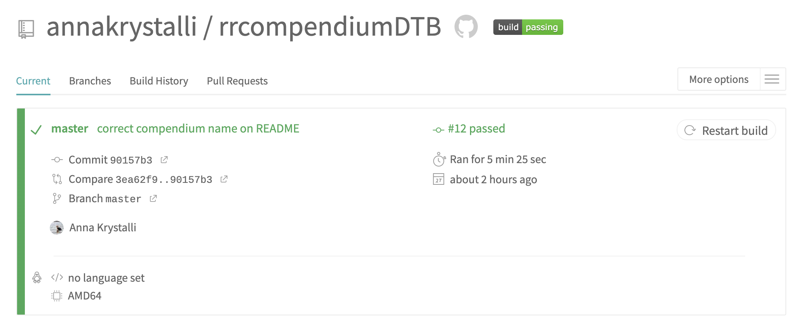
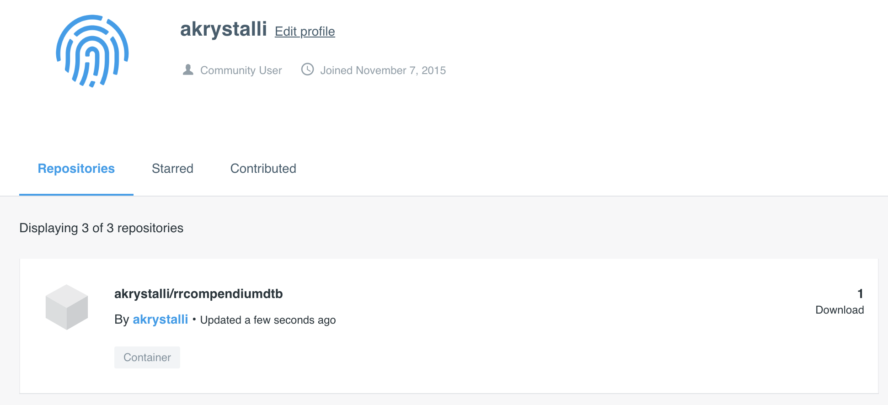
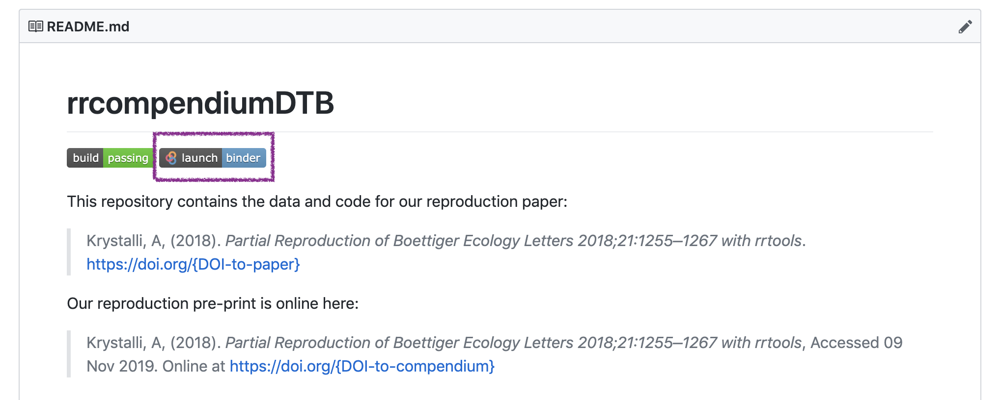
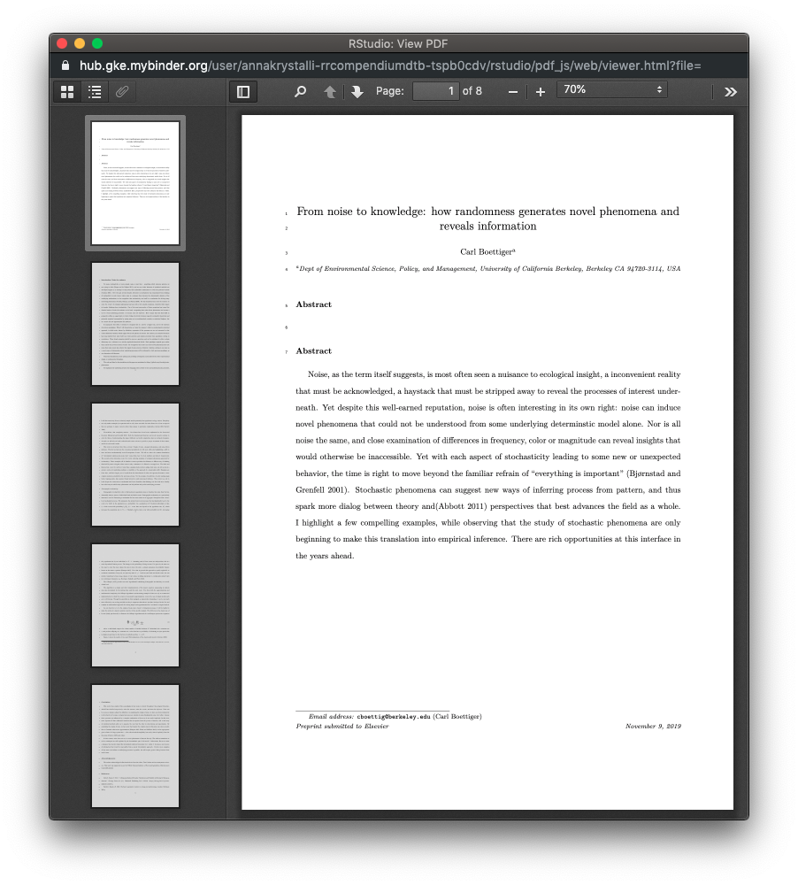
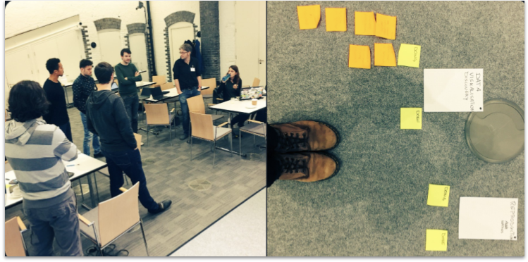
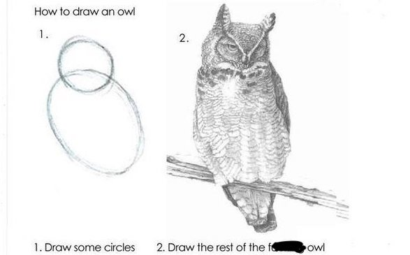
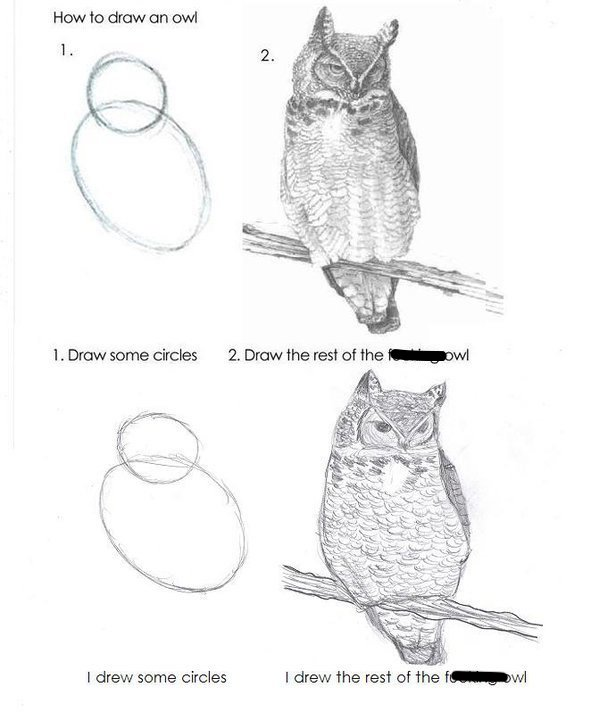
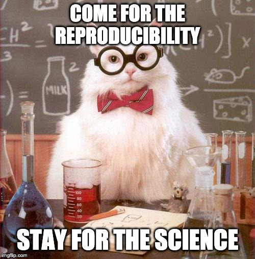
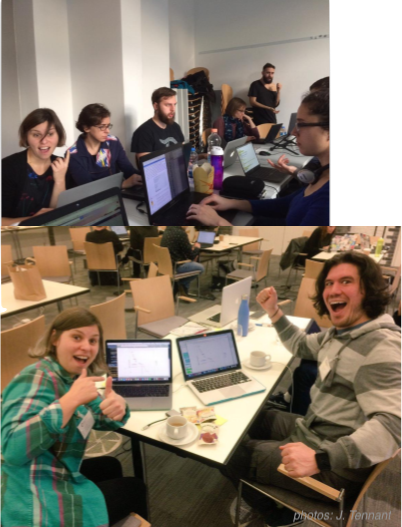

layout: true

<div class="my-footer"><span> TUoS Open and Reproducible Research Workshop    
&emsp;&emsp;&emsp;&emsp;&emsp;&emsp;&emsp;&emsp;&emsp;&emsp;&emsp;&emsp;&emsp;
&emsp;&emsp;&emsp;&emsp;&emsp;&emsp;&emsp;&emsp;&emsp;&emsp;&emsp;&emsp;&emsp;
         <a href="https://twitter.com/annakrystalli">     <i class="fab fa-twitter"></i> @annakrystalli </a> 
   </span>
   </div>


```{r setup, include=FALSE}
library(magrittr)
```


---
# `r emo::ji("wave")` Hello

### me: **Dr Anna Krystalli**

- **Research Software Engineer**, _University of Sheffield_
    + twitter **@annakrystalli**
    + github **@annakrystalli**
    + email **a.krystalli[at]sheffield.ac.uk**
    
- **Editor [rOpenSci](http://onboarding.ropensci.org/)**

- **Core Team:** [ReproHack](https://github.com/reprohack/reprohack-hq)

<br>

### slides: **bit.ly/r-in-repro-research-dc-wr**

???

Hi I'm Anna
- I'm an RSE at the Universiy of Sheffield
- An editor for rOpenSci 
- And a core team member of the ReproHack project

ANd you can find these slides at the following link

---
class: inverse, center, middle

# Motivation

???

I'm going to start with some motivating background

---


# Calls for reproducibility

> ### **Reproducibility** has the potential to serve as a **minimum standard for judging scientific claims** when full independent replication of a study is not possible.

 <br>


.center[

]
.img-attr[Reproducible Research in Computational Science
_ROGER D. PENG, SCIENCE 02 DEC 2011 : 1226-1227_
]
<br>

???

- I'm sure most by now have heard about the reproducibility crisis.

- I don't want to go into to much detail about the many and varied drivers of the crisis and discussions about the implications.

- but one thing that most would agree on is that the **publication system** as it stands is **not fit for validating modern research** which is increasingly underlaid by more and complex computational workflows

We have been making progress though, with computational reproducibility, _the ability to reproduce a result from the original code and data_ being put forward as a minimum standard for validating research findings

---
# Is code and data enough?

.center[

]

.img-attr[slide: [_Karthik Ram: rstudio::conf 2019 talk_](https://github.com/karthik/rstudio2019)]

???

- The good news is that this recognition has lead to more code and data being published.

- But that hasn't necessarily made research more reproducible. 

- Often trying to working with them feels a lot like this experience depicted here where you download some materials, start playing around, can’t get them to work and soon give up.


- This can be because of difficulty recreating a complex computational environment or something as simple as missing documentation. 

- In truth, it's not really surprising because still, **training in practices and standards** for researchers is **still lagging** despite demands for reproducibility.


---

# R for Open Reproducible Research

## A whistle-stop tour of tools, practices and conventions in R for more:

???

The motivation for this talk was to give a A whistle-stop tour of tools, practices and conventions if you are a researcher working in R that can help make your work more:

--

- ### **Reproducible**
--

- ### **Robust**
--

- ### **Transparent**
--

- ### **Reusable**
--

- ### **Shareable** research materials

???

A few caveats:

- I appreciate that folks might not be using R in their work. If you are programming and using another language, while the specific R functions and tools I mention might not be applicable, the principles of what they are trying to achieve will be.  

This is a long slide deck! And I won’t be able to get through all of it. But the slides are packed with links to further info so when I’ve given this talk before, folks have appreciated being able to browse the content so feel free to explore in more detail in your own time,

---
class: inverse, center, middle

# Project management


.img-attr.bottom[Icon by [Freepik](https://www.freepik.com/) from [flaticon.com](www.flaticon.com)]


???

I'm going to start with some tips on project management

---

# Rstudio Projects

## Use Rstudio projects to keep materials associated with a particular analysis together

<br>
 
.pull-left[
- **Self contained** and **portable**
- **Working directory set to root** of project on launch
- **Fresh session** everytime the project is launched

See Jenny Bryan's post on [**project oriented workflows**](https://www.tidyverse.org/articles/2017/12/workflow-vs-script/) for more details
]

.pull-right.center[

**File > New Project > New Directory**


]


???

First of all, how to organise your materials associated with a project

- If your working in R, I recommend you work in Rstudio, which is an IDE that makes working with R code a lot easier

- I also recommend you organise your work into Rstudio projects.
- A project is, in essence, a folder and the idea is that it contains everything you need to run your analysis.

So it's 

- **Self contained** and **portable**, making easier to share or move around
- WHen you open it, the **Working directory set to root** of project
- And you also start with a **Fresh session** everytime the project is launched
---
background-image: url('assets/my_awesome_project.png')
background-size: contain

???

- This is what a project looks like when launched
- Here's the working directory set to root
- You can see the environment is empty 
- and you can browse all the files in the project in the files tab

---
# `r emo::ji("package")` `here`

## Use `r emo::ji("package")` `here` to create robust relative paths

<br>

.pull-left[

- **Robust paths relative to project root**
  + portable
  + independent of:
     - working directory
     -  source code location

]

.pull-right.center[


]

```{r}
here::here()
```


```{r}
here::here("data", "summaries.csv")
```

.img-attr.right[Icon by [Freepik](https://www.freepik.com/) from [flaticon.com](www.flaticon.com)]


???

Having your work organised in a self contained folder also means you can write robust path names.

And for this I recommend using relative path names to the root directory. EVen better, you can use package `here` 

- Running the function with no arguments returns the root path of the project
- You can supply a vector of character strings to build paths within the project like I've done here.

- The important point is that these will evaluate correctly on anyones machine, which wouldn't be the case if for example I had hard coded the parent directory path, and makes your paths:

- **Robust relative to project root**
  + portable
  + independent of:
     - working directory
     -  source code location
---

# Dependency management

### Minimal approach

##### include session info

```{r, eval=FALSE}
sessionInfo()
```


##### include an `install.R` script

```{r eval=FALSE}
install.packages("dplyr")
install.packages("purrr")
```


.pull-left[

### Most robust approach

##### use `r emo::ji("package")` `renv` (previously `packrat`) 

- Create and manage a per project library of packages
- intialise during project set up
]

.pull-right[

]

_will revisit later on_

???

Another really important consideration and very common sticking point is sufficient management of dependencies.

A minimal approach would be to print your session information somewhere in your documentation. This includes system information as well as loaded packages and their versions

ALso include **executable script** to install necessary packages to make it easier for others to set up their projects, for example by including a `install.R` script.

A more robust approach would be to use package `renv` which creates a separate package library for each project which is included in the project. This means when you share your project, you are sharing the exact versions of packages used for your analysis.

We'll revisit this topic with an intermediate approach when we talk about packaging code.

---

class: inverse, center, middle

# Version Control

???

Let's move on to another very important topic when managing project, version control
---

# Version Control

### What is it? `r emo::ji("thinking")`

The **management of changes** to documents, computer programs, large web sites, and other collections of information.

### Git 

Open source (free to use) **Version control software.**

### GitHub 

A **website** (https://github.com/) that allows you to **store your Git repositories online** and makes it easy to collaborate with others.

???

Let'start by defining a few terms:

- Version control refers to the management of changes to documents, computer programs, large web sites, and any other collections of information.

- git is the open source software that allows us to manage such changes on out local machine

- while **GitHub** is a website or hub where anyone can share their git repositories online, enabling collaboration

---
# Why use them in research? 

.pull-left[
### Exhibit A


.img-attr[Image: xkcd CC BY-NC 2.5 ]
]

.pull-right[
### Exhibit B

 
 
.img-attr[ Image: Jorge Cham www.phdcomics.com]

]

???

Now, why should we use them in research?

- For starters, by regularly saving your work with a version control system, you can recover your work from accidental losses (especially if you've saved a copy on Github too). You can also return to previous states of your work

- Another really important feature is that it helps with the familiar to many yet all too common situation depicted here, because it helps manage chnages by many contributors in an efficient way. 
---

# Git, Github & Rstudio

#### Before: git only through the terminal `r emo::ji("cry")`

???

Now, in the past you could only run git in the terminal. Well actually that's not quite correct, there were other programs you could use it through but you would have to leave R, go to the other program, record all your changes and then go back to R to continue working.

--

***

## Now: Rstudio + `usethis` `r emo::ji("package")` == `r emo::ji("heart")` `Git` & `GitHub` `r emo::ji("star_struck")`

.center[

]

???

Rstudio integration with git and package `usethis` have made it much easier to version control your R projects! 

This guy knows! He's been using it since it first came out!
---
# Configure git & GitHub

### Configure git

**Check your configuration**

```{r, eval=FALSE}
usethis::git_sitrep()
```


**Set your configuration**

Use your github username and and the email you used to sign-up on GitHub

```{r, eval=FALSE}
usethis::use_git_config(
    user.name = "Jane",
    user.email = "jane@example.org")
```

???

So let's have a look at working with git and GitHub through R & Rstudio

First you'll need to configure git so that it knows who you are, important information when you are managing changes. There are some handy functions in package `usethis` for this.

- You can check your settings using function `git_sitrep`
- You can configure your setting using `use_git_config` and supplying your name and ideally the email address you have used to sign up to GitHub.

---
# Configure GitHub authentication

### Get GITHUB Personal Authorisation Token

```{r, eval=F}
usethis::browse_github_pat()
```


???

Now, to communicate with GitHub programmatically you will also need a personal authentication token.

You get this from GitHub but you can use `usethis` function `browse_github_pat` which navigates to the correct page on the GitHub. The initial settings for your PAT are pretty sensible but you can change any permissions for your PAT here.

- Once it's generated, you need to copy the token

---

### Store in `.Renviron` file

```{r, eval=F}
usethis::edit_r_environ()
```


???

Which you will then paste to you `.Renviron` file like so.

Now the Renviron file is a file that:
- lives in your home directory, 
- that is loaded everytime R launches and 
- it's where you can store system level environment variables which will be available during your R session

To open the file you can use handy `usethis` function `edit_r_environ`

---
# Initialise git


### Initialise **Rstudio project** with Git by **just checking a box!**

It's now **a repository**


Forgot to? use `usethis::use_git()`

???

Now that you are all set up, you are ready to initialise your analysis projects with git.

Initialising a project with git is really easy in Rstudio by clicking a box when you are first creating it. 

This is now called a repository.

But is you do forget, you can always use function `usethis::use_git()` in your project.


---
# Git panel

## Integrated graphical user interface

<br>

.center[

]

???

Rstudio has an integrated `git` panel through which you can perform the most common version control functions.

So let's have a quick look at what a typical git workflow looks like:

---
# Git Rstudio workflow

.pull-left[
#### view file status


#### stage files

]

.pull-right[
#### commit changes

]


???

Here we are looking at the git pane

---

# Share on GitHub

#### Create repo


```{r, eval=FALSE}
usethis::use_github(protocol = "https")
```


#### Push further changes


???

Once you commited your files and changes locally, you might want to share them on GitHub to make the work accessible by yourself or others online.

To do so, you can use `usethis::use_github(protocol = "https")` and specifying the protocol so that it uses your GitHub PAT.

This will create a repository on GitHub in your account and push all materials up to GitHub.

Any further changes you make locally, you can push up to GitHub by using the push button.

---

# Anatomy of a GitHub Repo

- **`README`**. Explain what your project is, and how to use it. 
  + `usethis::use_readme_md()`
  + `usethis::use_readme_rmd()`

- **`LICENSE`**. Without a licence, the contents of the repository are technically closed. 
  + Examples licence [MIT](https://tldrlegal.com/license/mit-license): `usethis::use_mit_license(name = "Anna Krystalli")`
  + `?licenses`: details of functions available to generate licenses
  + [https://choosealicense.com/](https://choosealicense.com/) help on choosing a licence.

    
- **`CONTRIBUTING.md`** - guidelines for contributors.
  + `usethis::use_tidy_contributing()` provides a relatively strict but instructive template

- **`CODE_OF_CONDUCT.md`** set the tone for discourse between contributors. 
  + `use_code_of_conduct()`

???

Now let's go through the anatomy of a GitHub repository.

There's a number of common documents you might find which I've listed here, and I've added some functions in R that can help you generate them.

---
# GitHub issues

### use GitHub issues to plan, record and discuss tasks.

.pull-left[
#### issues


]

.pull-right[
#### projects

]


???

Finally another really useful feature of GitHub repositories I want to mention are GitHub issues.

These are basically a task tracker. You can open issues relating to a specific task you need to accomplish, a problem you are having with the code, or just to discuss something. 

The nice thing about using them is that it keeps discussions about the project attached to the project rather that disparate email threads.

The project board also allows you to organise them and visually track progress of your various tasks.

---

class: inverse, center, middle

# Literate programming with Rmarkdown


???

Next, let's talk about another really relevant topic for researchers, literate programming.

---

# Literate programming


Programming paradigm first introduced by **Donald E. Knuth**. 

> ### Treat program as literature to be understandable to human beings

> <br>

> - focus on the logic and flow of human thought and understanding
> - single document to integrate data analysis (executable code) with textual documentation, **linking data, code, and text**


---

# Literate programming in R

### Rmarkdown (`.Rmd`) integrates:

- a **documentantion** language (`.md`)

- a **programming** language (`R`)

- functionality to **"knit" them together** through `r emo::ji("package")` `knitr`

<br>

### features

- `r emo::ji("white_check_mark")` provides a framework for writing narratives around code and data

- `r emo::ji("white_check_mark")` Code re-run in a clean environment every time the document is "knit"

???

In R, our framework for literate programming is called Rmarkdown and it integrates:

- a **documentantion** language (`.md` but can include html)

- a **programming** language (`R` by default but also has engines to support a number of different languages including python, sql, stan ao)

- functionality to **"knit" them together** through `r emo::ji("package")` `knitr`

---
background-image: url('assets/1728_TURI_Book sprint_25 pandoc_rmd_040619.jpg')
background-size: contain

# Rmarkdown outputs


.img-attr[This image was created by Scriberia for The Turing Way community and is used under a CC-BY licence.]

???

The cool thing about markdown is the richness of the types of documents you can output to.

The most common is to html document but you can also create:
- pdf,

-... and even word.

---
# Rmarkdown to html

#### **File > New File > RMarkdown... > Document**

.pull-left[

]

.pull-right.top[

]


???

Let's have a look at an example document which is being knit to html

On the lleft you have your rmd document.
- The top is the YAML header that contains document level metadata such as:
  - author, title, output type and styling settings like themes and whether to include a toc
  
- Below is an example of markdown, and the various notations render to specific formatting in the knit document

- Finally, these are the code chunks containing executable code and the offer a variety of options to control how they are displayed, how they are evaluated and how they are output.

---
# Applications in research

### Rmd documents can be useful for a number of research related [long form documentation](http://r-pkgs.had.co.nz/vignettes.html) materials:

.pull-left[

<br>

- Documentation of code & data (eg `r emo::ji("package")` [DataMaid](https://github.com/ekstroem/dataMaid))
- Electronic Notebooks
- Supplementary materials
- Reports
- Papers
]

.pull-right[

]


???

So why should we care about these documents in research?

---

# Publish to the web for free!


- **RPubs**: Publish rendered rmarkdown documents on the web with the click of a button in Rstudio <http://rpubs.com/>


- **GitHub**: Host your site through [`gh-pages`](https://pages.github.com/) on GitHub. Enable in GitHub repo `r emo::ji("gear")`**Settings**


- **Netlify**: Connect a repository, build your site, deploy and host for free. <https://www.netlify.com/>

???

These technologies are extremely empowering. Because they generate html outputs, and through a number of available options, they allow us to publish to the web for free! This is how I learned.

A few of the options available to us are:

- Netlify, richer features and easy automated builds
---

class: inverse, center, middle

# Rmarkdown extensions

Many great packages and applications build on rmarkdown.

All this makes it [incredibly versatile](https://rmarkdown.rstudio.com/gallery.html).

???

The other really cool thing about Rmarkdown is that there are many many useful extensions built on it for a variety of useful purposes, making it extremely versatile!

So once you master rmarkdown basics, you've got a good foundation building more complicated collections of documents

---

# [bookdown](https://bookdown.org/yihui/bookdown/)

#### Create and mantain online books

Authoring with R Markdown. Offers:

- cross-references, 
- citations, 
- HTML widgets and Shiny apps,
- tables of content and section numbering

The publication can be exported to HTML, PDF, and e-books (e.g. EPUB)

### Examples


- [rOpenSci Software Review policies](https://ropensci.github.io/dev_guide/)
- [Geocomputation in R](https://geocompr.robinlovelace.net/)

### [Thesisdown](https://github.com/ismayc/thesisdown)

An updated R Markdown thesis template using the bookdown package

???

One of the most useful extensions for research in my opinion is the `bookdown` package which allows users to create and maintain online books.

There's a number of added features like
- cross-references, 
- citations, 
- HTML widgets and Shiny apps,
- tables of content and section numbering

The publication can be exported to HTML, PDF, and e-books (e.g. EPUB)

I've listed a number of examples that you can browse through but I'd like to highlight package `thesisdown`, which is a thesis template built on bookdown! 

---

# [blogdown](https://bookdown.org/yihui/blogdown/)

## For creating and mantaining blogs through R.

Check out <https://awesome-blogdown.com/>, **a curated list of awesome #rstats blogs in blogdown** for inspiration!

[](https://masalmon.eu/)


???

A really useful packages for researchers is the blogdown package which makes it easier to build and maintain an academic website. 

It also makes it really easy to blog about your work, sharing code and analyses.
---
# presentations

## A number of existing frameworks

### [xaringan](https://github.com/yihui/xaringan) `r emo::ji("package")` Presentation Ninja 幻灯忍者 · 写轮眼

.center[
[](https://slides.yihui.name/xaringan/#1)
]


???

Finally, you can also create slides using rmarkdown, like the slides I'm using at the minute. I really like using html slides as you can make them interactive.

Importantly it makes it really easy to present code or code output.
---
class: inverse, center, middle

# Managing code

---
# Managing analysis code

## Separate function definition and application


.pull-left[
<br>

- In the beginning: **many lines of directly executed code in a single analysis script.** 

- As it matures: **reusable chunks -> functions**. 

.pull-right[

]


???

- When a project is new and shiny, an **analysis script usually contains many lines of directly executated code.** 

- As it matures, **reusable chunks get pulled into their own functions**. 

- as **functions defined in separate R scripts, The actual analysis scripts then become relatively short and hopefully easier to follow, ** 

- But what is the best way to manage such modular code?


---

# R Package Structure

## Used to share functionality with the R community

- Useful **conventions**

- Useful **software development tools**

- Easy **publishing** through GitHub

<br>

.center[

]

???

By suggestion to you is to follow the language conventions for packaging code. In R that would be **R package structure**. 

The good thing about following this structure is that it provides:

- useful convention so that you don't have to invent your own and can maintain the same structure across your projects

- This convention in turn allows us to use all the tools used for software developing, documenting, testing and distributing R code!
---
# Build panel

## Integrated graphical user interface

<br>

.center[

]

???

One of the useful features if you organise your project as an R package is the build panel which, similar to the git panel, allows us to perform most common code development tasks at the push of a button.

Now, to manage your project as an R package you need to follow R package conventions, so let's have a look at them
---


# R Package conventions:

- **metadata**: in the **`DESCRIPTION` file**

- **functions** in **`.R` scripts** in the **`R/` folder**

- **tests** in the **`tests/` folder**

- **Documentation:**
    - _functions_ using **Roxygen notation**
    - _workflows_ using **`.Rmd` documents** in the **`vignettes/`** folder


---

# `DESCRIPTION` file

#### Package metadata

```
Package: gaitr
Type: Package
Title: Functions to support BMC gait analysis
Description: Helpers to analyse processed gait data.
Version: 0.0.9000
Authors@R: 
    c(person(given = "Anna",
             family = "Krystalli",
             role = c("aut", "cre"),
             email = "annakrystalli@googlemail.com"),
      person(given = "Lorenza",
             family = "Angelini",
             role = "aut",
             email = "l.angelini@sheffield.ac.uk"))
License: MIT + file LICENSE

```

???

The most important file in an R package is the `DESCRIPTION` file.

This holds important metadata about tyour package such as:
- Title
- description
- Version
- authorship details
- license details

---

# citation

```{r}
citation("gaitr")
```

???

The cool thing about managing metadata about your project through the `DESCRIPTION` file is that you can then use R function `citation` on your project to autogenerate a citation in both text and bibtex format!

---
# Dependency management


It’s the job of the `DESCRIPTION` file to **list the packages that your code depends on**.

```
Imports: 
    dplyr,
    purrr,
    here,
    broom,
    tibble,
    magrittr,
    janitor,
    ggplot2
Suggests: 
    knitr,
    rmarkdown
```

#### add dependency

```{r, eval=FALSE}
usethis::use_package("forcats", type = "Imports")
```

???

The second important function of the `DESCRIPTION` file is keep track of project dependencies

- Imports are packages that are required for the package functions to work

- while `Suggest` packages might be required in testing or documentation but not necessarily by package functions.

- we can add packages to our `DESCRIPTION` file using `usethis` function `use_package`, the first argument being the name of the package we want to add and the second one being the type of dependency we want to specify.

---
# Functions in `R/`

### example function script

Create a new function `.R` file in the `R/` folder
```{r, eval=FALSE}

usethis::use_r("add")
```

```
R
└── add.R

0 directories, 1 files
```

???

As I mentioned, the other important convention to organising code as an R package is **storing our functions in `.R` scripts in an `/R` folder** in the root of our project.

To quickly create such a script in the correct location, we can use `usethis` function `use_r` and supply the name of the file we want to create as the argument

This creates the script with the name we specified, `add.R` in the `R` folder

---
# Document functions with `Roxygen`

- Create help files on build (autogenerated `.Rd` files in `man/`)
- Specify which functions are exported (autogenerated `NAMESPACE`)

```{r}
#' Add together two numbers.
#' 
#' @param x A number.
#' @param y A number.
#' @return The sum of x and y.
#' @examples
#' add(1, 1)
#' add(10, 1)
#' @export
add <- function(x, y) {
  x + y
}
```


???

Another important aspect to managing our R code is documenting it.

In R we use an annotation language called `roxygen` to document our R functions, indicated by the `#'` line prefix, and here I'm documenting a simple function that adds x & y which I created in our `add.R` script

This allows us to document:
- function descriptions
- function input details through the `@params` slots
- function outputs through the `@return` slot
- examples of how to use the function and most importantly
- the `@export` slot specifies that the function should be made available to users when the package is loaded.

---

# [tests](http://r-pkgs.had.co.nz/tests.html)

## Tests provide confidence in what the code is doing.

.center[

]

???

Once we have written our functions, it's a good idea, especially if they are critical to our analysis, to write test for them so we can confirm that they are behaving as we expect them to

Again, by managing our code as an R package means that **tools developed for testing R code are available for us to use**.

---

# Example test

```{r, eval=FALSE}
usethis::use_test("add")
```

Creates a `tests/` folder with the following files

```
tests
├── testthat
│   ├── test-add.R
└── testthat.R
```
##### test-add.R

```{r, eval=FALSE}
context("test-add")

test_that("add works", {
  expect_equal(add(2, 2), 4)
})
```


???

Tests live in a `/tests` folder but again, there's a handy function in `usethis`, `use_test` to help us create our test scripts in the correct place.

- By using the same name as the test script, the function names the script appropriately so we can quickly find where the tests associated with a particular function script are located.

- Here I've written a simple test that confirms that summation is working correctly

- To run the tests, I click the `test` button on the build panel.If any of the tests fail I will get an error, otherwise the tests proceed silently.

---
# Continuous Integration w/ Travis

## A cloud testing framework for automating your tests
.pull-left[
- Monitor the effect of changes to the code
- Safe onboarding of contributions


### Start with a `.travis.yml` file

```{r, eval=FALSE}
usethis::use_travis()
```

]

.pull-right.center[
<br>
<br>
.center[]

]
---
# `.travis.yml`

#### Resulting `.travis.yml` file template

```
language: R
sudo: false
cache: packages

```
#### instructions to enable TRAVIS CI

```
✔ Writing '.travis.yml'
✔ Adding '^\\.travis\\.yml$' to '.Rbuildignore'
● Turn on travis for your repo at https://travis-ci.org/profile/annakrystalli
● Copy and paste the following lines into '/Users/Anna/Documents/workflows/talks/README.md':
  <!-- badges: start -->
  [](https://travis-ci.org/annakrystalli/talks)
  <!-- badges: end -->
```
---
# Continuous Integration w/ GitHub Actions

You can now run Continuous Integration on GitHub! See Jim Hester's rstudio conf 2020 talk on [Azure Pipelines and GitHub Actions](https://resources.rstudio.com/rstudio-conf-2020/azure-pipelines-and-github-actions-jim-hester)

- `usethis::use_github_action_check_release()`: installs the **latest release R** version on **macOS** and runs `R CMD check` via the rcmdcheck package.
- `usethis::use_github_action_check_standard()`: runs `R CMD check` on the **three major OSs** (linux, macOS and Windows) on the **release version of R and R-devel**.
- `usethis::use_github_action_check_full()`: installs the **last 5 minor R versions** and runs `R CMD check` on the **three major OSs** (linux, macOS and Windows).


All github actions added to `.github/workflows` directory of a package.

---
# Tips on Tests and CI

### **Use other R package tests & CI configurations as inspiration**

- Look in `tests/` for ideas on suitable tests.

- Look at CI configuration files (eg `travis.yml` or files in `.github/workflows`) to set up testing environment.

---

class: inverse, center, middle


# Research compendia


???

Now, I want to try and bring all this together and talk about research compendia

So:

- What is a research compendium and why is it important?

---
# A Research compendium

### The paper is the advertisement

> “an article about computational result is advertising, not scholarship. The **actual scholarship is the full software environment, code and data, that produced the result.**”

*John Claerbout paraphrased in [Buckheit and Donoho (1995)](https://statweb.stanford.edu/~wavelab/Wavelab_850/wavelab.pdf)*


### The concept of a Research Compendium

>“
...We introduce the **concept of a compendium**
as both a **container for the different elements**
that make up the document and its computations (i.e. text, code, data, ...), and as a **means for distributing, managing and updating the
collection**."

[_Gentleman and Temple Lang, 2004_](https://biostats.bepress.com/bioconductor/paper2/)


???

Well, let's start with the following quote which states that an article about a computational result is advertising, not scholarship. The **actual scholarship is the full software environment, code and data, that produced the result.**

Given this, it seems important to not focus only on the paper but to start defining what form exactly the published materials associated with a computational result should take.


In response to this, Gentleman & Land proposed the concept of a research compendium. For me it's important that they gave this collection of materials a name and described it's purpose:
- both a **container for the different elements**
that make up the document and its computations (i.e. text, code, data, ...), 
- and as a **means for distributing, managing and updating the
collection**

---
# Research compendia in R

.pull-left[

]

.pull-right[


]

.img-attr[slides: [_Karthik Ram: rstudio::conf 2019 talk_](https://github.com/karthik/rstudio2019)]

<br>

**Ben Marwick, Carl Boettiger & Lincoln Mullen (2018)** [_Packaging Data Analytical Work Reproducibly Using R (and Friends)_](https://peerj.com/preprints/3192/)


???

In R, the research community members it a step further and proposed a structure for a research compendium based around R package structure that is modular and flexible to project complexity.

So here you see a mple structure on the left that uses only a DESCRIPTION file to store metadata about the paper.


While a more complex project, like the one here on the right, can borrow more elements form the package structure, like:
- functions in an `R/` folder
- tests
- continuous integration


---

# Example compendium


.pull-left[

**Paper**:

##### Boettiger, C. (2018) *From noise to knowledge: how randomness generates novel phenomena and reveals information*. <https://doi.org/10.1111/ele.13085>


]


.pull-right[

**Compendium**

##### *cboettig/noise-phenomena: Supplement to: "From noise to knowledge: how randomness generates novel phenomena and reveals information"* http://doi.org/10.5281/zenodo.1219780


]

???

I'm going to use an example compendium, 
- which you can find at it's own DOI, 
- that was published along with this paper 
- to demonstrate the building of a research compendium

---

# `rrtools`: Creating Compendia in R

### "The goal of rrtools is to provide **instructions, templates, and functions** for making a **basic compendium** suitable for writing **reproducible research with R**."


<br>

--

### Install [`rrtools`](https://github.com/benmarwick/rrtools) from GitHub
```{r, eval=FALSE}
# install.packages("devtools")
devtools::install_github("benmarwick/rrtools")
```

???

And I'm going to use this great package, `rrtools` that was developed initially by one the paper authors, ben marwick, whose  is 

to provide **instructions, templates, and functions** 

for making a **basic compendium** 

suitable for writing **reproducible research with R*


It's onlu available on github atm so you'll need to install it from there
---
# Create compendium


```{r, eval=FALSE}
rrtools::create_compendium("~/Documents/workflows/rrcompendium")
```


```
✔ Setting active project to '/Users/Anna/Documents/workflows/rrcompendium'
✔ Creating 'R/'
✔ Creating 'man/'
✔ Writing 'DESCRIPTION'
✔ Writing 'NAMESPACE'
✔ Writing 'rrcompendium.Rproj'
✔ Adding '.Rproj.user' to '.gitignore'
✔ Adding '^rrcompendium\\.Rproj$', '^\\.Rproj\\.user$' to '.Rbuildignore'
✔ Opening new project 'rrcompendium' in RStudio
✔ The package rrcompendium has been created
✔ Opening the new compendium in a new RStudio session...

Next, you need to:  ↓ ↓ ↓ 
● Edit the DESCRIPTION file
● Use other 'rrtools' functions to add components to the compendium
```

---

# Prepare for GitHub


```{r, eval=FALSE}
rrtools::use_readme_rmd()
```

.pull-left[

```

✔ Creating 'README.Rmd' from template.
✔ Adding 'README.Rmd' to `.Rbuildignore`.
● Modify 'README.Rmd'
✔ Rendering README.Rmd to README.md for GitHub.
✔ Adding code of conduct.
✔ Creating 'CONDUCT.md' from template.
✔ Adding 'CONDUCT.md' to `.Rbuildignore`.
✔ Adding instructions to contributors.
✔ Creating 'CONTRIBUTING.md' from template.
✔ Adding 'CONTRIBUTING.md' to `.Rbuildignore`.

```
]

.pull-right[


]


---
# Create analysis folder

```{r, eval=FALSE}
rrtools::use_analysis()
```


```
✔ Adding bookdown to Imports
✔ Creating 'analysis' directory and contents
✔ Creating 'analysis'
✔ Creating 'analysis/paper'
✔ Creating 'analysis/figures'
✔ Creating 'analysis/templates'
✔ Creating 'analysis/data'
✔ Creating 'analysis/data/raw_data'
✔ Creating 'analysis/data/derived_data'
✔ Creating 'references.bib' from template.
✔ Creating 'paper.Rmd' from template.

Next, you need to:  ↓ ↓ ↓ ↓ 
● Write your article/report/thesis, start at the paper.Rmd file
● Add the citation style library file (csl) to replace the default provided here, see https://github.com/citation-style-language/
● Add bibliographic details of cited items to the 'references.bib' file
● For adding captions & cross-referencing in an Rmd, see https://bookdown.org/yihui/bookdown/
● For adding citations & reference lists in an Rmd, see http://rmarkdown.rstudio.com/authoring_bibliographies_and_citations.html
```

---
# `paper.Rmd` to `paper.pdf`


.pull-left[

**Rmd**


]


.pull-right[

**pdf**


]


---
# Capturing dependencies

```{r, eval=FALSE}
rrtools::add_dependencies_to_description()
```

```
Imports: 
    bookdown,
    ggplot2 (>= 3.0.0),
    ggthemes (>= 3.5.0),
    here (>= 0.1),
    knitr (>= 1.20),
    rticles (>= 0.6)
    
```

---
# Further Helpers


## `r emo::ji("package")` `rticles`

Contains a **suite of custom R Markdown templates for popular journals**, simplifying the creation of documents that conform to research paper submission standards. 

---

# `r emo::ji("package")` `citr` 

RStudio Add-in to **Insert Markdown Citations**


---
class: inverse, center, middle

# Reproducible Computational Environments

---
# Why isn't sharing code enough?


### Case Study: Sharing a Geospatial Analysis in R

***

#### On a computer without System Library `GDAL` `r emo::ji("x")`

.pull-left[


```r
package ‘rgdal’ successfully unpacked 
and MD5 sums checked

configure: gdal-config: gdal-config
checking gdal-config usability... ./configure: 
line 1353: gdal-config: command not found
no
*Error: gdal-config not found
...
*ERROR: configuration failed for 
package ‘rgdal’

```
]

.pull-right[
<br>
<br>

.img-attr[slide: [_Karthik Ram: rstudio::conf 2019 talk_](https://github.com/karthik/rstudio2019)]

]

---
# What are Docker containers?


## standardized units of software

**package up everything needed to run an application:** _code, runtime, system tools, system libraries_ and settings in a lightweight, standalone, executable package 

--

- #### **Dockerfile**: Text file containing recipe for setting up computation environment.

- #### **Docker Image**: Executable **built** from the **Dockerfile** with all required dependencies installed. Can have many images from the same `Dockerfile`.

- #### **Docker Container**: **Docker Images** become containers at **runtime**

.center[

]

---

# Rocker on DockerHub

#### using the `rocker/geospatial` Docker Image `r emo::ji("white_check_mark")`


***

.pull-left[


]

.pull-right[
<br>
<br>

.img-attr[slide: [_Karthik Ram: rstudio::conf 2019 talk_](https://github.com/karthik/rstudio2019)]


]


---
# Create Dockerfile w/ `rrtools`

```{r, eval=FALSE}
rrtools::use_dockerfile()
```

```r
✔ Creating 'Dockerfile' from template.
✔ Adding 'Dockerfile' to `.Rbuildignore`.
● Modify 
Next: 
 * Edit the dockerfile with your name & email
 * Edit the dockerfile to include system dependencies, such as linux libraries that are needed by the R packages you're using
 * Check the last line of the dockerfile to specify which Rmd should be rendered in the Docker container, edit if necessary
```

---
# `Dockerfile`

```{bash, eval= FALSE}
# get the base image, the rocker/verse has R, RStudio and pandoc
FROM rocker/verse:3.6.0

# required
*MAINTAINER Anna Krystalli <annakrystallil@googlemail.com>

COPY . /rrcompendiumDTB

# go into the repo directory
RUN . /etc/environment \
  # Install linux depedendencies here
  # e.g. need this for ggforce::geom_sina
  && sudo apt-get update \
  && sudo apt-get install libudunits2-dev -y \
  # build this compendium package
  && R -e "devtools::install('/rrcompendiumDTB', dep=TRUE)" \
  # render the manuscript into a docx, you'll need to edit this if you've
  # customised the location and name of your main Rmd file
* && R -e "rmarkdown::render('/rrcompendiumDTB/analysis/paper/paper.Rmd')"
```
---

# Docker + Travis

## Create `.travis.yml`

```{r, eval=FALSE}
rrtools::use_travis()
```

```r
✔ Creating '.travis.yml' from template.
✔ Adding '.travis.yml' to `.Rbuildignore`.
Next: 
 * Add a travis shield to your README.Rmd:
[](https://travis-ci.org/annakrystalli/rrcompendiumDTB)
 * Turn on travis for your repo at https://travis-ci.org/annakrystalli/rrcompendiumDTB
** To connect Docker, go to https://travis-ci.org/, and add your environment 
*variables: DOCKER_EMAIL, DOCKER_USER, DOCKER_PASS to enable pushing to the 
*Docker Hub
```
---
# `.travis.yml`

```bash
env:
  global:
  - REPO=$DOCKER_USER/rrcompendiumdtb

sudo: required

warnings_are_errors: false

language: generic

services:
  - docker

before_install:
* - docker build -t $REPO .
```
Create & build image using dockerfile, i.e. compile pkg and render Rmd to Word doc

---
# `.travis.yml`


Push our custom docker image to docker hub, env vars stored on travis-ci.org
```bash

after_success:
* - docker login -u $DOCKER_USER -p $DOCKER_PASS
  - export REPO=$DOCKER_USER/rrcompendiumdtb
  - export TAG=`if [ "$TRAVIS_BRANCH" == "master" ]; then echo "latest"; else echo $TRAVIS_BRANCH ; fi`
  - docker build -f Dockerfile -t $REPO:$COMMIT .
  - docker tag $REPO:$COMMIT $REPO:$TAG
  - docker tag $REPO:$COMMIT $REPO:travis-$TRAVIS_BUILD_NUMBER
* - docker push $REPO

```


### Travis repository settings


---

# Travis build passes!


.center[
[](https://travis-ci.com/annakrystalli/rrcompendiumDTB)
]

---
# Image on Dockerhub



.center[

##### Docker Image: <https://hub.docker.com/repository/docker/akrystalli/rrcompendiumdtb>

##### Compendium Repository: <https://github.com/annakrystalli/rrcompendiumDTB>

]
---
# Working with the Docker Image

#### Pull it from Dockerhub.

```bash
docker pull akrystalli/rrcompendiumdtb:latest
```


#### Run in Rstudio in your browser

More on [using the RStudio image](https://github.com/rocker-org/rocker/wiki/Using-the-RStudio-image)

```{bash,  eval=FALSE}

docker container run -e PASSWORD=<password> -e USERID=$UID -p 
8787:8787 --detach --name rrcompendiumdtb
akrystalli/rrcompendiumdtb:latest

```


---
class: inverse, center, middle

# Binder

---
background-image: url('assets/binder.png')
background-size: contain

# What is binder? https://mybinder.org/

---
background-image: url('assets/1728_TURI_Book sprint_45 repo2docker_040619_v2_MK.jpg')
background-size: contain


# Binderhub Ecosystem


.img-attr[This image was created by Scriberia for The Turing Way community and is used under a CC-BY licence.]

---
background-image: url('assets/holepunch_readme.png')
background-size: contain

# Binder for R

---
background-image: url('assets/reproducible-data-analysis_033.png')
background-size: contain


# R repository options for Binder

.img-attr[slide: [_Karthik Ram: rstudio::conf 2019 talk_](https://github.com/karthik/rstudio2019)]

---

# Binderise your R projects w/ `holepunch`

### <https://github.com/karthik/holepunch>

```{r, eval=FALSE}
remotes::install_github("karthik/holepunch")

```

#### Create `.binder/Dockerfile`

```{r, eval=FALSE}
holepunch::write_dockerfile(maintainer = "Anna Krystalli") 
```

```r
→ Setting R version to 3.6.0
→ Locking packages down at 2019-11-09
✔ Dockerfile generated at ./.binder/Dockerfile
```
---
# `.binder/Dockerfile`

```bash
*FROM rocker/binder:3.6.0
LABEL maintainer='Anna Krystalli'
USER root
COPY . ${HOME}
RUN chown -R ${NB_USER} ${HOME}
USER ${NB_USER}


RUN wget https://github.com/annakrystalli/rrcompendiumDTB/raw/master/DESCRIPTION && R -e "options(repos = list(CRAN = 'http://mran.revolutionanalytics.com/snapshot/2019-11-09/'));
*devtools::install_deps(); devtools::install(); tinytex::install_tinytex()"

RUN rm DESCRIPTION.1; exit 0
```
---
# Add binder `README` badge

```{r, eval=FALSE}
holepunch::generate_badge()
```


```r
● Copy and paste the following lines into '/Users/Anna/Documents/workflows/compendia/rrcompendium-full/README.Rmd':
  <!-- badges: start -->
  [](https://mybinder.org/v2/gh/annakrystalli/rrcompendiumDTB/master?urlpath=rstudio)
  <!-- badges: end -->
  [Copied to clipboard]
```

.center[
[](https://mybinder.org/v2/gh/annakrystalli/rrcompendiumDTB/master?urlpath=rstudio)


]

---
background-image: url('assets/binder_rrcompendium.png')
background-size: contain

# Launched Binderised Compendium

--
.center[

]

---
class: inverse, center, middle
#  Reproducibility in Practice

---
# ReproHacks

## one day reproducibility hackathons

***

### **Mission:  Reproduce papers from code and data**

- Record experiences and feedback to authors

- Available soon: Publish Reproducibility Report in ReScience C

.pull-left[

]
.pull-right[

]
---
class: inverse, middle, center

# ReproHack Benefits

***

---
# Participants

.pull-left[
1. #### Practical reproducibility they can implement in their own work
]

.pull-right[

]

---

# Participants

.pull-left[
1. #### Practical reproducibility they can implement in their own work
]

.pull-right[

]

---

# Participants

.pull-left[
1. Practical reproducibility they can implement in their own work

2. #### Inspiration from working with other people’s code and data.
]

.pull-right[

]

---
# Participants

.pull-left[
1. Practical reproducibility they can implement in their own work

2. Inspiration from working with other people’s code and data.

3. #### Reproduction as community value
]

.pull-right[

]


---
# Authors


.pull-left[
1. #### Useful feedback on the reproducibility of their work

]

.pull-right[

]

---
# Authors


.pull-left[
1. Useful feedback on the reproducibility of their work

2. #### Appreciation for their efforts in making their work reproducible
]

.pull-right[

]

---

# Authors


.pull-left[
1. Useful feedback on the reproducibility of their work

2. #### Appreciation for their efforts in making their work reproducible
]

.pull-right[

]

---
# Authors


.pull-left[
1. Useful feedback on the reproducibility of their work

2. Appreciation for their efforts in making their work reproducible

3. #### An opportunity to engage others with their research.
]

.pull-right[

]

---

# Reproducing papers is fun!! 

.pull-left[

]

.pull-right[

<blockquote class="twitter-tweet"><p lang="en" dir="ltr">Huge thanks to <a href="https://twitter.com/EnviroKaty?ref_src=twsrc%5Etfw">@EnviroKaty</a> for submitting a fab 🦋 🦋🦋 paper to the <a href="https://twitter.com/hashtag/CCMcr19?src=hash&amp;ref_src=twsrc%5Etfw">#CCMcr19</a> <a href="https://twitter.com/hashtag/ReproHack?src=hash&amp;ref_src=twsrc%5Etfw">#ReproHack</a>! I had loads of fun reproducing the analysis for this really cool paper <a href="https://t.co/v1ww2D5xhg">https://t.co/v1ww2D5xhg</a> <a href="https://t.co/r8rYMAMvPm">pic.twitter.com/r8rYMAMvPm</a></p>&mdash; Jessica Ward (@JKRWard) <a href="https://twitter.com/JKRWard/status/1144254546841165827?ref_src=twsrc%5Etfw">June 27, 2019</a></blockquote> <script async src="https://platform.twitter.com/widgets.js" charset="utf-8"></script>

]


---

# Upcoming ReproHacks!

.pull-left[

<blockquote class="twitter-tweet"><p lang="en" dir="ltr">This thing is really happening! <a href="https://t.co/d2xnHNo9z2">pic.twitter.com/d2xnHNo9z2</a></p>&mdash; ReproHack NL ♻️ (@ReproHackNL) <a href="https://twitter.com/ReproHackNL/status/1174998682879631360?ref_src=twsrc%5Etfw">September 20, 2019</a></blockquote> <script async src="https://platform.twitter.com/widgets.js" charset="utf-8"></script>

]

.pull-right[

]

---
class: inverse, center, middle
# Take home

---
background-image: url('assets/1728_TURI_Book sprint_38 computer readable_040619.jpg')
background-size: contain

# Following conventions `r emo::ji("right_arrow")`

.img-attr[This image was created by Scriberia for The Turing Way community and is used under a CC-BY licence.
]

---
background-image: url('assets/reproducible-data-analysis_042.png')
background-size: contain

# Successful Reproducibility `r emo::ji("right_arrow")`
<br>
<br>
<br>
<br>
<br>
<br>
<br>
<br>
<br>
<br>
<br>
<br>
<br>
<br>

.img-attr[slide: [_Karthik Ram: rstudio::conf 2019 talk_](https://github.com/karthik/rstudio2019)]

---
background-image: url('assets/1728_TURI_Book sprint_36 data research cycle_040619.jpg')
background-size: contain


#  Enhanced Research Cycle `r emo::ji("arrows_counterclockwise")`

.img-attr[This image was created by Scriberia for The Turing Way community and is used under a CC-BY licence.
]


---
background-image: url('assets/1728_TURI_Book sprint_26 culture shift_040619.jpg')
background-size: contain

# Reproducibility as standard `r emo::ji("+1")`

.img-attr[This image was created by Scriberia for The Turing Way community and is used under a CC-BY licence.
]

---
class: inverse, center, middle
# Resources

---
# The Turing Way

.pull-left[

### Book
#### a lightly opinionated guide to reproducible data science
<https://the-turing-way.netlify.com> 
  

]

.pull-right[

### workshops

- **Boost Your Research Reproducibility with Binder** [materials](https://github.com/alan-turing-institute/the-turing-way/tree/master/workshops/boost-research-reproducibility-binder)

- **Build a binderhub** [materials](https://github.com/alan-turing-institute/the-turing-way/tree/master/workshops/build-a-binderhub)

]

### <https://github.com/alan-turing-institute/the-turing-way>

---
# Reproducibility in R

.pull-left[

#### Version Control
- [Happy Git and GitHub for the useR](https://happygitwithr.com/)

#### RMarkdown

- [R Markdown: The Definitive guide](https://bookdown.org/yihui/rmarkdown/)
- [RMarkdown Driven Development (RmdDD)](https://emilyriederer.netlify.com/post/rmarkdown-driven-development/): Blog post by Emily Riederer

#### R Packages

- [R packages](https://r-pkgs.org/) by Hadley Wickham and Jenny Bryan

]

.pull-right[
#### Research Compendia

- Karthik Ram: [_rstudio::conf 2019 talk_](https://github.com/karthik/rstudio2019)

#### Docker & Binder

- Getting started with binder [docs](https://mybinder.readthedocs.io/en/latest/introduction.html)
- rOpenSci [Docker tutorial](https://ropenscilabs.github.io/r-docker-tutorial/)

#### Tutorials

- [Rstudio Essentials](https://resources.rstudio.com/) Webinar series

- [rrresearch](https://annakrystalli.me/rrresearch/): ACCE DTP course on Research Data & Project Management
]

---

# ReproHacks


### [reprohack-hq](https://github.com/reprohack/reprohack-hq) repository

#### Check out our [issues](https://github.com/reprohack/reprohack-hq/issues)


#### Chat to us:

[](https://gitter.im/reprohack/community?utm_source=badge&utm_medium=badge&utm_campaign=pr-badge)

#### Sign up to our Newsletter

 <form style="border:1px solid #ccc;padding:3px;text-align:center;" action="https://tinyletter.com/reprohack-hq" method="post" target="popupwindow" onsubmit="window.open('https://tinyletter.com/reprohack-hq', 'popupwindow', 'scrollbars=yes,width=800,height=600');return true"><p><label for="tlemail">Enter your email address</label></p><p><input type="text" style="width:140px" name="email" id="tlemail" /></p><input type="hidden" value="1" name="embed"/><input type="submit" value="Subscribe" /><p><a href="https://tinyletter.com" target="_blank">powered by TinyLetter</a></p></form>
         


---
class: inverse, center, middle
# Questions?
