layout: true

<div class="my-footer"><span>RSS Sheffield Local Group meeting    
&emsp;&emsp;&emsp;&emsp;&emsp;&emsp;&emsp;&emsp;&emsp;&emsp;&emsp;&emsp;&emsp;
&emsp;&emsp;&emsp;&emsp;&emsp;&emsp;&emsp;&emsp;&emsp;&emsp;&emsp;&emsp;&emsp;
                    @annakrystalli <a href="https://twitter.com/annakrystalli">`r shiny::icon("twitter")` </a>
                    @annakrystalli <a href="https://github.com/annakrystalli">`r shiny::icon("github-alt")` </a>
                    </span></div>


```{r setup, include=FALSE}
library(magrittr)
```


---
# `r emo::ji("wave")` Hello

### me: **Dr Anna Krystalli**

- **Research Software Engineer**, _University of Sheffield_
    + twitter **@annakrystalli**
    + github **@annakrystalli**
    + email **a.krystalli[at]sheffield.ac.uk**
    
- **Editor [rOpenSci](http://onboarding.ropensci.org/)**

- **Co-organiser:** [Sheffield R Users group](https://www.meetup.com/SheffieldR-Sheffield-R-Users-Group/)

<br>

### slides: **bit.ly/r-in-repro-research**

---
class: inverse, center, middle

# Motivation


---


# Calls for reproducibility

> ### **Reproducibility** has the potential to serve as a **minimum standard for judging scientific claims** when full independent replication of a study is not possible.

 <br>


.center[

]
<br>


---
# Is code and data enough?

.center[
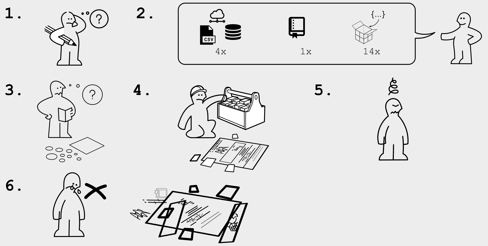
]

.img-attr[slide: [_Kartik Ram: rstudio::conf 2019 talk_](https://github.com/karthik/rstudio2019)]

---

# Calls for open science

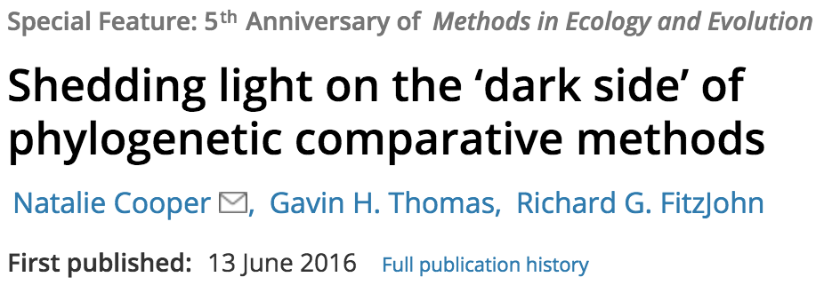

> ... highlight problems with users jumping straight into software implementations of methods (e.g. in r) that may lack documentation on biases and assumptions that are mentioned in the original papers.

> <small> To help solve these problems, we make a number of suggestions including **providing blog posts** or **videos** to **explain new methods in less technical terms**, **encouraging reproducibility and code sharing**, making **wiki-style pages** summarising the literature on popular methods, more careful consideration and testing of whether a method is appropriate for a given question/data set, **increased collaboration**, and a shift from publishing purely novel methods to **publishing improvements to existing methods** and ways of detecting biases or testing model fit. Many of these points are applicable across methods in ecology and evolution, not just phylogenetic comparative methods.</small>

---

# R for Open Reproducible Research

## A whistle-stop tour of tools, practices and conventions in R for more:
--

- ### **Reproducible**
--

- ### **Robust**
--

- ### **Transparent**
--

- ### **Reusable**
--

- ### **Shareable** research materials


---
class: inverse, center, middle

# Project management


.img-attr.bottom[Icon by [Freepik](https://www.freepik.com/) from [flaticon.com](www.flaticon.com)]

---

# Rstudio Projects

## Use Rstudio projects to keep materials associated with a particular analysis together

<br>
 
.pull-left[
- **Self contained** and **portable**
- **Working directory set to root** of project on launch
- **Fresh session** everytime the project is launched

See Jenny Bryan's post on [**project oriented workflows**](https://www.tidyverse.org/articles/2017/12/workflow-vs-script/) for more details
]

.pull-right.center[

**File > New Project > New Directory**

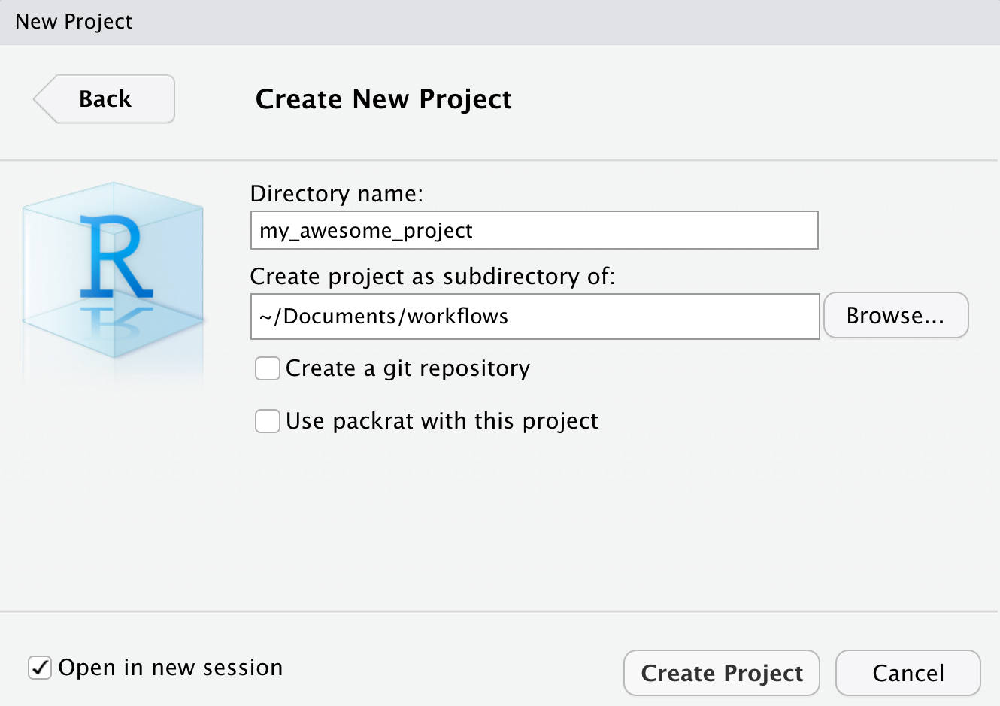
]

---
background-image: url('assets/my_awesome_project.png')
background-size: contain


---
# `r emo::ji("package")` `here`

## Use `r emo::ji("package")` `here` to create robust relative paths

<br>

.pull-left[

- **Robust paths relative to project root**
  + portable
  + independent of:
     - working directory
     -  source code location

]

.pull-right.center[


]

```{r}
here::here()
```


```{r}
here::here("data", "summaries.csv")
```

.img-attr.right[Icon by [Freepik](https://www.freepik.com/) from [flaticon.com](www.flaticon.com)]


---

# Dependency management

### Minimal approach

##### include an `install.R` script

```{r eval=FALSE}
install.packages("dplyr")
install.packages("purrr")
```


.pull-left[

### Most robust approach

##### use `r emo::ji("package")` `packrat` 

- Create and manage a per project library of packages
- intialise during project set up
]

.pull-right[
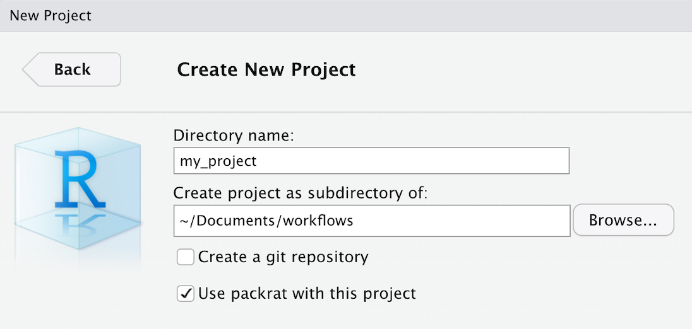
]

_will revisit later on_

---
# `r emo::ji("package")` `drake`

## Use `r emo::ji("package")` `drake` to orchestrate your workflows

<br>

.pull-left[

]

.pull-right.center[

]

#### make plan

```{r}
plan <- drake::drake_plan(
  raw_data = readr::read_csv(here::here("data", "iris.csv")),
  data = raw_data %>%
    dplyr::mutate(Species = forcats::fct_inorder(Species)),
  fit = lm(Sepal.Width ~ Petal.Width + Species, data))
```

---
# Plan

#### view plan

```{r}
plan
```

#### re-execute plan

```{r}
drake::make(plan)
```

---

#### inspect targets

```{r}
drake::readd(fit)
```

---
# visualise workflow

.centre[

```{r fig.height=5, fig.width=12}
drake::vis_drake_graph(drake::drake_config(plan))

```
]

---

class: inverse, center, middle

# Version Control


---

# Version Control

### What is it? `r emo::ji("thinking")`

The **management of changes** to documents, computer programs, large web sites, and other collections of information.

### Git 

Open source (free to use) **Version control software.**

### GitHub 

A **website** (https://github.com/) that allows you to **store your Git repositories online** and makes it easy to collaborate with others.

---
# Why use them in research? 

.pull-left[
### Exhibit A


.img-attr[Image: xkcd CC BY-NC 2.5 ]
]

.pull-right[
### Exhibit B

 
 
.img-attr[ Image: Jorge Cham www.phdcomics.com]

]
---

# Git, Github & Rstudio

#### Before: git only through the terminal `r emo::ji("cry")`

--

***

## Now: Rstudio + `usethis` `r emo::ji("package")` == `r emo::ji("heart")` `Git` & `GitHub` `r emo::ji("star_struck")`

.center[

]


---
# Configure git & GitHub

### Configure git

**Check your configuration**

```{r, eval=FALSE}
usethis::use_git_config()
```


**Set your configuration**

Use your github username and and the email you used to sign-up on GitHub

```{r, eval=FALSE}
usethis::use_git_config(
    user.name = "Jane",
    user.email = "jane@example.org")
```

---
# Configure GitHub authentication

### Get GITHUB Personal Authorisation Token

```{r, eval=F}
usethis::browse_github_pat()
```


---

### Store in `.Renviron` file

```{r, eval=F}
usethis::edit_r_environ()
```


---
# Initialise git


### Initialise **Rstudio project** with Git by **just checking a box!**

It's now **a repository**

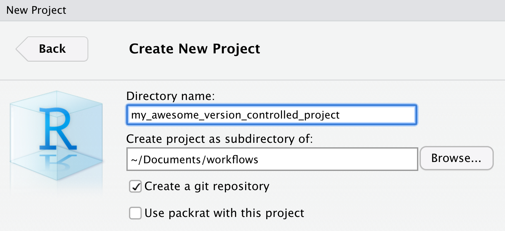


Forgot to? use `usethis::use_git()`


---
# Git panel

## Integrated graphical user interface

<br>

.center[
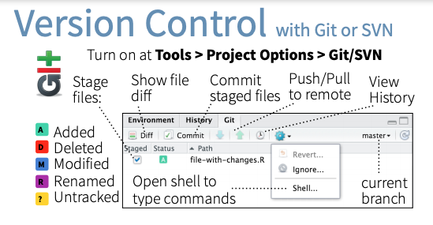
]

---
# Git Rstudio workflow

.pull-left[
#### view file status
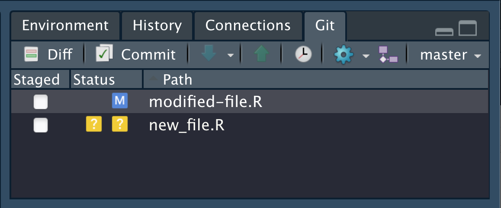

#### stage files
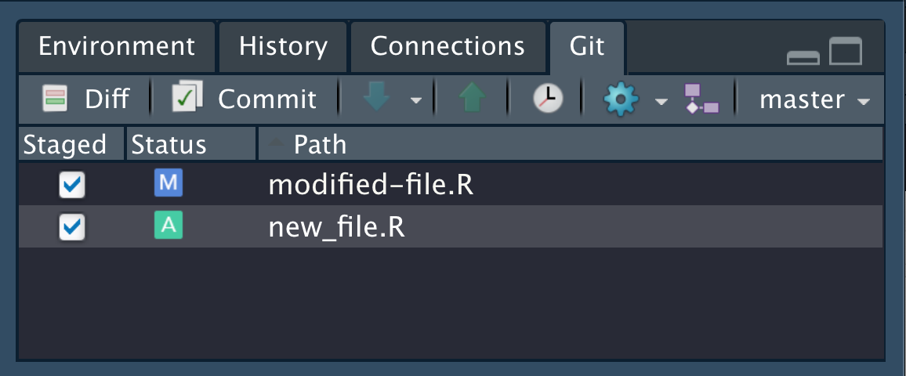
]

.pull-right[
#### commit changes
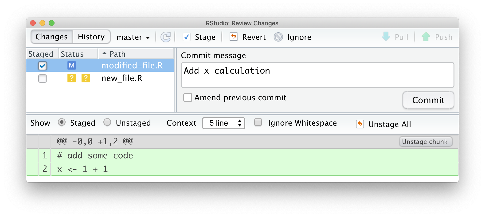
]
---

# Share on GitHub

#### Create repo


```{r, eval=FALSE}
usethis::use_github(protocol = "https")
```

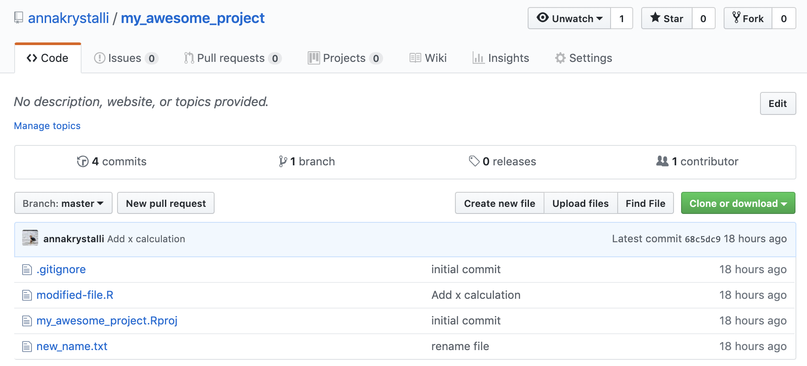

#### Push further changes

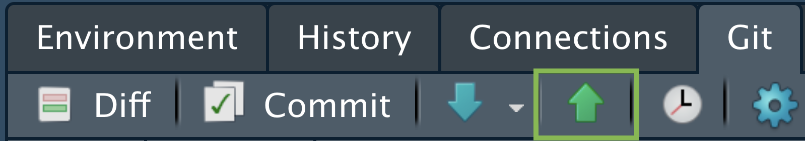


---

# Anatomy of a GitHub Repo

- **`README`**. Explain what your project is, and how to use it. 
  + `usethis::use_readme_md()`
  + `usethis::use_readme_rmd()`

- **`LICENSE`**. Without a licence, the contents of the repository are technically closed. 
  + Examples licence [MIT](https://tldrlegal.com/license/mit-license): `usethis::use_mit_license(name = "Anna Krystalli")`
  + `?licenses`: details of functions available to generate licenses
  + [https://choosealicense.com/](https://choosealicense.com/) help on choosing a licence.

    
- **`CONTRIBUTING.md`** - guidelines for contributors.
  + `usethis::use_tidy_contributing()` provides a realtively strict but instructive template

- **`CODE_OF_CONDUCT.md`** set the tone for discourse between contributors. 
  + `use_code_of_conduct()`

---
# GitHub issues

### use GitHub issues to plan, record and discuss tasks.

.pull-left[
#### issues
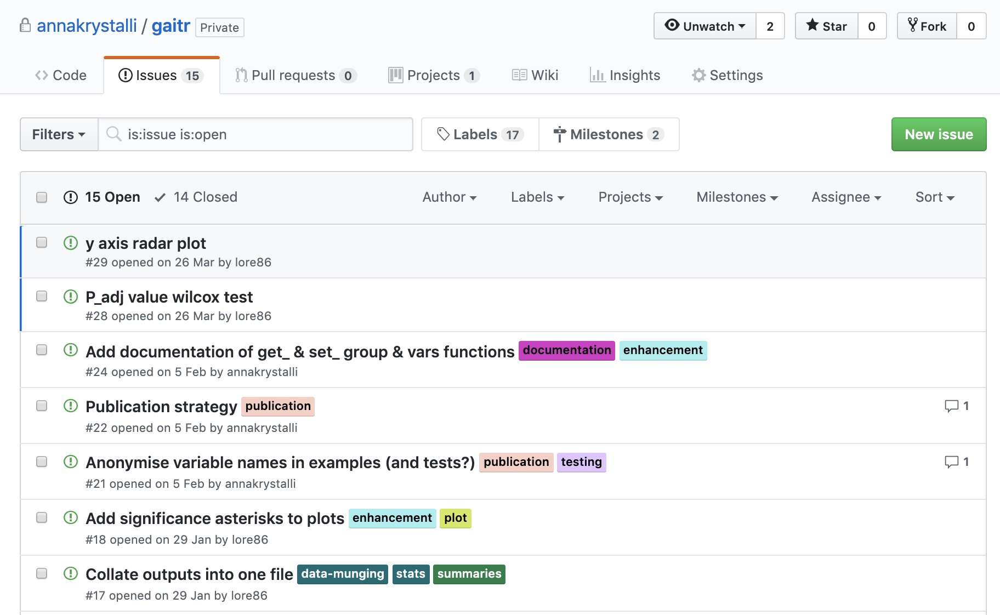

]

.pull-right[
#### projects
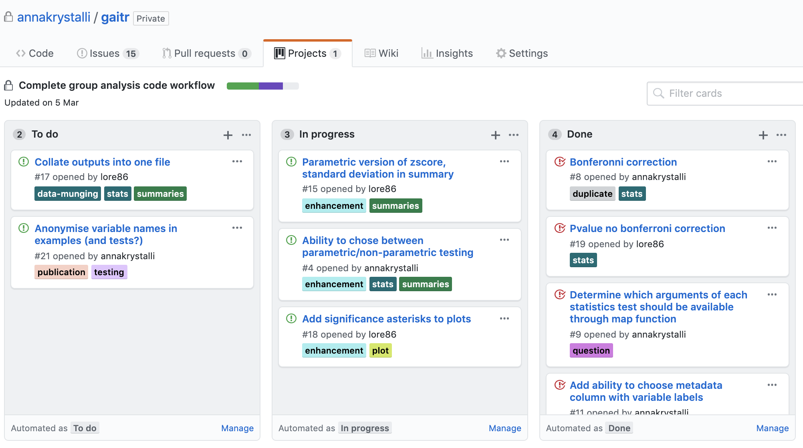
]


---

class: inverse, center, middle

# Literate programming with Rmarkdown


---

# Literate programming


Programming paradigm first introduced by **Donald E. Knuth**. 

> ### Treat program as literature to be understandable to human beings

> <br>

> - focus on the logic and flow of human thought and understanding
> - single document to integrate data analysis (executable code) with textual documentation, **linking data, code, and text**


---

# Literate programming in R

### Rmarkdown (`.Rmd`) integrates:

- a **documentantion** language (`.md`)

- a **programming** language (`R`)

- functionality to **"knit" them together** through `r emo::ji("package")` `knitr`

<br>

### features

- `r emo::ji("white_check_mark")` provides a framework for writing narratives around code and data

- `r emo::ji("white_check_mark")` Code re-run in a clean environment every time the document is "knit"

---
background-image: url('assets/RMarkdownOutputFormats.png')
background-size: contain

# Rmarkdown outputs


---
# Rmarkdown to html

#### **File > New File > RMarkdown... > Document**

.pull-left[
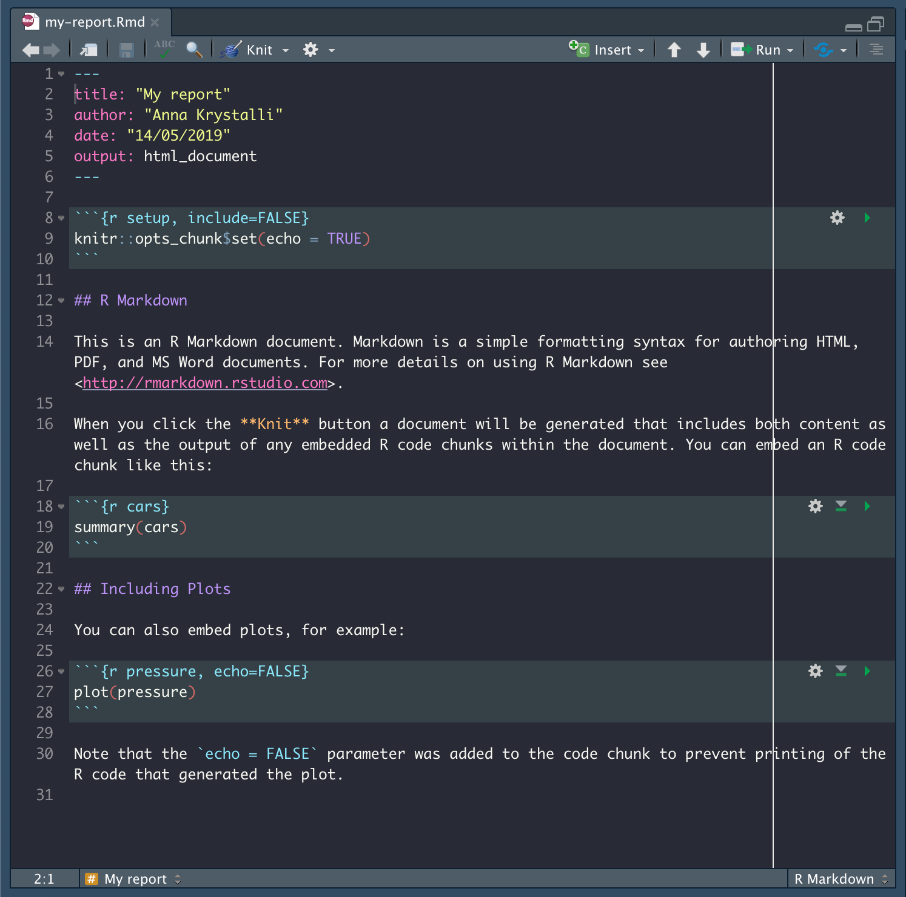
]

.pull-right.top[
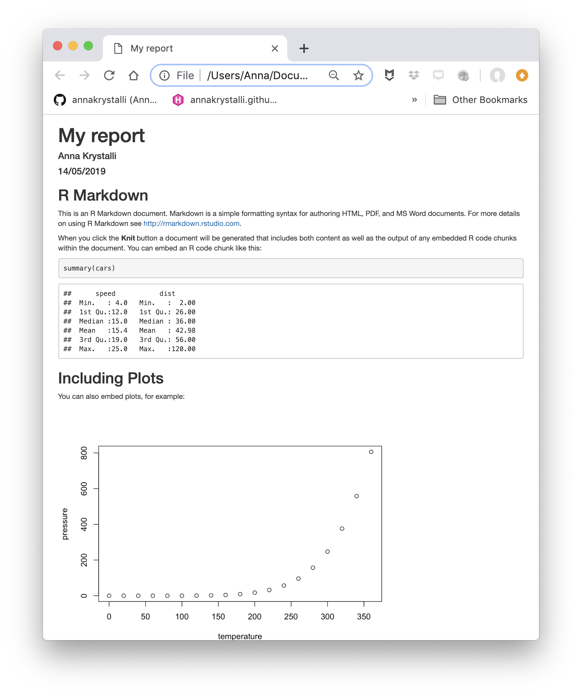
]


---
# Applications in research

### Rmd documents can be useful for a number of research related [long form documentation](http://r-pkgs.had.co.nz/vignettes.html) materials:

.pull-left[

<br>

- Documentation of code & data (eg `r emo::ji("package")` [DataMaid](https://github.com/ekstroem/dataMaid))
- Electronic Notebooks
- Supplementary materials
- Reports
- Papers
]

.pull-right[
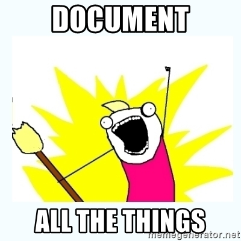
]
---
# Rmd Vs Word

#### Spell check in Rstudio! 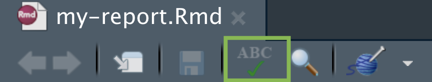

## `r emo::ji("package")` [redoc](https://github.com/noamross/redoc) <small>**HOT OFF THE PRESS**</small>

**Enables a two-way R Markdown-Microsoft Word workflow**. It generates Word documents that can be de-rendered back into R Markdown, **retaining edits on the Word document**, including tracked changes.


---

# Publish to the web for free!

- **RPubs**: Publish rendered rmarkdown documents on the web with the click of a button <http://rpubs.com/>


- **GitHub**: Host your site through [`gh-pages`](https://pages.github.com/) on GitHub. Enable in GitHub repo `r emo::ji("gear")`**Settings**

.center[
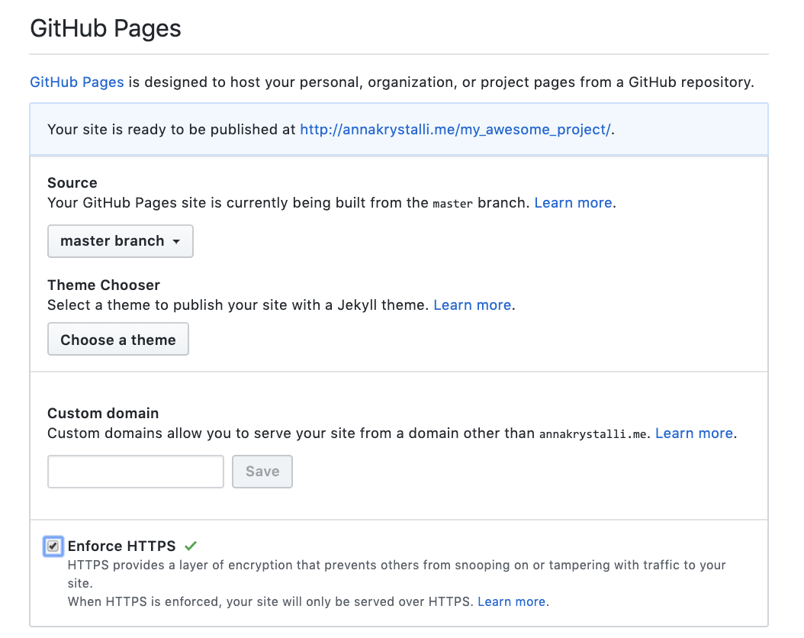
]


---

class: inverse, center, middle

# Rmarkdown extensions

Many great packages and applications build on rmarkdown.

All this makes it [incredibly versatile](https://rmarkdown.rstudio.com/gallery.html).

---

# [bookdown](https://bookdown.org/yihui/bookdown/)

#### Create and mantain online books

Authoring with R Markdown. Offers:

- cross-references, 
- citations, 
- HTML widgets and Shiny apps,
- tables of content and section numbering

The publication can be exported to HTML, PDF, and e-books (e.g. EPUB)

### Examples


- [rOpenSci Software Review policies](https://ropensci.github.io/dev_guide/)
- [Geocomputation in R](https://geocompr.robinlovelace.net/)

### [Thesisdown](https://github.com/ismayc/thesisdown)

An updated R Markdown thesis template using the bookdown package


---

# [pkgdown](http://pkgdown.r-lib.org/articles/pkgdown.html)

#### For buidling package documentation

Produce **function references** from `.Rd` files and **demonstrate function use** through long form documentation (vignettes).


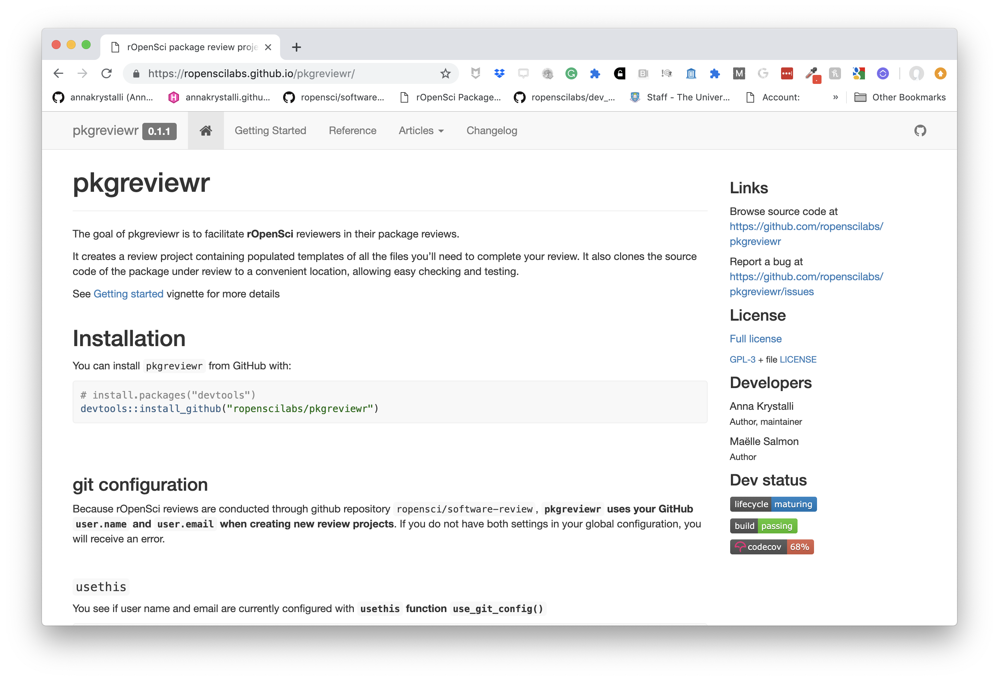

---

# [workflowr](https://jdblischak.github.io/workflowr/) pkg

#### Build analyses websites and organise your project

Makes it easier for researchers to organize projects and share results. Includes **checks to ensure rendered versions correspond to up to date versions of code**.


.pull-left[
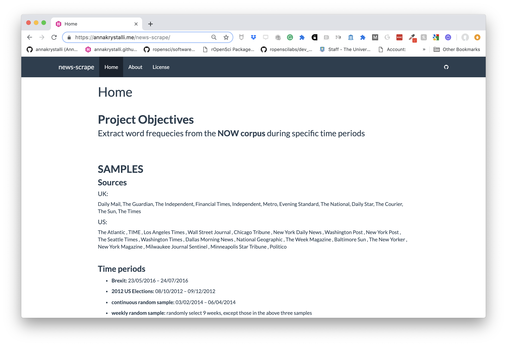
]
.pull-right[
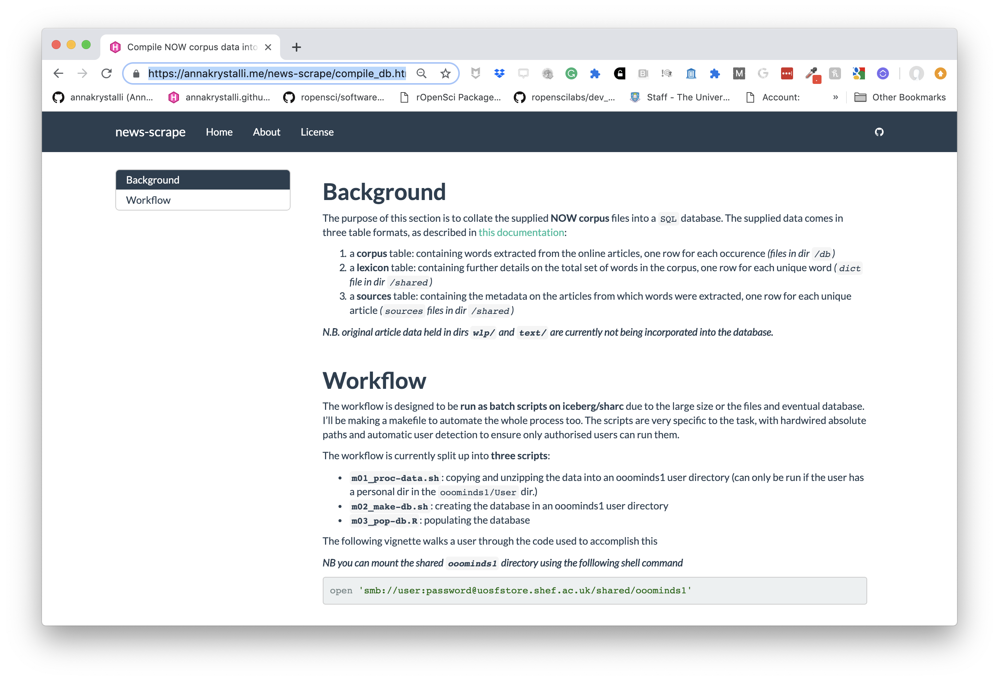
]
---

# [blogdown](https://bookdown.org/yihui/blogdown/)

## For creating and mantaining blogs through R.

Check out <https://awesome-blogdown.com/>, **a curated list of awesome #rstats blogs in blogdown** for inspiration!

[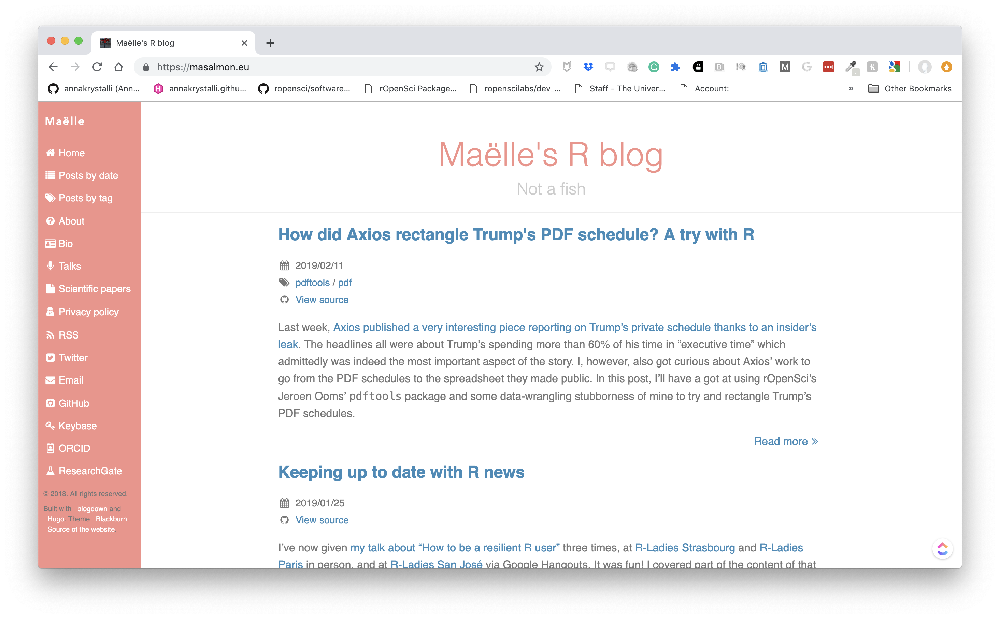](https://masalmon.eu/)

---
# presentations

## A number of existing frameworks

### [xaringan](https://github.com/yihui/xaringan) `r emo::ji("package")` Presentation Ninja 幻灯忍者 · 写轮眼

.center[
[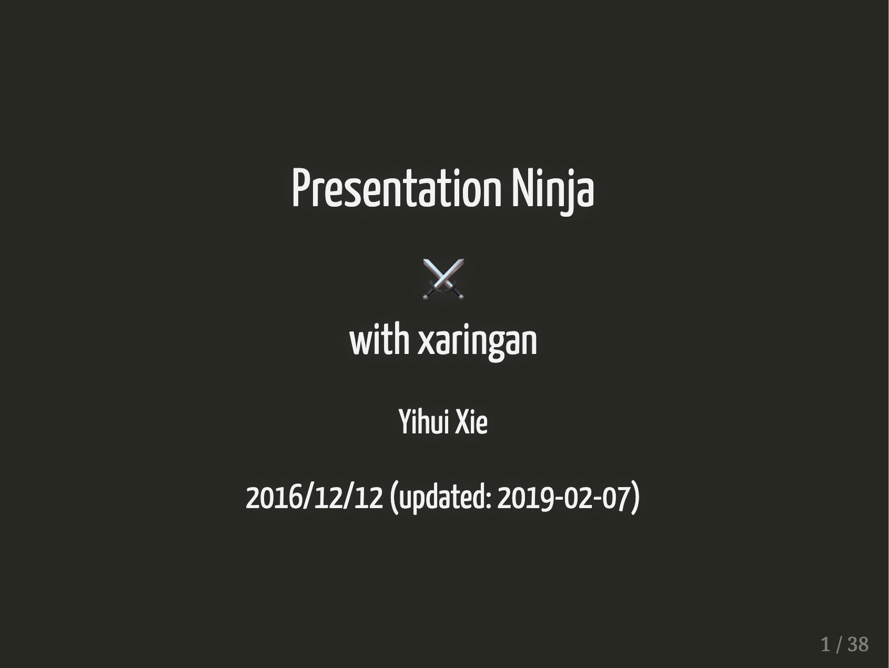](https://slides.yihui.name/xaringan/#1)
]

---
class: inverse, center, middle

# Managing code

---
# Managing analysis code

## Separate function definition and application


.pull-left[
<br>

- When a project is new and shiny, an **analysis script usually contains many lines of directly executated code.** 

- As it matures, **reusable chunks get pulled into their own functions**. 

- The actual analysis scripts then become relatively short, and **functions defined in separate R scripts.** ]

.pull-right[

]

---

# R Package Structure

## Used to share functionality with the R community

- Useful **conventions**

- Useful **software development tools**

- Easy **publishing** through GitHub

<br>

.center[
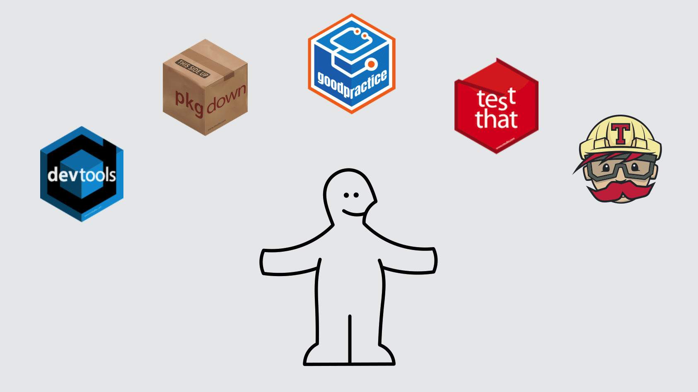
]
---
# Build panel

## Integrated graphical user interface

<br>

.center[
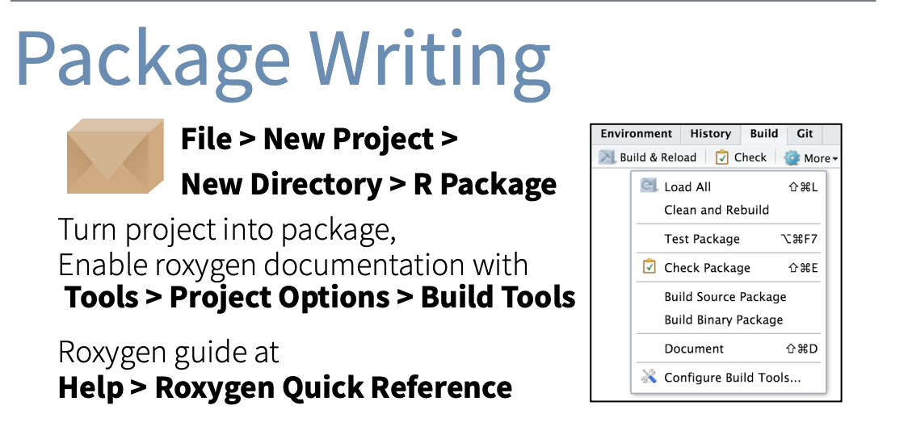
]
---


# R Package conventions:

- **metadata**: in the **`DESCRIPTION` file**

- **functions** in **`.R` scripts** in the **`R/` folder**

- **tests** in the **`tests/` folder**

- **Documentation:**
    - _functions_ using **Roxygen notation**
    - _workflows_ using **`.Rmd` documents** in the **`vignettes/`** folder


---

# `DESCRIPTION` file

#### Package metadata

```
Package: gaitr
Type: Package
Title: Functions to support BMC gait analysis
Description: Helpers to analyse processed gait data.
Version: 0.0.9000
Authors@R: 
    c(person(given = "Anna",
             family = "Krystalli",
             role = c("aut", "cre"),
             email = "annakrystalli@googlemail.com"),
      person(given = "Lorenza",
             family = "Angelini",
             role = "aut",
             email = "l.angelini@sheffield.ac.uk"))
License: MIT + file LICENSE

```

---

# citation

```{r}
citation("gaitr")
```


---
# Dependency management


It’s the job of the `DESCRIPTION` file to **list the packages that your code depends on**.

```
Imports: 
    dplyr,
    purrr,
    here,
    broom,
    tibble,
    magrittr,
    janitor,
    ggplot2
Suggests: 
    knitr,
    rmarkdown
```

#### add dependency

```{r, eval=FALSE}
usethis::use_package("forcats", type = "Imports")
```


---
# Functions in `R/`

### example function script

Create a new function `.R` file in the `R/` folder
```{r, eval=FALSE}

usethis::use_r("add")
```

```
R
└── add.R

0 directories, 1 files
```

---
# Document functions with `Roxygen`

- Create help files on build (autogenerated `.Rd` files in `man/`)
- Specify which functions are exported (autogenerated `NAMESPACE`)

```{r}
#' Add together two numbers.
#' 
#' @param x A number.
#' @param y A number.
#' @return The sum of x and y.
#' @examples
#' add(1, 1)
#' add(10, 1)
add <- function(x, y) {
  x + y
}
```


---

# [tests](http://r-pkgs.had.co.nz/tests.html)

## Tests provide confidence in what the code is doing.

.center[

]


---

# Example test

```{r, eval=FALSE}
usethis::use_test("add")
```

Creates a `tests/` folder with the following files

```
tests
├── testthat
│   ├── test-add.R
└── testthat.R
```
##### test-add.R

```{r, eval=FALSE}
context("test-add")

test_that("add works", {
  expect_equal(add(2, 2), 4)
})
```


---
# Continuous Integration

A cloud testing framework that can automate your tests
- Monitor the effect of changes to the code
- Safe onboarding of contributions

### Use a `.travis.yml` files

```{r, eval=FALSE}
usethis::use_travis()
```

---

#### `.travis.yml` file template

```
language: R
sudo: false
cache: packages

```
#### instructions to enable TRAVIS CI

```
✔ Writing '.travis.yml'
✔ Adding '^\\.travis\\.yml$' to '.Rbuildignore'
● Turn on travis for your repo at https://travis-ci.org/profile/annakrystalli
● Copy and paste the following lines into '/Users/Anna/Documents/workflows/talks/README.md':
  <!-- badges: start -->
  [](https://travis-ci.org/annakrystalli/talks)
  <!-- badges: end -->
```

---

class: inverse, center, middle


# Research compendia


---
# A Research compendium

### The paper is the advertisement

> “an article about computational result is advertising, not scholarship. The **actual scholarship is the full software environment, code and data, that produced the result.**”

*John Claerbout paraphrased in [Buckheit and Donoho (1995)](https://statweb.stanford.edu/~wavelab/Wavelab_850/wavelab.pdf)*


### The concept of a Research Compendium

>“
...We introduce the **concept of a compendium**
as both a **container for the different elements**
that make up the document and its computations (i.e. text, code, data, ...), and as a **means for distributing, managing and updating the
collection**."

[_Gentleman and Temple Lang, 2004_](https://biostats.bepress.com/bioconductor/paper2/)


---
# Research compendia in R

.pull-left[
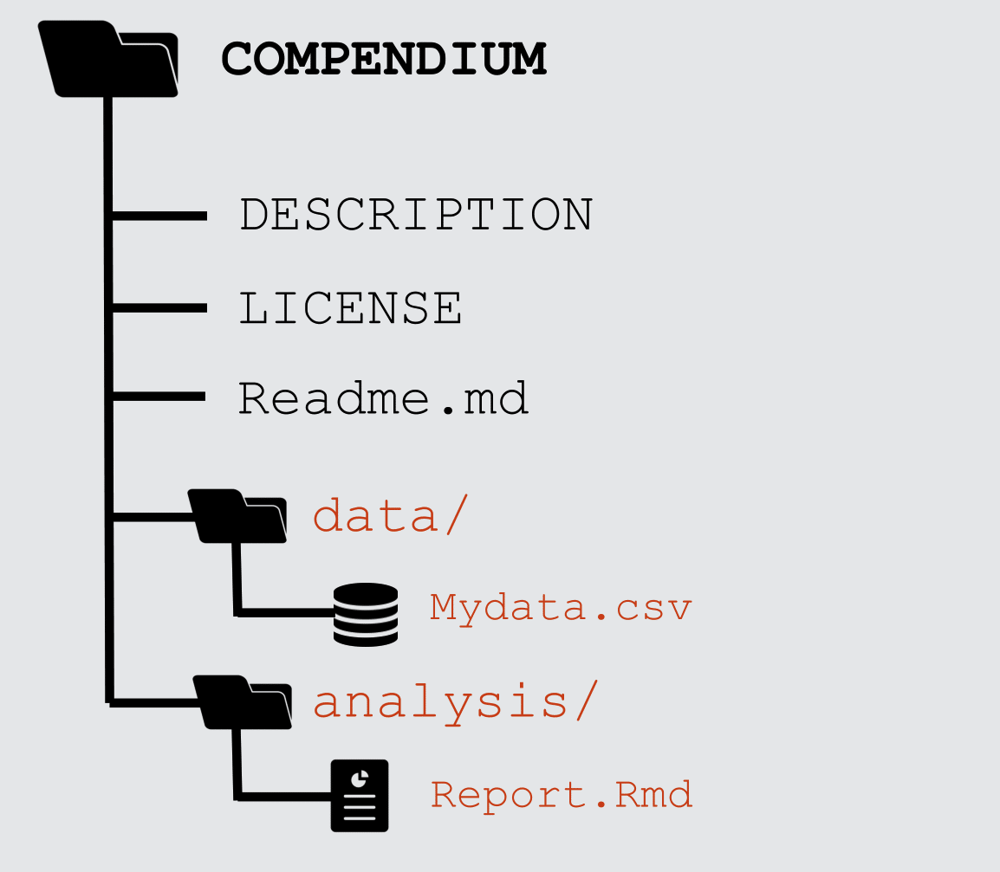
]

.pull-right[

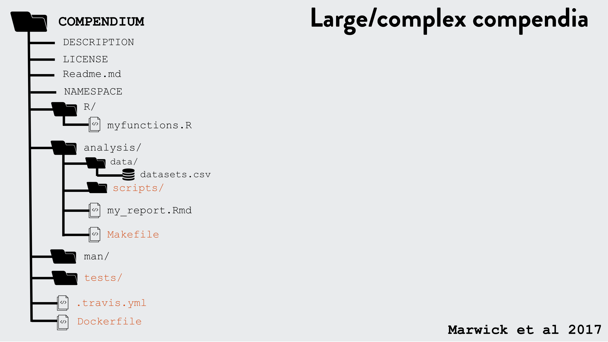
]

.img-attr[slides: [_Kartik Ram: rstudio::conf 2019 talk_](https://github.com/karthik/rstudio2019)]

<br>

### Ben Marwick, Carl Boettiger & Lincoln Mullen (2018) [_Packaging Data Analytical Work Reproducibly Using R (and Friends)_](https://peerj.com/preprints/3192/)

---

# Example compendium


.pull-left[

**Paper**:

##### Boettiger, C. (2018) *From noise to knowledge: how randomness generates novel phenomena and reveals information*. <https://doi.org/10.1111/ele.13085>


]


.pull-right[

**Compendium**

##### *cboettig/noise-phenomena: Supplement to: "From noise to knowledge: how randomness generates novel phenomena and reveals information"* http://doi.org/10.5281/zenodo.1219780

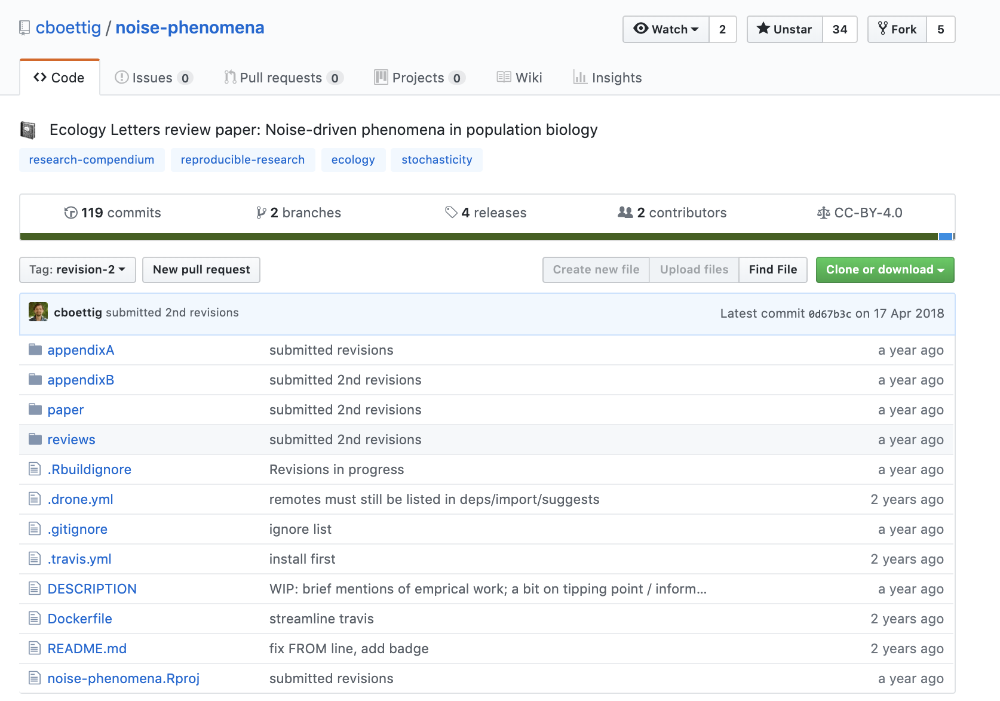

]


---

# `rrtools`: Creating Compendia in R

### "The goal of rrtools is to provide **instructions, templates, and functions** for making a **basic compendium** suitable for writing **reproducible research with R**."


<br>

### Install [`rrtools`](https://github.com/benmarwick/rrtools) from GitHub
```{r, eval=FALSE}
# install.packages("devtools")
devtools::install_github("benmarwick/rrtools")
```


---
# Create compendium


```{r, eval=FALSE}
rrtools::create_compendium("~/Documents/workflows/rrcompendium")
```


```
✔ Setting active project to '/Users/Anna/Documents/workflows/rrcompendium'
✔ Creating 'R/'
✔ Creating 'man/'
✔ Writing 'DESCRIPTION'
✔ Writing 'NAMESPACE'
✔ Writing 'rrcompendium.Rproj'
✔ Adding '.Rproj.user' to '.gitignore'
✔ Adding '^rrcompendium\\.Rproj$', '^\\.Rproj\\.user$' to '.Rbuildignore'
✔ Opening new project 'rrcompendium' in RStudio
✔ The package rrcompendium has been created
✔ Opening the new compendium in a new RStudio session...

Next, you need to:  ↓ ↓ ↓ 
● Edit the DESCRIPTION file
● Use other 'rrtools' functions to add components to the compendium
```

---

# Prepare for GitHub


```{r, eval=FALSE}
rrtools::use_readme_rmd()
```

.pull-left[

```

✔ Creating 'README.Rmd' from template.
✔ Adding 'README.Rmd' to `.Rbuildignore`.
● Modify 'README.Rmd'
✔ Rendering README.Rmd to README.md for GitHub.
✔ Adding code of conduct.
✔ Creating 'CONDUCT.md' from template.
✔ Adding 'CONDUCT.md' to `.Rbuildignore`.
✔ Adding instructions to contributors.
✔ Creating 'CONTRIBUTING.md' from template.
✔ Adding 'CONTRIBUTING.md' to `.Rbuildignore`.

```
]

.pull-right[


]


---
# Create analysis folder

```{r, eval=FALSE}
rrtools::use_analysis()
```


```
✔ Adding bookdown to Imports
✔ Creating 'analysis' directory and contents
✔ Creating 'analysis'
✔ Creating 'analysis/paper'
✔ Creating 'analysis/figures'
✔ Creating 'analysis/templates'
✔ Creating 'analysis/data'
✔ Creating 'analysis/data/raw_data'
✔ Creating 'analysis/data/derived_data'
✔ Creating 'references.bib' from template.
✔ Creating 'paper.Rmd' from template.

Next, you need to:  ↓ ↓ ↓ ↓ 
● Write your article/report/thesis, start at the paper.Rmd file
● Add the citation style library file (csl) to replace the default provided here, see https://github.com/citation-style-language/
● Add bibliographic details of cited items to the 'references.bib' file
● For adding captions & cross-referencing in an Rmd, see https://bookdown.org/yihui/bookdown/
● For adding citations & reference lists in an Rmd, see http://rmarkdown.rstudio.com/authoring_bibliographies_and_citations.html
```

---
# `paper.Rmd` to `paper.pdf`


.pull-left[

**Rmd**

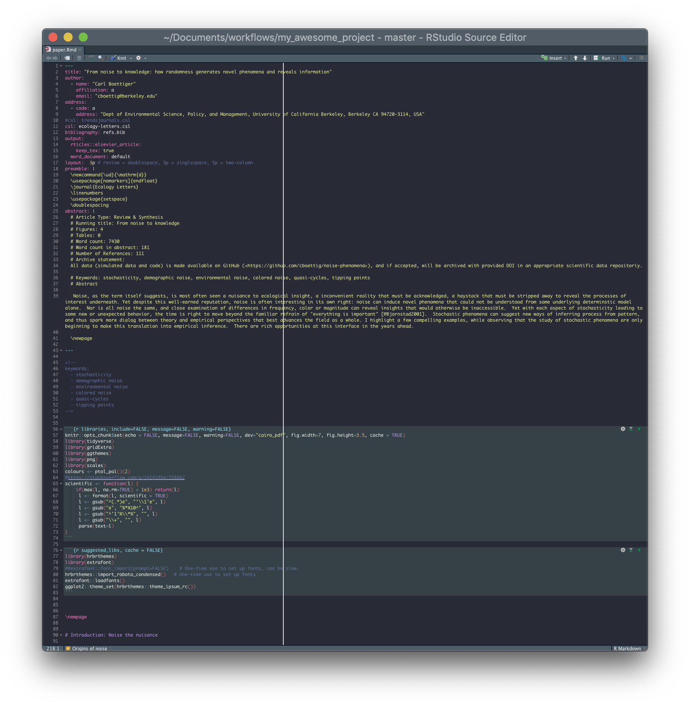

]


.pull-right[

**pdf**

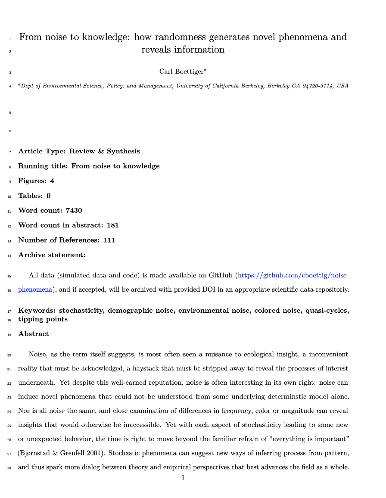

]


---
# Capturing dependencies

```{r, eval=FALSE}
rrtools::add_dependencies_to_description()
```

```
Imports: 
    bookdown,
    ggplot2 (>= 3.0.0),
    ggthemes (>= 3.5.0),
    here (>= 0.1),
    knitr (>= 1.20),
    rticles (>= 0.6)
    
```

---
# Further Helpers

.pull-left[
### `r emo::ji("package")` `rticles`

Contains a **suite of custom R Markdown templates for popular journals**, simplifying the creation of documents that conform to research paper submission standards. 

]

.pull-right[
### `r emo::ji("package")` `citr`


]

---
background-image: url('assets/reproducible-data-analysis_042.png')
background-size: contain

# Succesful Reproducibility
<br>
<br>
<br>
<br>
<br>
<br>
<br>
<br>
<br>
<br>
<br>
<br>
<br>
<br>

.bottom[
.img-attr[slide: [_Kartik Ram: rstudio::conf 2019 talk_](https://github.com/karthik/rstudio2019)]
]
---
class: inverse, center, middle
# Questions?


---
# Further reading

.pull-left[

#### Version Control
- [Happy Git and GitHub for the useR](https://happygitwithr.com/)

#### RMarkdown

- [R Markdown: The Definitive guide](https://bookdown.org/yihui/rmarkdown/)

#### R Packages

- [R packages](http://r-pkgs.had.co.nz/) by Hadley Wickham

]
#### Research Compendia

- Kartik Ram: [_rstudio::conf 2019 talk_](https://github.com/karthik/rstudio2019)

#### Tutorials

- [Rstudio Essentials](https://resources.rstudio.com/) Webminar series

- [rrresearch](https://annakrystalli.me/rrresearch/): ACCE DTP course on Research Data & Project Management