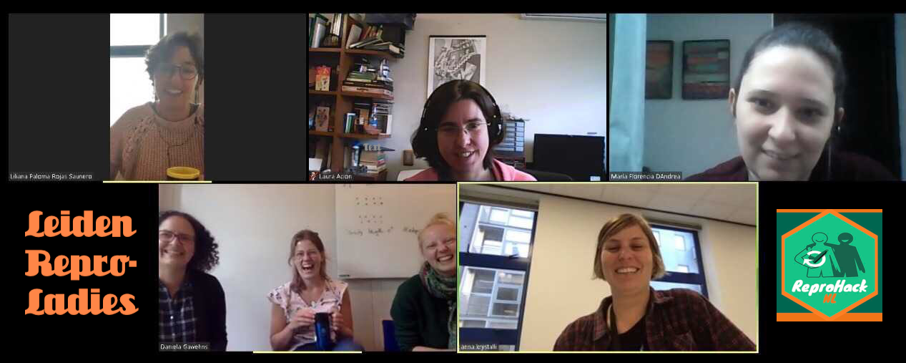
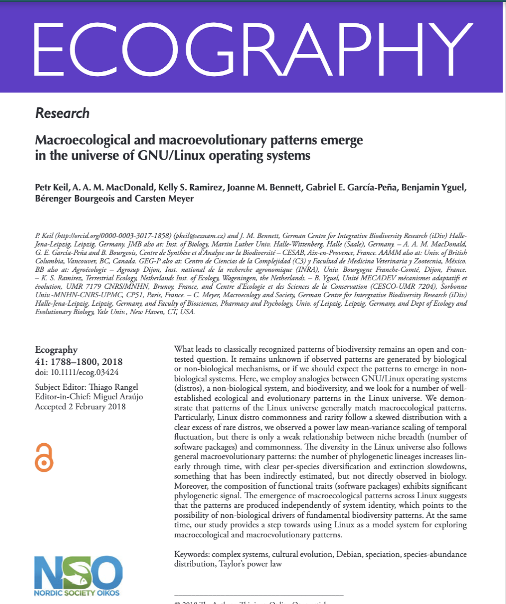
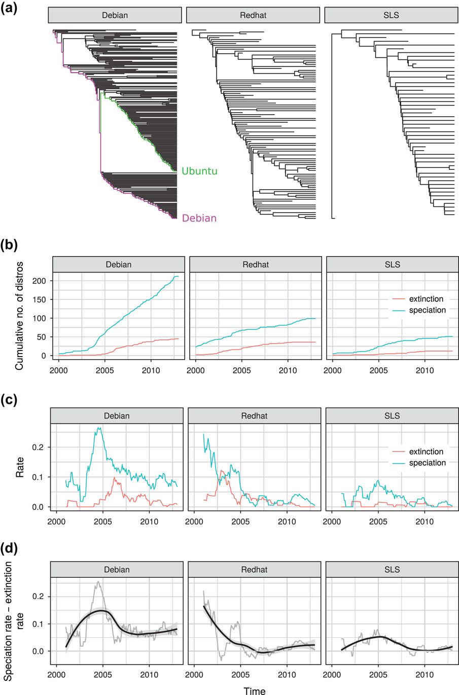
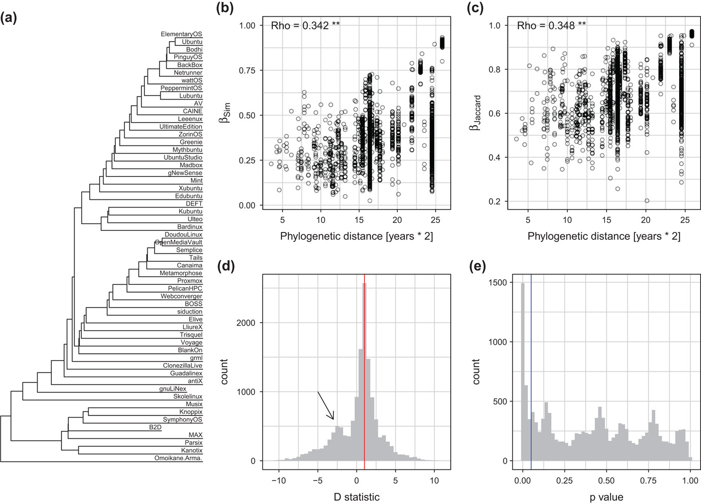
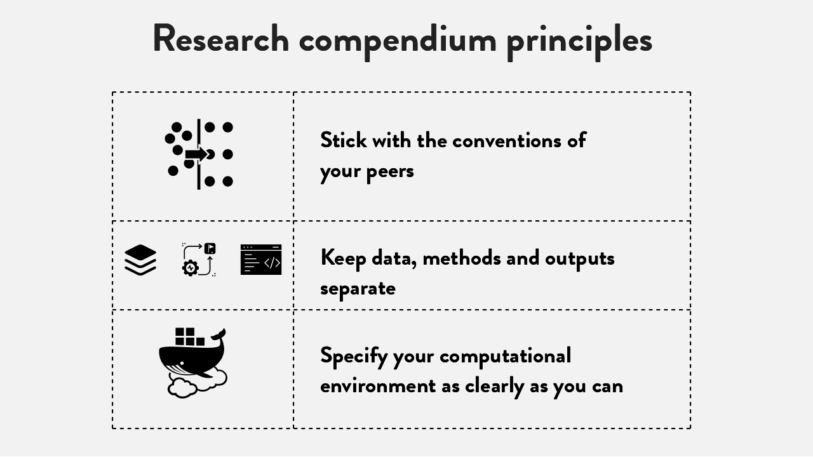
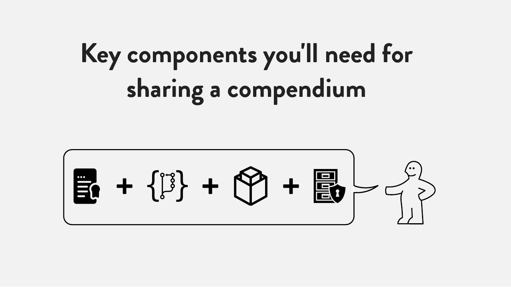
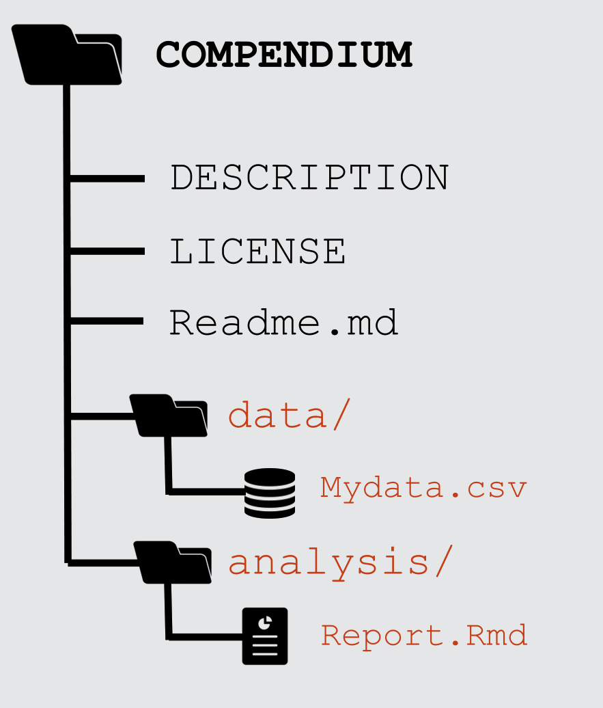
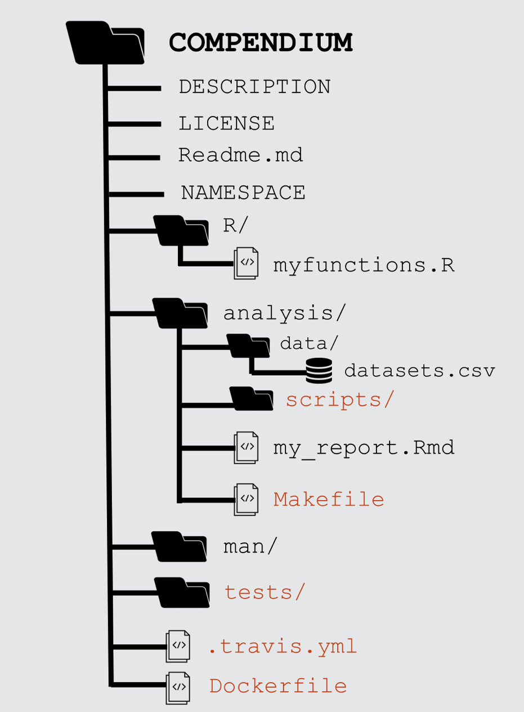

```{r xaringan-themer, include = FALSE}
library(xaringanthemer)

duo_accent(
  primary_color = "#77DDBC", secondary_color = "#75a3a3",
  title_slide_text_color = "#334d4d", text_bold_color = "white" ,
  text_color = "#e6e6e6", link_color = "#75a3a3",
  inverse_text_color = "#334d4d", inverse_header_color = "#77DDBC",
  header_font_google = google_font("Calistoga", "400"),
  text_font_google   = google_font("Lato", "700", "700i"),
  code_font_google   = google_font("Source Code Pro"),
  background_color = "#334d4d",
  title_slide_background_image = "../backgrounds/reprohack-slide.png",
  #background_image = "../backgrounds/reprohack-slide.png",
  background_size = "cover", outfile = "assets/css/ç-xaringan-themer.css"
)
```

# `r emo::ji("wave")` Hello

### me: **Dr Anna Krystalli**

- **Research Software Engineer**, _University of Sheffield_
    + twitter **@annakrystalli**
    + github **@annakrystalli**
    + email **a.krystalli[at]sheffield.ac.uk**
    
- **Editor [rOpenSci](http://onboarding.ropensci.org/)**

- **Co-organiser:** [Sheffield R Users group](https://www.meetup.com/SheffieldR-Sheffield-R-Users-Group/)


<br>

### slides: **bit.ly/repro-value-in-practice**

---
## Welcome to the 4th ReproHack! `r emo::ji("tada")`


<blockquote class="twitter-tweet"><p lang="en" dir="ltr">This thing is really happening! <a href="https://t.co/d2xnHNo9z2">pic.twitter.com/d2xnHNo9z2</a></p>&mdash; ReproHack NL ♻️ (@ReproHackNL) <a href="https://twitter.com/ReproHackNL/status/1174998682879631360?ref_src=twsrc%5Etfw">September 20, 2019</a></blockquote> <script async src="https://platform.twitter.com/widgets.js" charset="utf-8"></script>

---

## Welcome to the 4th ReproHack! `r emo::ji("tada")`

### Thanks to the Leiden Repro Ladies `r emo::ji("pray")`




---

## Welcome to the 4th ReproHack! `r emo::ji("tada")`

### Thanks to the Software Sustainability Institute `r emo::ji("pray")`


---
class: inverse, center, middle
# Background


---
background-image: url(assets/boats.png)
background-size: cover

.box[
## Marine Biology
]

---
background-image: url(assets/maps.png)
background-size: cover

.box[
## Marine Biology
]


---
background-image: url(https://www.reactiongifs.com/r/O_o.gif)
background-size: cover
class: inverse

.box[

## Quality Assurance
> #### _QA Auditor for a Contract Research Organisation subject to GLP regulation_

]


---
background-image: url(assets/ruchindra-gunasekara-GK8x_XCcDZg-unsplash.jpg)
background-size: cover

.box[

## Ultrasport
> #### _Brand coordinator for an extreme sports equipment distributing_

]


---
class: inverse, center, middle

# Back to science: 

---
### **Ooops, that's embarassing!**

.pull-left[

<br>
<br>
<br>


]

.pull-right[

]

---

# The paper is the advertisement

> “an article about computational result is advertising, not scholarship. The **actual scholarship is the full software environment, code and data, that produced the result.**”

*John Claerbout paraphrased in [Buckheit and Donoho (1995)](https://statweb.stanford.edu/~wavelab/Wavelab_850/wavelab.pdf)*

--

### Why is our whole system geared towards **reviewing, publishing, distributing, archiving** the adverstisement?

---

## Progress: calls for reproducibility as minimum standard

> #### **Reproducibility** has the potential to serve as a **minimum standard for judging scientific claims** when full independent replication of a study is not possible.

 <br>


.center[

]
.img-attr[Reproducible Research in Computational Science
_ROGER D. PENG, SCIENCE 02 DEC 2011 : 1226-1227_
]
<br>

---
class: inverse, center, middle

.box[
## Benefit #1
]

## transparency as a means of verification

---
background-image: url("https://media1.giphy.com/media/BWTZOE4vnj3gs/giphy.gif?cid=790b761105c665c045cf431bde7e8419e02f3f6314ac0d32&rid=giphy.gif")
background-size: cover

.box[
### there is a hidden superpower
]


---
background-image: url("assets/repository-fork.png")
class: inverse

--
.pull-left[
<br>
<br>
<br>
<br>
<br>
<br>
.box[
## **Woah, It's evolution...**
]
]

.pull-right[
<br>
<br>
<br>
<br>
<br>
<br>


]

---
class: inverse

> #### [**_Macroecological and macroevolutionary patterns emerge in the universe of GNU/Linux operating systems_**](https://doi.org/10.1111/ecog.03424)
> doi:10.1111/ecog.03424
 
.pull-left[



]

--

.pull-right[


]

---
class: inverse

> #### [**_Macroecological and macroevolutionary patterns emerge in the universe of GNU/Linux operating systems_**](https://doi.org/10.1111/ecog.03424)
> doi:10.1111/ecog.03424

.center[

]
---
background-image: url("assets/hanslibdata.png")
background-size: cover
class: inverse

## Example: **gapminder.org: 2006** 

.box[
### [liberating stories from data](https://youtu.be/hVimVzgtD6w?t=15m3s)
]

---
## Gapminder today

```{r, fig.show = "animate", message=FALSE, warning=FALSE}
library(ggplot2)

p <- ggplot(gapminder::gapminder, aes(gdpPercap, lifeExp, size = pop, color = continent, frame = year)) +
  geom_point() + scale_x_log10() + theme_bw()
```

```{r, message=FALSE, warning=FALSE, fig.height=4}
plotly::ggplotly(p)
```
---
class: inverse, center, middle

.box[
## Benefit #2
]


## transparency as a means of supercharging research cycle
---
class: inverse, center, middle

# The Reproducible Research Compendium
---

### The concept of a Research Compendium

>“
...We introduce the **concept of a compendium**
as both a **container for the different elements**
that make up the document and its computations (i.e. text, code, data, ...), and as a **means for distributing, managing and updating the
collection**."

[_Gentleman and Temple Lang, 2004_](https://biostats.bepress.com/bioconductor/paper2/)


---
## Principles





.img-attr[slides: [_Karthik Ram: rstudio::conf 2019 talk_](https://github.com/karthik/rstudio2019)]

---
## Components





.img-attr[slides: [_Karthik Ram: rstudio::conf 2019 talk_](https://github.com/karthik/rstudio2019)]

---
### Research compendia in R


**Ben Marwick, Carl Boettiger & Lincoln Mullen (2018)** [_Packaging Data Analytical Work Reproducibly Using R (and Friends)_](https://peerj.com/preprints/3192/)

.pull-left[

.img-attr[slides: [_Karthik Ram: rstudio::conf 2019 talk_](https://github.com/karthik/rstudio2019)]


]

.pull-right[




]


---

## Example compendium


.pull-left[

**Paper**:

##### Boettiger, C. (2018) *From noise to knowledge: how randomness generates novel phenomena and reveals information*. <https://doi.org/10.1111/ele.13085>


]


.pull-right[

**Compendium**

##### *cboettig/noise-phenomena: Supplement to: "From noise to knowledge: how randomness generates novel phenomena and reveals information"* http://doi.org/10.5281/zenodo.1219780


]


---

# `rrtools`: Creating Compendia in R

### "The goal of rrtools is to provide **instructions, templates, and functions** for making a **basic compendium** suitable for writing **reproducible research with R**."


<br>

### Install [`rrtools`](https://github.com/benmarwick/rrtools) from GitHub
```{r, eval=FALSE}
# install.packages("devtools")
devtools::install_github("benmarwick/rrtools")
```


---
# Create compendium


```{r, eval=FALSE}
rrtools::create_compendium("~/Documents/workflows/rrcompendium")
```


```
✔ Setting active project to '/Users/Anna/Documents/workflows/rrcompendium'
✔ Creating 'R/'
✔ Creating 'man/'
✔ Writing 'DESCRIPTION'
✔ Writing 'NAMESPACE'
✔ Writing 'rrcompendium.Rproj'
✔ Adding '.Rproj.user' to '.gitignore'
✔ Adding '^rrcompendium\\.Rproj$', '^\\.Rproj\\.user$' to '.Rbuildignore'
✔ Opening new project 'rrcompendium' in RStudio
✔ The package rrcompendium has been created
✔ Opening the new compendium in a new RStudio session...

Next, you need to:  ↓ ↓ ↓ 
● Edit the DESCRIPTION file
● Use other 'rrtools' functions to add components to the compendium
```

---
# `DESCRIPTION` file

#### Package metadata

```yaml
Package: rrcompendiumDTB
Title: Partial Reproduction of Boettiger Ecology Letters 2018;21:1255–1267 with rrtools
Version: 0.0.0.9000
Authors@R:
    person(given = "Anna",
           family = "Krystalli",
           role = c("aut", "cre"),
           email = "annakrystalli@googlemail.com")
Description: This repository contains the research compendium of the partial 
    reproduction of Boettiger Ecology Letters 2018;21:1255–1267. The compendium 
    contains all data, code, and text associated with this sub-section of the 
    analysis.
```

---

# Prepare for sharing


```{r, eval=FALSE}
rrtools::use_readme_rmd()
```

.pull-left[

```

✔ Creating 'README.Rmd' from template.
✔ Adding 'README.Rmd' to `.Rbuildignore`.
● Modify 'README.Rmd'
✔ Rendering README.Rmd to README.md for GitHub.
✔ Adding code of conduct.
✔ Creating 'CONDUCT.md' from template.
✔ Adding 'CONDUCT.md' to `.Rbuildignore`.
✔ Adding instructions to contributors.
✔ Creating 'CONTRIBUTING.md' from template.
✔ Adding 'CONTRIBUTING.md' to `.Rbuildignore`.

```
]

.pull-right[


]


---
# Create analysis folder

```{r, eval=FALSE}
rrtools::use_analysis()
```


```
✔ Adding bookdown to Imports
✔ Creating 'analysis' directory and contents
✔ Creating 'analysis'
✔ Creating 'analysis/paper'
✔ Creating 'analysis/figures'
✔ Creating 'analysis/templates'
✔ Creating 'analysis/data'
✔ Creating 'analysis/data/raw_data'
✔ Creating 'analysis/data/derived_data'
✔ Creating 'references.bib' from template.
✔ Creating 'paper.Rmd' from template.

Next, you need to:  ↓ ↓ ↓ ↓ 
● Write your article/report/thesis, start at the paper.Rmd file
● Add the citation style library file (csl) to replace the default provided here, see https://github.com/citation-style-language/
● Add bibliographic details of cited items to the 'references.bib' file
● For adding captions & cross-referencing in an Rmd, see https://bookdown.org/yihui/bookdown/
● For adding citations & reference lists in an Rmd, see http://rmarkdown.rstudio.com/authoring_bibliographies_and_citations.html
```

---
# `paper.Rmd` to `paper.pdf`


.pull-left[

**Rmd**


]


.pull-right[

**pdf**


]


---
# Capturing dependencies

```{r, eval=FALSE}
rrtools::add_dependencies_to_description()
```

```
Imports: 
    bookdown,
    ggplot2 (>= 3.0.0),
    ggthemes (>= 3.5.0),
    here (>= 0.1),
    knitr (>= 1.20),
    rticles (>= 0.6)
    
```

---
# Further Helpers


## `r emo::ji("package")` `rticles`

Contains a **suite of custom R Markdown templates for popular journals**, simplifying the creation of documents that conform to research paper submission standards. 

---

# `r emo::ji("package")` `citr` 

RStudio Add-in to **Insert Markdown Citations**


---
class: inverse, center, middle

# Reproducible Computational Environments

---
## Why isn't sharing code enough?


### Case Study: Sharing a Geospatial Analysis in R

***

#### On a computer without System Library `GDAL` `r emo::ji("x")`

.pull-left[


```r
package ‘rgdal’ successfully unpacked 
and MD5 sums checked

configure: gdal-config: gdal-config
checking gdal-config usability... ./configure: 
line 1353: gdal-config: command not found
no
*Error: gdal-config not found
...
*ERROR: configuration failed for 
package ‘rgdal’

```
]

.pull-right[
<br>
<br>

.img-attr[slide: [_Karthik Ram: rstudio::conf 2019 talk_](https://github.com/karthik/rstudio2019)]

]

---
## What are Docker containers?


### standardized units of software

**package up everything needed to run an application:** _code, runtime, system tools, system libraries_ and settings in a lightweight, standalone, executable package 

--

- #### **Dockerfile**: Text file containing recipe for setting up computation environment.

- #### **Docker Image**: Executable **built** from the **Dockerfile** with all required dependencies installed. Can have many images from the same `Dockerfile`.

- #### **Docker Container**: **Docker Images** become containers at **runtime**

.center[

]

---

# Rocker on DockerHub

#### using the `rocker/geospatial` Docker Image `r emo::ji("white_check_mark")`


***

.pull-left[


]

.pull-right[
<br>
<br>

.img-attr[slide: [_Karthik Ram: rstudio::conf 2019 talk_](https://github.com/karthik/rstudio2019)]


]


---
# Create Dockerfile w/ `rrtools`

```{r, eval=FALSE}
rrtools::use_dockerfile()
```

```r
✔ Creating 'Dockerfile' from template.
✔ Adding 'Dockerfile' to `.Rbuildignore`.
● Modify 
Next: 
 * Edit the dockerfile with your name & email
 * Edit the dockerfile to include system dependencies, such as linux libraries that are needed by the R packages you're using
 * Check the last line of the dockerfile to specify which Rmd should be rendered in the Docker container, edit if necessary
```

---
# `Dockerfile`

```{bash, eval= FALSE}
# get the base image, the rocker/verse has R, RStudio and pandoc
FROM rocker/verse:3.6.0

# required
*MAINTAINER Anna Krystalli <annakrystallil@googlemail.com>

COPY . /rrcompendiumDTB

# go into the repo directory
RUN . /etc/environment \
  # Install linux depedendencies here
  # e.g. need this for ggforce::geom_sina
  && sudo apt-get update \
  && sudo apt-get install libudunits2-dev -y \
  # build this compendium package
  && R -e "devtools::install('/rrcompendiumDTB', dep=TRUE)" \
  # render the manuscript into a docx, you'll need to edit this if you've
  # customised the location and name of your main Rmd file
* && R -e "rmarkdown::render('/rrcompendiumDTB/analysis/paper/paper.Rmd')"
```
---

# Docker + Travis

## Create `.travis.yml`

```{r, eval=FALSE}
rrtools::use_travis()
```

```r
✔ Creating '.travis.yml' from template.
✔ Adding '.travis.yml' to `.Rbuildignore`.
Next: 
 * Add a travis shield to your README.Rmd:
[](https://travis-ci.org/annakrystalli/rrcompendiumDTB)
 * Turn on travis for your repo at https://travis-ci.org/annakrystalli/rrcompendiumDTB
** To connect Docker, go to https://travis-ci.org/, and add your environment 
*variables: DOCKER_EMAIL, DOCKER_USER, DOCKER_PASS to enable pushing to the 
*Docker Hub
```
---

# `.travis.yml`

```bash
env:
  global:
  - REPO=$DOCKER_USER/rrcompendiumdtb

sudo: required

warnings_are_errors: false

language: generic

services:
  - docker

before_install:
* - docker build -t $REPO .
```
Create & build image using dockerfile

---
# `.travis.yml`


Push our custom docker image to docker hub

```bash

after_success:
* - docker login -u $DOCKER_USER -p $DOCKER_PASS
  - export REPO=$DOCKER_USER/rrcompendiumdtb
  - export TAG=`if [ "$TRAVIS_BRANCH" == "master" ]; then echo "latest"; else echo $TRAVIS_BRANCH ; fi`
  - docker build -f Dockerfile -t $REPO:$COMMIT .
  - docker tag $REPO:$COMMIT $REPO:$TAG
  - docker tag $REPO:$COMMIT $REPO:travis-$TRAVIS_BUILD_NUMBER
* - docker push $REPO

```


---
class: middle, inverse, center

# How to review a research compendium?

---
class: inverse, center, middle

## Review as an auditor

---

## Access

- How easy was it to gain access to the materials?

## Installation

- How easy / automated was installation?
- Were all steps sufficiently described?
- Was anything missing?

## General completeness

- Was a LICENSE included?
- Was there a DOI / copyable citation details?

---

## Documentation

- Was there adequate documentation describing how to use the materials to reproduce the paper?


 ## Analysis
 - were all dependencies clearly specified (including System Dependencies)?
 - How automated was the reproduction
 - How fully waas the computational environment describes
 - how easy was it to link analysis code to:
   - the plots it generates
   - sections in the manuscript in which it is described
 - 
 

---
class: inverse, center, middle
## Review as a user


---
.pull-left[

]

.pull-right[

## User Testing

#### What did you find easy / intuitive?

--

#### What did you find confusing / difficult

--

#### What did you enjoy?

]
---


## Feedback as a community member

--


### Acknowledge author effort


--

### Give feedback in good faith

--

### Focus on community benefits
- and system level solutions

---

## ReproHack outputs: [ReScience C](http://rescience.github.io/)

.pull-left[

### Replication Report


- Repeat a published protocol
- Respect its spirit and intentions
- Varying the technical details, e.g. using different software, initial conditions, etc.

`r emo::ji("point_right")` **Change something that everyone believes shouldn’t matter, and see if the scientific conclusions are affected**

]

.pull-right[


]


---

## ReproHack outputs: [ReScience C](http://rescience.github.io/)

.pull-left[

### Replication Report


- Repeat a published protocol
- Respect its spirit and intentions
- Varying the technical details, e.g. using different software, initial conditions, etc.

`r emo::ji("point_right")` **Change something that everyone believes shouldn’t matter, and see if the scientific conclusions are affected**

]

.pull-right[

###  _Coming soon:_ Reproducibility Report

- Accessibility of materials,
- Installation and dependency management,
- Documentation clarity,
- Ease of reuse,
- What else?

]

---
class: inverse, center, middle
# td:lr

## Reproducbility:

## the value in the practice

---
background-image: url('assets/1728_TURI_Book sprint_38 computer readable_040619.jpg')
background-size: contain

.box[
## Following conventions `r emo::ji("right_arrow")`

<br>
<br>
<br>
<br>
<br>
<br>
<br>
<br>
<br>
<br>
<br>
<br>
<br>
<br>
<br>
<br>
<br>
<br>

]

.box[
#### This image was created by Scriberia for The Turing Way community and is used under a CC-BY licence.
]
---
background-image: url('assets/reproducible-data-analysis_042.png')
background-size: contain

.box[
## Successful Reproducibility `r emo::ji("right_arrow")`
<br>
<br>
<br>
<br>
<br>
<br>
<br>
<br>
<br>
<br>
<br>
<br>
<br>
<br>
<br>
<br>
<br>
<br>

.box[slide: [_Karthik Ram: rstudio::conf 2019 talk_](https://github.com/karthik/rstudio2019)]
]
---
background-image: url('assets/1728_TURI_Book sprint_36 data research cycle_040619.jpg')
background-size: contain

.box[
##  Enhanced Research Cycle `r emo::ji("arrows_counterclockwise")`
<br>
<br>
<br>
<br>
<br>
<br>
<br>
<br>
<br>
<br>
<br>
<br>
<br>
<br>
<br>
<br>
<br>
<br>

.box[
#### This image was created by Scriberia for The Turing Way community and is used under a CC-BY licence.
]
]

---
background-image: url('assets/1728_TURI_Book sprint_26 culture shift_040619.jpg')
background-size: contain

.box[
## Reproducibility as standard `r emo::ji("+1")`

<br>
<br>
<br>
<br>
<br>
<br>
<br>
<br>
<br>
<br>
<br>
<br>
<br>
<br>
<br>
<br>
<br>
<br>

.box[
#### This image was created by Scriberia for The Turing Way community and is used under a CC-BY licence.
]
]

---
class: inverse, center, middle
# Further Resources

---
# The Turing Way

.pull-left[

### Book
#### a lightly opinionated guide to reproducible data science
<https://the-turing-way.netlify.com> 
  

]

.pull-right[

### workshops

- **Boost Your Research Reproducibility with Binder** [materials](https://github.com/alan-turing-institute/the-turing-way/tree/master/workshops/boost-research-reproducibility-binder)

- **Build a binderhub** [materials](https://github.com/alan-turing-institute/the-turing-way/tree/master/workshops/build-a-binderhub)

]

### <https://github.com/alan-turing-institute/the-turing-way>


---


---
# Reviewing resources

## Inspiration from paper reviews:

> ### _How to Read a Research Compendium_ [arXiv:1806.09525v1](https://arxiv.org/pdf/1806.09525.pdf)  [cs.GL]

## Inspiration from package reviews:

> ### [rOpenSci Packages: Development, Maintenance, and Peer Review](https://devguide.ropensci.org/)


### [DataONE Reproducible Research Compendia Onboarding](https://github.com/benmarwick/onboarding-reproducible-compendia)
- [`reviewer_template.md`](https://github.com/benmarwick/onboarding-reproducible-compendia/blob/master/reviewer_template.md)


---
# Reprohack Resources


### [reprohack-hq](https://github.com/reprohack/reprohack-hq) repository

#### Check out our [issues](https://github.com/reprohack/reprohack-hq/issues)


#### Chat to us:

[](https://gitter.im/reprohack/community?utm_source=badge&utm_medium=badge&utm_campaign=pr-badge)

#### Sign up to our Newsletter

 <form style="border:1px solid #ccc;padding:3px;text-align:center;" action="https://tinyletter.com/reprohack-hq" method="post" target="popupwindow" onsubmit="window.open('https://tinyletter.com/reprohack-hq', 'popupwindow', 'scrollbars=yes,width=800,height=600');return true"><p><label for="tlemail">Enter your email address</label></p><p><input type="text" style="width:140px" name="email" id="tlemail" /></p><input type="hidden" value="1" name="embed"/><input type="submit" value="Subscribe" /><p><a href="https://tinyletter.com" target="_blank">powered by TinyLetter</a></p></form>
         
---
class: inverse, center, middle
# Thanks for listening! `r emo::ji("wave")`

--

<br>

## Questions?


---

## Acknowledgements

- slides made using `r emo::ji("package")` [xaringan](https://github.com/yihui/xaringan) & [xaringanthemer](https://github.com/gadenbuie/xaringanthemer)

- Warehouse image by <a style="background-color:black;color:white;text-decoration:none;padding:4px 6px;font-family:-apple-system, BlinkMacSystemFont, &quot;San Francisco&quot;, &quot;Helvetica Neue&quot;, Helvetica, Ubuntu, Roboto, Noto, &quot;Segoe UI&quot;, Arial, sans-serif;font-size:12px;font-weight:bold;line-height:1.2;display:inline-block;border-radius:3px" href="https://unsplash.com/@ruchindra?utm_medium=referral&amp;utm_campaign=photographer-credit&amp;utm_content=creditBadge" target="_blank" rel="noopener noreferrer" title="Download free do whatever you want high-resolution photos from Ruchindra Gunasekara"><span style="display:inline-block;padding:2px 3px"><svg xmlns="http://www.w3.org/2000/svg" style="height:12px;width:auto;position:relative;vertical-align:middle;top:-2px;fill:white" viewBox="0 0 32 32"><title>unsplash-logo</title><path d="M10 9V0h12v9H10zm12 5h10v18H0V14h10v9h12v-9z"></path></svg></span><span style="display:inline-block;padding:2px 3px">Ruchindra Gunasekara</span></a>
- User testing image by <a style="background-color:black;color:white;text-decoration:none;padding:4px 6px;font-family:-apple-system, BlinkMacSystemFont, &quot;San Francisco&quot;, &quot;Helvetica Neue&quot;, Helvetica, Ubuntu, Roboto, Noto, &quot;Segoe UI&quot;, Arial, sans-serif;font-size:12px;font-weight:bold;line-height:1.2;display:inline-block;border-radius:3px" href="https://unsplash.com/@dabu?utm_medium=referral&amp;utm_campaign=photographer-credit&amp;utm_content=creditBadge" target="_blank" rel="noopener noreferrer" title="Download free do whatever you want high-resolution photos from Magnus"><span style="display:inline-block;padding:2px 3px"><svg xmlns="http://www.w3.org/2000/svg" style="height:12px;width:auto;position:relative;vertical-align:middle;top:-2px;fill:white" viewBox="0 0 32 32"><title>unsplash-logo</title><path d="M10 9V0h12v9H10zm12 5h10v18H0V14h10v9h12v-9z"></path></svg></span><span style="display:inline-block;padding:2px 3px">Magnus</span></a>