```{r xaringan-themer, include = FALSE}
library(xaringanthemer)

duo_accent(
  primary_color = "#404040", secondary_color = "#4c83b6",
  title_slide_text_color = "#f8f9fa", 
  #text_bold_color = "#404040" ,
  text_color = "#404040", link_color = "#4c83b6",
  inverse_text_color = "#f8f9fa", inverse_header_color = "#f8f9fa",
  text_font_size = "25px",
  header_font_google = google_font("Source Sans Pro", "400"),
  text_font_google   = google_font("Source Sans Pro", "300", "300i"),
  code_font_google   = google_font("Source Code Pro"),
  title_slide_background_image = "../rstudioconf-title-grey1.png",
  background_size = "cover", outfile = "assets/css/rstudioconf-xaringan-themer.css"
)
```

# `r emo::ji("wave")` Hello


### me: **Dr Anna Krystalli**

- **Research Software Engineer**, _University of Sheffield_
    + `r icon::fa('twitter')` **@annakrystalli**
    + `r icon::fa('github')` **@annakrystalli**
    + `r icon::fa('envelope')` **a.krystalli[at]sheffield.ac.uk**
    
- **Editor [rOpenSci](http://onboarding.ropensci.org/)**

- **Co-organiser:** [Sheffield R Users group](https://www.meetup.com/SheffieldR-Sheffield-R-Users-Group/)


<br>

---
layout: true

.footnote[`r icon::fa('twitter')` @annakrystalli]

---
## Rstudio::conf 2020 

##### `r icon::fa('map-pin')` &nbsp; San Francisco, USA  &nbsp; &nbsp;`r icon::fa('calendar')` &nbsp; 25 - 28 Jan


> ### 2 days of [Workshops](https://rviews.rstudio.com/2020/01/27/rstudio-conf-2020-workshopsr/)
>
> - All materials [available](https://github.com/rstudio-conf-2020)
> 
> ### 2 days of talks
>
> - All [recorded](https://resources.rstudio.com/rstudio-conf-2020)


---
class: inverse, middle 

.center[
## Data visualisation
]

---

## [Data, visualization, and designing AI](https://resources.rstudio.com/rstudio-conf-2020/data-visualization-and-designing-ai-fernanda-viegas-and-martin-wattenberg)

#### _Fernanda Viegas & Martin Wattenberg_

```{r, echo = FALSE, out.width = "60%"}
knitr::include_graphics("assets/rstudioconf-pair.png")
```


---

## [Facets - KNOW YOUR DATA](https://pair-code.github.io/facets/)

.pull-left[

### Better data leads to better models.
]

.pull-right[

**Understanding your data is critical to building a powerful machine learning system.**


- **Facets Overview:** Get a sense of the shape of each feature of your dataset

- **Facets Dive.** explore individual observations  
]

---

## Facets Overview

Summary exploration of data

.pull-left[

```{r, echo = FALSE}
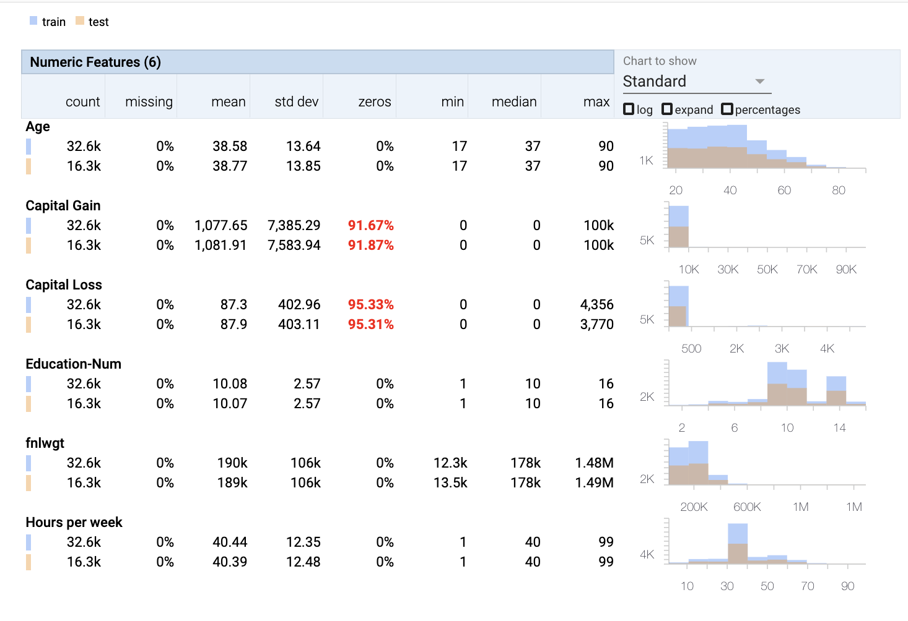
```


]

.pull-right[

```{r, echo = FALSE}
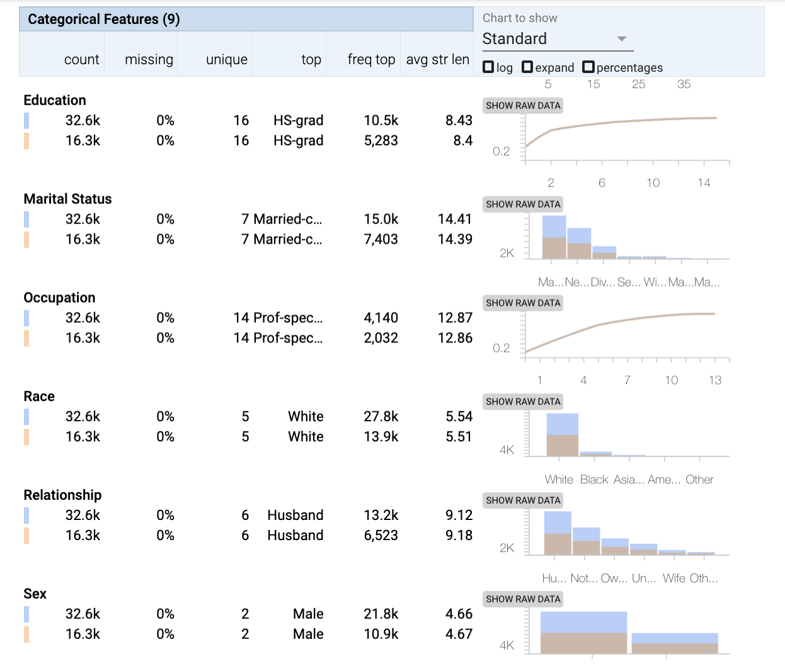
```
]

---
## Facets Dive

Exploration of individual datasets

.pull-left[

```{r, echo = FALSE}
knitr::include_graphics("assets/rstudioconf-facets-matrix.png")
```


]

.pull-right[

```{r, echo = FALSE}
knitr::include_graphics("assets/rstudioconf-facets-hist.png")
```

]
---

## Facets Dive - Quick Draw

[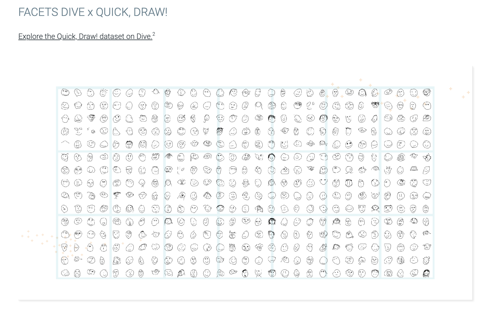](https://pair-code.github.io/facets/quickdraw.html)

---
## People + AI (PAIR)

This Guidebook will help you build human-centered AI products. It’ll enable you to avoid common mistakes, design excellent experiences, and focus on people as you build AI-driven applications.

---
## [Auto-magic Package Development](https://resources.rstudio.com/rstudio-conf-2020/auto-magic-package-development-alicia-schep)

#### _Alicia Schep_

‘vlbuildr’ package seeks to provide a pipe-friendly, “R-like” functional interface for building up simple to complex specifications for Vega-Lite graphics

```{r, echo = FALSE}
knitr::include_graphics("assets/rstudioconf-facets-hist.png")
```

---

### Vegalite


```{r, echo = FALSE}
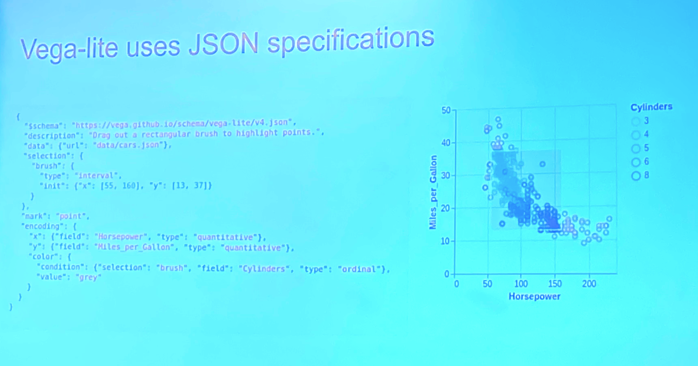
```


---

### Vegalite

```{r, echo = FALSE}
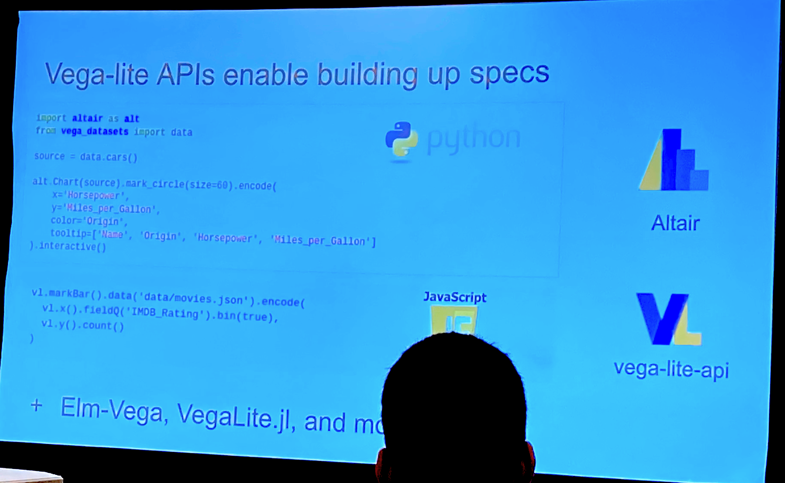
```


---

```r
vl_chart() %>%
  vl_add_data(url = "https://vega.github.io/vega-editor/app/data/cars.json") %>%
  vl_mark_point() %>%
  vl_encode_x(field = "Horsepower", type = "quantitative") %>%
  vl_encode_y(field = "Miles_per_Gallon", type = "quantitative") %>%
  vl_encode_color(field = list("repeat" = "column"), type = "nominal") %>%
  vl_repeat_col("Origin", "Cylinders") %>%
  vl_resolve_scale_color("independent")
```
---

```{r, echo=FALSE, fig.height= 4, fig.width= 3, out.width= "80%"}
library(vlbuildr)
vl_chart() %>%
  vl_add_data(url = "https://vega.github.io/vega-editor/app/data/cars.json") %>%
  vl_mark_point() %>%
  vl_encode_x(field = list("repeat" = "column"), type = "quantitative") %>%
  vl_encode_y(field = list("repeat" = "row"), type = "quantitative") %>%
  vl_add_interval_selection("brush", resolve = "global") %>%
  vl_encode_color(value = "grey") %>%
  vl_condition_color(selection = "brush", field = "Origin", type = "nominal") %>%
  vl_repeat_row("Horsepower", "Acceleration", "Miles_per_Gallon") %>%
  vl_repeat_col("Miles_per_Gallon", "Acceleration", "Horsepower")
```


---
class: inverse, middle

.center[
# the stuff of dreams
]

---

## [Shiny styling](https://resources.rstudio.com/rstudio-conf-2020/styling-shiny-apps-with-sass-and-bootstrap-4-joe-cheng) w `bootstraplib`

#### _Joe Cheng_


```{r, echo = FALSE}
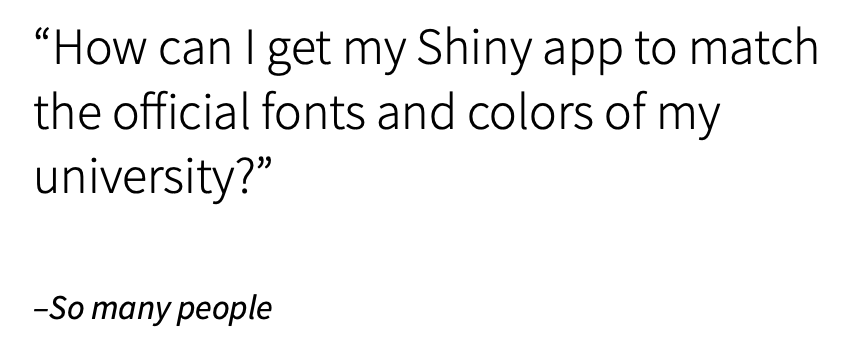
```


---

## [Shiny styling](https://resources.rstudio.com/rstudio-conf-2020/styling-shiny-apps-with-sass-and-bootstrap-4-joe-cheng) w `bootstraplib`


.pull-left[

```{r, echo = FALSE}
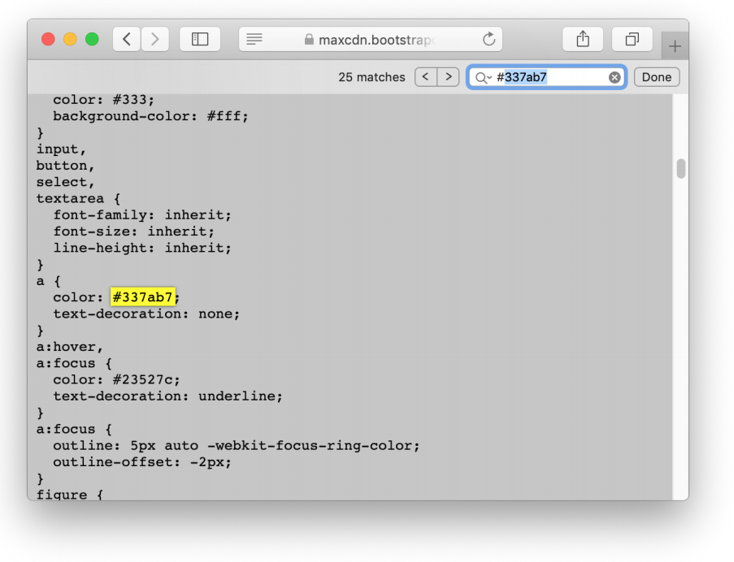
```


]

.pull-right[

```{r, echo = FALSE}
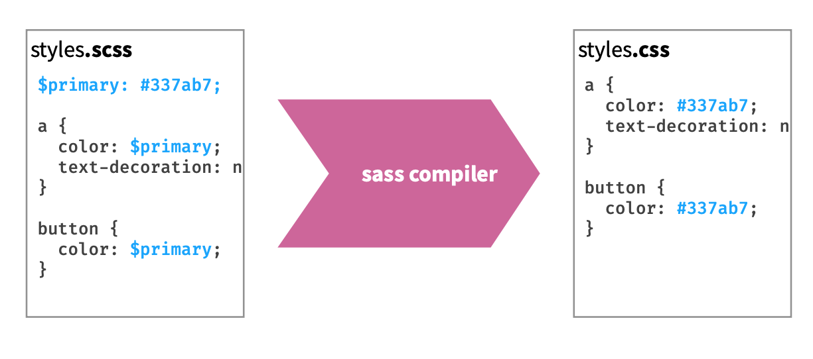
```

]

---


```{r, echo = FALSE}
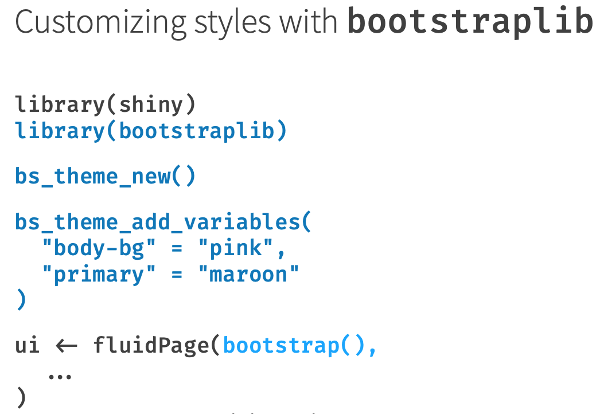
```

---

## `bootstraplib` addin

```{r, echo = FALSE, out.width = "55%"}
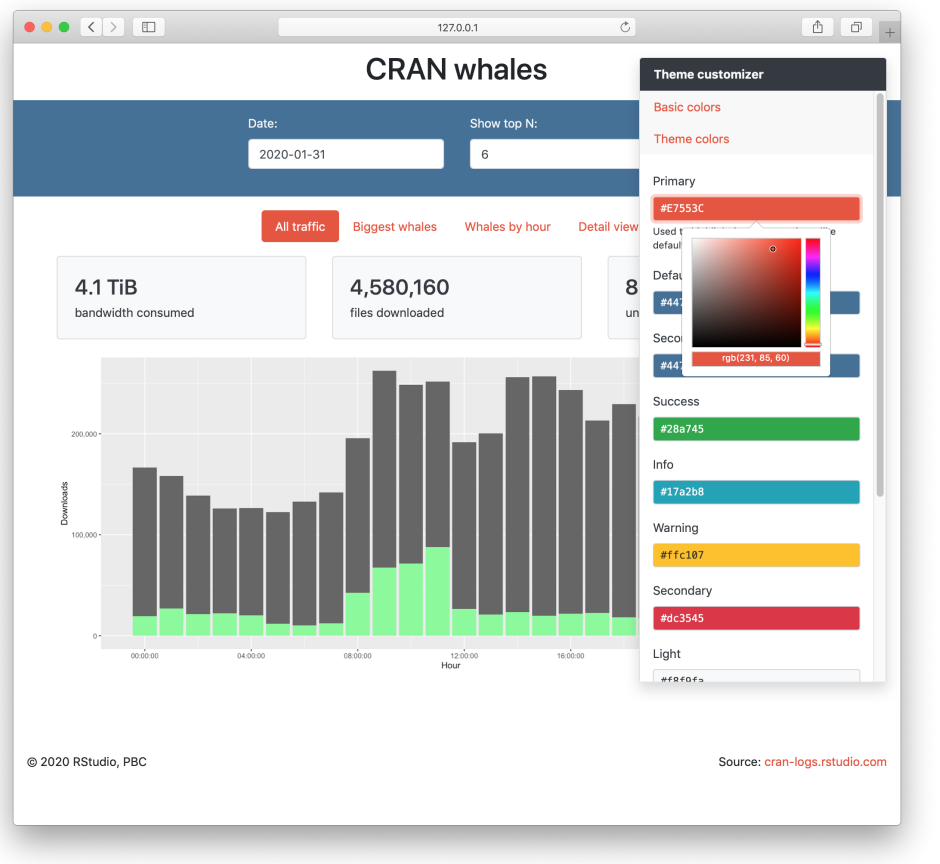

```

---

## [Reproducible shinyapps w `shinymeta`](https://resources.rstudio.com/rstudio-conf-2020/reproducible-shiny-apps-with-shinymeta-dr-carson-sievert)

#### _Carson Sievert_

```{r, echo = FALSE, out.height="20%"}
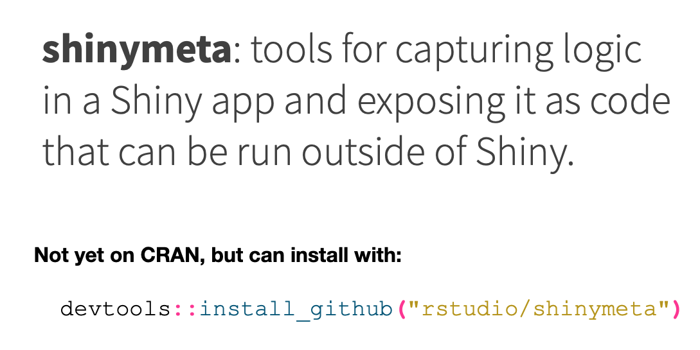

```

---

### Example `shinymeta`

.pull-left[

```{r, echo = FALSE}
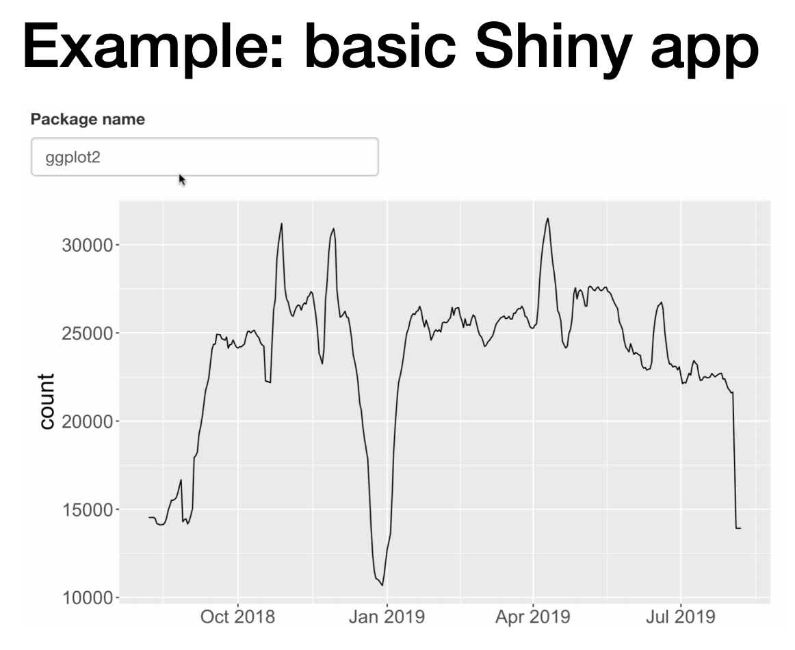
```


]

.pull-right[

```{r, echo = FALSE}
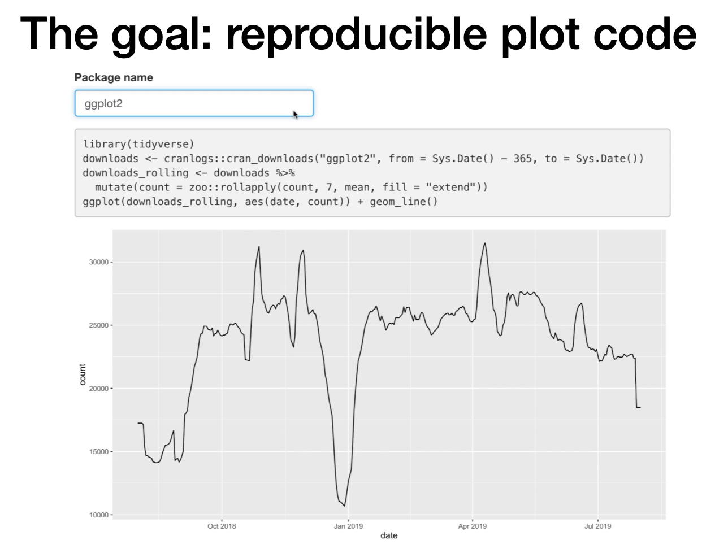
```

]


---

### `shinymeta` usage

```{r, echo = FALSE}
knitr::include_graphics("assets/rstudioconf-shinymeta-code.png")

```

---

### `shinymeta` outputs

.pull-left[

```{r, echo = FALSE}
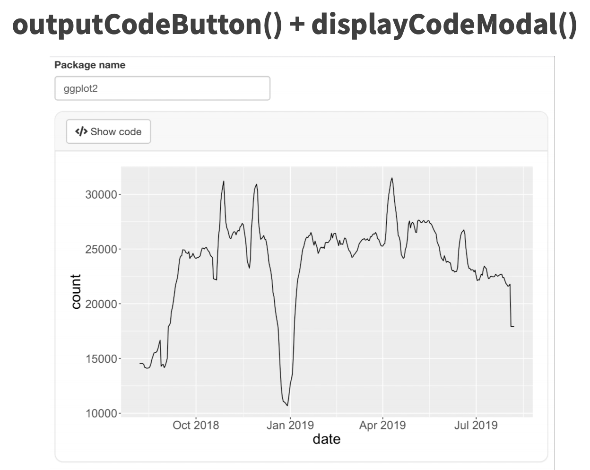
```


]

.pull-right[

```{r, echo = FALSE}
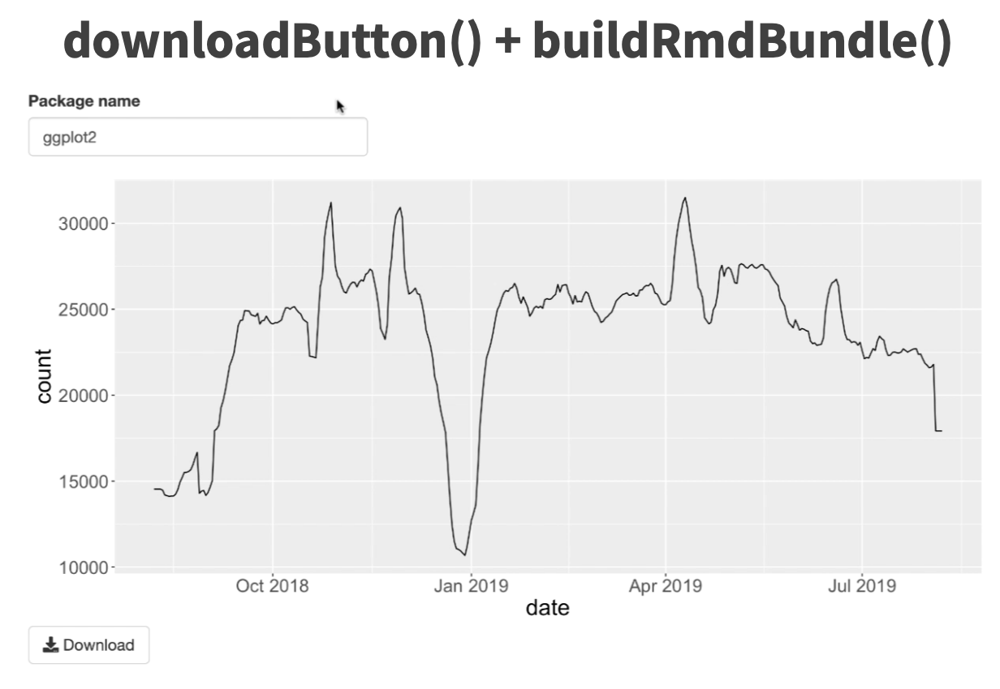
```

]


---

## [Interactivity and Programming in the Tidyverse](https://resources.rstudio.com/rstudio-conf-2020/interactivity-and-programming-in-the-tidyverse-lionel-henry)

#### _Lionel Henry_

advances in the tidy eval framework that make it easier to program around tidyverse pipelines without having to learn a lot of theory.

---
## Data-masking

> ### Idea of blending data with the workspace

```{r}
lm(Sepal.Length ~ Sepal.Width, data = iris)
```

---

## Data-masking

> #### Creates ambiguity between **data-variables** and **environment-variables**
 - unexpected masking by data-variables
 - data-variables that can't pass through functions

---

### Masking by data-variables

```{r, echo=FALSE}
library(dplyr)
```

.pull-left[
```{r}
n <- 100
data.frame(x = 1) %>%
  mutate(y = x / n) %>%
  pull(y)

```

]

.pull-right[
```{r}
data.frame(x = 1,
           n = 2) %>%
  mutate(y = x / n) %>%
  pull(y)

```

]

---
### Masking by data-variables

#### Solution: Be explicit!

```{r}
data.frame(x = 1,
           n = 2) %>%
  mutate(y = .data$x / .env$n) 
```

Use **`.env`** pronoun to refer to objects in environment and `.data` for data columns

---

### Passing data-variables through funtions

```{r}
mean_by <- function(data, by, var){
  data %>%
    group_by(by) %>%
    summarise(avg = mean(var))
}
```

```{r, error=TRUE}
iris %>% mean_by(Species, Petal.Length)
```

---

### Passing data-variables through funtions

Tunnel data variable through env-variable with **`{{ }}`**

```{r}
mean_by <- function(data, by, var){
  data %>%
    group_by({{ by }}) %>% #<<
    summarise(avg = mean({{ var }})) #<<
}
```

```{r, error=TRUE}
iris %>% mean_by(Species, Petal.Length)
```

---

### Programmable result name

Use glue string!

```{r}
mean_by <- function(data, by, var){
  data %>%
    group_by({{ by }}) %>%
    summarise("{{ var }}" := mean({{ var }})) #<<
}
```

```{r, error=TRUE, highlight.output=2}
iris %>% mean_by(Species, Petal.Length)
```
---

### Writting functions with data masking propagates it

> Users will need to be aware!

---

### Wrap tidy pipelines without data-masking?

```{r}
mean_by <- function(data, by, var){
  data %>%
    group_by(.data[[by]]) %>% #<<
    summarise("{var}" := mean(.data[[var]])) #<<
}
```

```{r, error=TRUE}
iris %>% mean_by("Species", "Petal.Length")
```

---

## [Rstudio 1.3 Sneak Preview](https://resources.rstudio.com/rstudio-conf-2020/rstudio-1-3-sneak-preview-jonathan-mcpherson)

#### _Jonathan McPherson_


```{r, echo = FALSE}
knitr::include_graphics("assets/rstudioconf-1.3gr.png")
```


---

## Rstudio 1.3 Sneak Preview


.pull-left[

```{r, echo = FALSE}
knitr::include_graphics("assets/rstudioconf-1.3schk.png")
```


]

.pull-right[

```{r, echo = FALSE}
knitr::include_graphics("assets/rstudioconf-1.3schk2.png")
```
]


---
class: inverse, middle

.center[
# masters of entertainment
]

---

## [Learning R with humorous side projects](https://resources.rstudio.com/rstudio-conf-2020/learning-r-with-humorous-side-projects-ryan-timpe)

#### _Ryan Timpe_

---

##### Q: Which season should I watch while playing the Golden Girls Drinking Game?

```{r, echo = FALSE, out.width= "70%"}
knitr::include_graphics("assets/rstudioconf-humour-ggirls.png")
```

---

### Animated paths of Jurassic Park characters


```{r, echo = FALSE, out.width= "70%"}
knitr::include_graphics("assets/rstudioconf-humour-jpark2.png")
```

---

### Learn new tools!

```{r, echo = FALSE, out.width= "70%"}
knitr::include_graphics("assets/rstudioconf-humour-tools.png")
```
---

### [One R Markdown Document, Fourteen Demos](https://resources.rstudio.com/rstudio-conf-2020/one-r-markdown-document-fourteen-demosyihui-xie?wvideo=aj3deolth1)

#### _Yihui Xie_

<p><a href="https://resources.rstudio.com/rstudio-conf-2020/one-r-markdown-document-fourteen-demosyihui-xie?wvideo=aj3deolth1"></a></p>

---
class: inverse, middle

.center[
# fell good moments
]
---

## R-ladies!

<blockquote class="twitter-tweet"><p lang="en" dir="ltr">Hello 👋 from <a href="https://twitter.com/hashtag/RLadies?src=hash&amp;ref_src=twsrc%5Etfw">#RLadies</a> at <a href="https://twitter.com/hashtag/rstudioconf?src=hash&amp;ref_src=twsrc%5Etfw">#rstudioconf</a>!!💜 <a href="https://t.co/lTUK2Ap9bc">pic.twitter.com/lTUK2Ap9bc</a></p>&mdash; R-Ladies Global (@RLadiesGlobal) <a href="https://twitter.com/RLadiesGlobal/status/1223082687759441920?ref_src=twsrc%5Etfw">January 31, 2020</a></blockquote> <script async src="https://platform.twitter.com/widgets.js" charset="utf-8"></script>

---

## RStudio, PBC

.pull-left[

#### _J.J. Allaire_

<iframe allowtransparency="true" title="Wistia video player" allowFullscreen frameborder="0" scrolling="no" class="wistia_embed" name="wistia_embed" src="https://fast.wistia.net/embed/iframe/i7lqqlo6ng" width="400" height="225"></iframe>

]


.pull-right[

**Primary purpose:** [Create free and open-source software for data science, scientific research, and technical communication.](https://blog.rstudio.com/2020/01/29/rstudio-pbc/)

```{r, echo = FALSE}

```

]
---
class: inverse, middle

## Thanks for `r emo::ji("eyes")`

### slides: **bit.ly/rstudioconf20**
