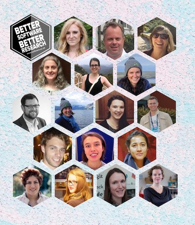
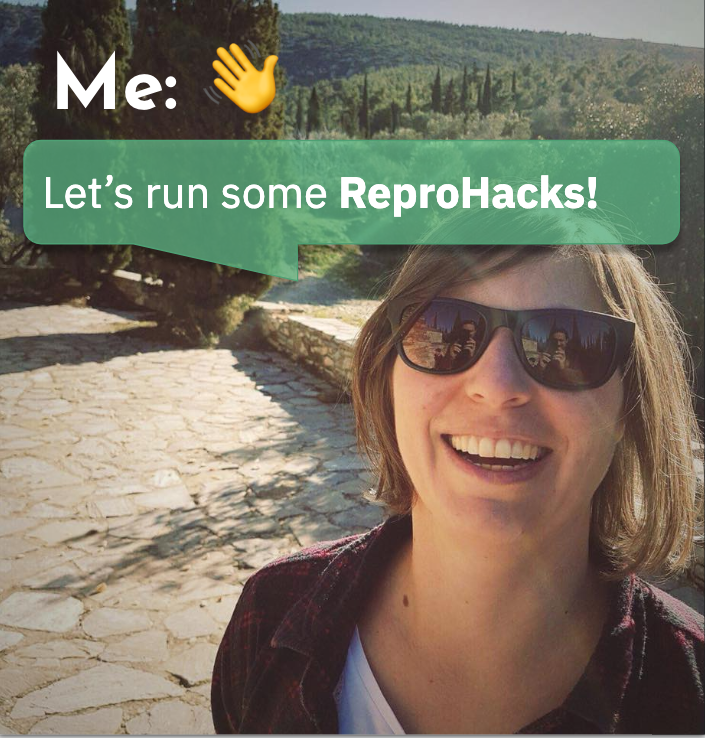
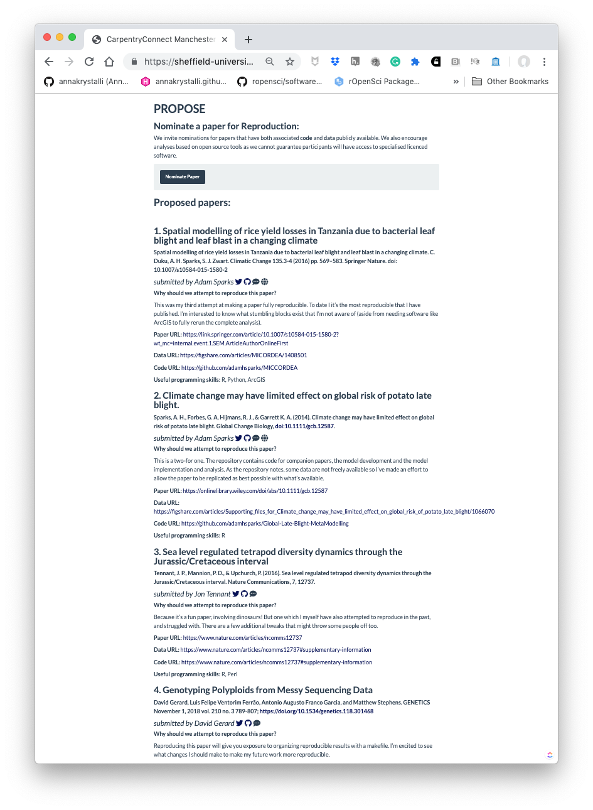

# `r emo::ji("wave")` Hello

### me: **Dr Anna Krystalli**

- **Research Software Engineer**, _University of Sheffield_
    + twitter **@annakrystalli**
    + github **@annakrystalli**
    + email **a.krystalli[at]sheffield.ac.uk**
    
- **Editor [rOpenSci](http://onboarding.ropensci.org/)**

- **Co-organiser:** [Sheffield R Users group](https://www.meetup.com/SheffieldR-Sheffield-R-Users-Group/)

 

### slides: **bit.ly/r-in-repro-research**

---

# ReproHack History

#### OpenCon Satellite: Berlin, 2016

#### OpenCon Satellite: London, 2017

--
 
 

Inspired by Owen Petchey's [Reproducible Research in Ecology, Evolution, Behaviour, and Environmental Studies](https://github.com/opetchey/RREEBES) course, 

- Reproduce published results from raw data
- Over a few months and a number of sessions

--

### **ReproHack mission:  Reproduce paper in a day from code and data**

---

# SSI Fellowship

.pull-left[

]

--

.pull-right[

]

---
class: inverse, left, bottom

# .font_title[How does it work?]

***
---

# Call for papers

.pull-left[

<blockquote class="twitter-tweet">
✨Do you champion <a href="https://twitter.com/hashtag/reproducible?src=hash&amp;ref_src=twsrc%5Etfw">#reproducible</a> <a href="https://twitter.com/hashtag/research?src=hash&amp;ref_src=twsrc%5Etfw">#research</a>?  ✨Do you have a reproducible paper with open code and data?  The <a href="https://twitter.com/SoftwareSaved?ref_src=twsrc%5Etfw">@SoftwareSaved</a> <a href="https://twitter.com/hashtag/ReproHack?src=hash&amp;ref_src=twsrc%5Etfw">#ReproHack</a> series needs you! 🚀  Help others learn &amp; engage with your work by submitting it to our 1-day Reproducibility hackathons!<a href="https://t.co/PssdXqwl8Z">https://t.co/PssdXqwl8Z</a>
&mdash; annakrystalli (@annakrystalli) <a href="https://twitter.com/annakrystalli/status/1138769695513952260?ref_src=twsrc%5Etfw">June 12, 2019</a></blockquote> 
]

--

.pull-right[

]

---

# On the day

- #### Review and select papers for reproduction 
- #### Work with materials and reproduce 
- #### Discuss 
- #### Feed back to authors

---
class: inverse, bottom, left

# .font_title[Benefits]

***

---
# Participants

.pull-left[
1. #### Practical reproducibility they can implement in their own work
]

.pull-right[

]

---

# Participants

.pull-left[
1. #### Practical reproducibility they can implement in their own work
]

.pull-right[

]

---

# Participants

.pull-left[
1. Practical reproducibility they can implement in their own work

2. #### Inspiration from working with other people’s code and data.
]

.pull-right[

]

---
# Participants

.pull-left[
1. Practical reproducibility they can implement in their own work

2. Inspiration from working with other people’s code and data.

3. #### Reproduction as community value
]

.pull-right[

]

---
# Authors

.pull-left[
1. #### Useful feedback on the reproducibility of their work

]

.pull-right[

]

---
# Authors

.pull-left[
1. Useful feedback on the reproducibility of their work

2. #### Appreciation for their efforts in making their work reproducible
]

.pull-right[

]

---

# Authors

.pull-left[
1. Useful feedback on the reproducibility of their work

2. #### Appreciation for their efforts in making their work reproducible
]

.pull-right[

]

---
# Authors

.pull-left[
1. Useful feedback on the reproducibility of their work

2. Appreciation for their efforts in making their work reproducible

3. #### An opportunity to engage others with their research.
]

.pull-right[

]

---
class: inverse, left, bottom

# .font_title[Some lessons]

***
---

# Reproducing papers is fun!! 

.pull-left[

]

---

# Reproducing papers is fun!! 

.pull-left[

<blockquote class="twitter-tweet">
Huge thanks to <a href="https://twitter.com/EnviroKaty?ref_src=twsrc%5Etfw">@EnviroKaty</a> for submitting a fab 🦋 🦋🦋 paper to the <a href="https://twitter.com/hashtag/CCMcr19?src=hash&amp;ref_src=twsrc%5Etfw">#CCMcr19</a> <a href="https://twitter.com/hashtag/ReproHack?src=hash&amp;ref_src=twsrc%5Etfw">#ReproHack</a>! I had loads of fun reproducing the analysis for this really cool paper <a href="https://t.co/v1ww2D5xhg">https://t.co/v1ww2D5xhg</a> <a href="https://t.co/r8rYMAMvPm">pic.twitter.com/r8rYMAMvPm</a>
&mdash; Jessica Ward (@JKRWard) <a href="https://twitter.com/JKRWard/status/1144254546841165827?ref_src=twsrc%5Etfw">June 27, 2019</a></blockquote> 

]

.pull-right[
<blockquote class="twitter-tweet">
Many thanks to <a href="https://twitter.com/annakrystalli?ref_src=twsrc%5Etfw">@annakrystalli</a> for a brilliant <a href="https://twitter.com/hashtag/ReproHack?src=hash&amp;ref_src=twsrc%5Etfw">#ReproHack</a> at <a href="https://twitter.com/hashtag/CCMcr19?src=hash&amp;ref_src=twsrc%5Etfw">#CCMcr19</a> today - and mega thanks to <a href="https://twitter.com/Ben_C_J?ref_src=twsrc%5Etfw">@Ben_C_J</a> for nominating one of his papers with <a href="https://twitter.com/LisaDeBruine?ref_src=twsrc%5Etfw">@LisaDeBruine</a> and colleagues to see if we could reproduce the modelling results - and we could! 💯 😀👍 <a href="https://twitter.com/hashtag/opencode?src=hash&amp;ref_src=twsrc%5Etfw">#opencode</a> <a href="https://twitter.com/hashtag/opendata?src=hash&amp;ref_src=twsrc%5Etfw">#opendata</a> ftw!
&mdash; Andrew Stewart (@ajstewart_lang) <a href="https://twitter.com/ajstewart_lang/status/1144316430063677446?ref_src=twsrc%5Etfw">June 27, 2019</a></blockquote> 

]

---
class: inverse, left, bottom

# .font_title[Future Development]

***
---
# A growing team!
.row[
.pull-left[
.image_profile[]
]

.pull-right[

### [Florencia D'Andrea](https://rladies.org/argentina-rladies/name/maria-dandrea/)

Postdoc at the National Agricultural Technology Institute of Argentina
]
]

--

.row[

]

---
#  More ReproHacks!

.pull-left[

<blockquote class="twitter-tweet">
This thing is really happening! <a href="https://t.co/d2xnHNo9z2">pic.twitter.com/d2xnHNo9z2</a>
&mdash; ReproHack NL ♻️ (@ReproHackNL) <a href="https://twitter.com/ReproHackNL/status/1174998682879631360?ref_src=twsrc%5Etfw">September 20, 2019</a></blockquote> 

]

.pull-right[

]

---

# ReproHack outputs: [ReScience C](http://rescience.github.io/)

.pull-left[

#### Replication Report

- Repeat a published protocol
- Respect its spirit and intentions
- Varying the technical details, e.g. using different software, initial conditions, etc.

`r emo::ji("point_right")` **Change something that everyone believes shouldn’t matter, and see if the scientific conclusions are affected**

]

.pull-right[

]

---

# ReproHack outputs: [ReScience C](http://rescience.github.io/)

.pull-left[

#### Replication Report

- Repeat a published protocol
- Respect its spirit and intentions
- Varying the technical details, e.g. using different software, initial conditions, etc.

`r emo::ji("point_right")` **Change something that everyone believes shouldn’t matter, and see if the scientific conclusions are affected**

]

.pull-right[

####  Reproducibility Report

- Accessibility of materials,
- Installation and dependency management,
- Documentation clarity,
- Ease of reuse,
- What else?

]

---

# Many ways to ReproHack

---
# Reproducible Reprohacks

.pull-left[

#### Current setup

- paper list compiled in shiny app
- Google forms to submit papers & author feedback
- GitHub repo to run event

 

[reprohack/reprohack-template-shiny](https://github.com/reprohack/reprohack-template-shiny)|[instructions](https://github.com/reprohack/reprohack-hq/blob/master/organiser_instructions.md)
]

--

.pull-right[

#### Next Generation setup

**Build custom website to coordinate events.**

**Forms:**
- Event submission for organisers
- Paper submission for authors
- Feedback submission for participants

]

---
# Lessons

### SSI Fellowship benefits:

- networking and getting the word out
- finding collaborators
- independence to help push project forward

--

### Tips

- Make your project as open as possible
- Use the opportunity to collaborate
- Have fun!

---

et involved!

### [reprohack-hq](https://github.com/reprohack/reprohack-hq) repository

#### Check out our [issues](https://github.com/reprohack/reprohack-hq/issues)

#### Chat to us:

#### Sign up to our Newsletter

 <form style="border:1px solid #ccc;padding:3px;text-align:center;" action="https://tinyletter.com/reprohack-hq" method="post" target="popupwindow" onsubmit="window.open('https://tinyletter.com/reprohack-hq', 'popupwindow', 'scrollbars=yes,width=800,height=600');return true">
<label for="tlemail">Enter your email address</label>

<input type="text" style="width:140px" name="email" id="tlemail" />
<input type="hidden" value="1" name="embed"/><input type="submit" value="Subscribe" />
<a href="https://tinyletter.com" target="_blank">powered by TinyLetter</a>
</form>
         

