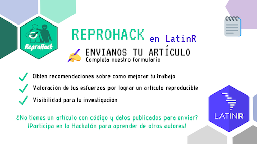
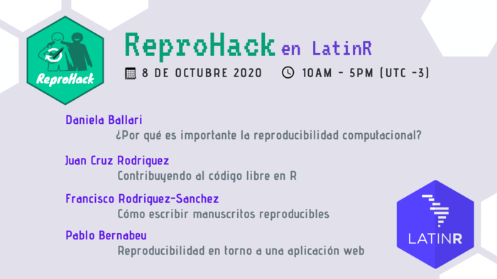
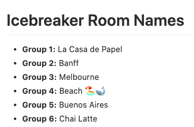
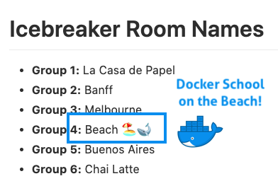

background-image: url(assets/backgrounds/ro-sticker-background.jpg)
background-size: contain

```{r, echo=FALSE, out.width="20%"}
knitr::include_graphics("assets/reprohack_logo.png")
```


## ReproHacking through the pandemic

<br>

### _Anna Krystalli_ <i class="fab fa-twitter "></i> @annakrystalli
.white[
_SSI Community Call, 23rd Feb 2021_
]

```{r setup, include=FALSE}
knitr::opts_chunk$set(echo = FALSE,
                  out.width = "90%",
                  fig.height = 6,
                  dev = "svg",
                  message = FALSE,
                  warning = FALSE)
library(magrittr)
library(dplyr)
library(xaringanthemer)
```

```{r xaringan-themer, include = FALSE}
library(xaringanthemer)

#neg_color <- "#f25a22"
#pos_color <- "#03CC99"
neg_color <- "#fc8d62"
pos_color <- "#1b9e77"
text_font_google = google_font("Lato", "300", "300i")

#primary_color = "#2D896B"
#secondary_color = "#46CC97"
style_duo_accent(primary_color = pos_color, secondary_color = neg_color,
  header_font_google = google_font("Fira Sans", "700"),
  text_font_google   = text_font_google,
  code_font_google   = google_font("Source Code Pro"),
  title_slide_text_color = "#edf9f6",
  background_color = "#edf9f6",
  black_color = "#2a332c",
  title_slide_background_image = "assets/background.jpg",
  colors = c(
  red = "#f34213",
  purple = "#3e2f5b",
  orange = "#ff8811",
  darkgreen = "#2e6351",
  white = "#FFFFFF"
),
  outfile = "assets/css/user2020-xaringan-themer.css"
)
```

---


# `r emo::ji("wave")` Hello

### me: **Dr Anna Krystalli**

- **Research Software Engineer**, _University of Sheffield_
    + twitter **@annakrystalli**
    + github **@annakrystalli**
    + email **a.krystalli[at]sheffield.ac.uk**
    
- **Editor [rOpenSci](http://onboarding.ropensci.org/)**

- **Co-organiser:** [Sheffield R Users group](https://www.meetup.com/SheffieldR-Sheffield-R-Users-Group/)

---
layout: true

.left.footnote[**<i class="fab fa-twitter "></i> @annakrystalli**]

---
class: inverse, center, middle

# ReproHack Background


???

Let's start with a bit of background

---


### Software Sustainability Institute Fellowship 2019


.pull-left[

]

--

.pull-right[

```{r}
knitr::include_graphics("assets/me-reprohack.png")
```

```{r}
knitr::include_graphics("https://github.com/reprohack/reprohack-2019-06-27/blob/master/CCmcrlogo.png?raw=true")
```

]

---


# Reprohack

#### One day reproducibility hackathons


### **ReproHack mission:  Reproduce paper in a day from code and data**

***

--

- ### How reproducible are papers?

--

- ### How can we provide a sandbox environment to practice reproducibility?

???

So these were really the key issues that the ReproHack project sought to address:


- How reproducible are papers with associated published code and data?

- How can we provide a sandbox environment where both authors and reviewers can practice reproducibility?


---
class: inverse, middle, center

# How does it work?

---

## Call for papers

.pull-left[


<blockquote class="twitter-tweet"><p lang="en" dir="ltr">✨Do you champion <a href="https://twitter.com/hashtag/reproducible?src=hash&amp;ref_src=twsrc%5Etfw">#reproducible</a> <a href="https://twitter.com/hashtag/research?src=hash&amp;ref_src=twsrc%5Etfw">#research</a>? <br>✨Do you have a reproducible paper with open code and data?<br><br>The <a href="https://twitter.com/SoftwareSaved?ref_src=twsrc%5Etfw">@SoftwareSaved</a> <a href="https://twitter.com/hashtag/ReproHack?src=hash&amp;ref_src=twsrc%5Etfw">#ReproHack</a> series needs you! 🚀<br><br>Help others learn &amp; engage with your work by submitting it to our 1-day Reproducibility hackathons!<a href="https://t.co/PssdXqwl8Z">https://t.co/PssdXqwl8Z</a></p>&mdash; annakrystalli (@annakrystalli) <a href="https://twitter.com/annakrystalli/status/1138769695513952260?ref_src=twsrc%5Etfw">June 12, 2019</a></blockquote> <script async src="https://platform.twitter.com/widgets.js" charset="utf-8"></script>
]

--

.pull-right.middle[

```{r, out.width="100%"}
knitr::include_graphics("assets/rh-paper_list.png")
```

]


???

In the current format, leading up to the event, 

we have a call for papers 

where we encourage authors to submit their papers for reproduction.

We like this because it means authors get engaged from the start

And this hopefully results in a nice paper list  for participants to work with on the day

---
background-image: url("assets/on_the_day-bg.jpg")
background-size: cover

# On the day


- ###  Select paper and form groups

- ### Work with materials and reproduce 

- ### Discuss 

- ### Feed back to authors

???

On the day, we start with a bit of an introduction in which we stress that:

 - Reproducibility is hard!
- Authors are incredibly brave to invite us into their work
- So we set the tone to invite only constructive feedback.


Participants are then free to review and select papers they wish to work on and attempt to reproduce them

At some point we regroup to share progress and close with a final share out.

Most importantly, we ask participants to feed their experiences back to the authors

---


## ReproHacks since the Fellowship


### [Leiden ReproHack](https://reprohacknl.github.io/ReproHack/)


```{r, echo=FALSE, out.width="90%"}
knitr::include_graphics("assets/Hackathon.jpg")
```


???

Since the Fellowship, there's been a number of events run both by myself and the ReproHack community

- Leiden ReproHack: lead to formation of core team

- Just won the Open Initiatives Trophy at the Dutch Open Science fair
---

## ReproHacks since the Fellowship


### [N8 CIR Northern Tour ReproHack Series](https://n8cir.org.uk/news/reprohacks/) (x5)

```{r, echo = FALSE}
knitr::include_graphics("assets/n8-reprohack_collage.gif")
```


???

- N8 CIR Northern Tour ReproHack Series] A series of (x5) events across Northern UK universities

---
## ReproHacks since the Fellowship

### [N8 CIR Northern Tour ReproHack Series](https://n8cir.org.uk/news/reprohacks/) (x5)

.pull-left[
```{r, out.width="70%"}
knitr::include_graphics("assets/reprohack-webad_N8-01.png")
```

]

.pull-right[

<blockquote class="twitter-tweet"><p lang="en" dir="ltr">‼️🚨 Manchester <a href="https://twitter.com/N8CIR?ref_src=twsrc%5Etfw">@N8CIR</a> <a href="https://twitter.com/ReproHack?ref_src=twsrc%5Etfw">@ReproHack</a> CANCELLED ‼️🚨 <br><br>Due to the changing situation with <a href="https://twitter.com/hashtag/COVID19?src=hash&amp;ref_src=twsrc%5Etfw">#COVID19</a> we&#39;ve decided that despite the low risk, it would be irresponsible to expose participants unnecessarily to it.<br><br>We&#39;ll either reschedule or explore a remote option. 🙏</p>&mdash; annakrystalli (@annakrystalli) <a href="https://twitter.com/annakrystalli/status/1238001705700265984?ref_src=twsrc%5Etfw">March 12, 2020</a></blockquote> <script async src="https://platform.twitter.com/widgets.js" charset="utf-8"></script>

]

???

Cancellation of the Manchester event due to COVID lead to us exploring something we'd been discussing from the start, a remote format for the event!
---
## ReproHacks since the Fellowship


### [N8 CIR Remote ReproHack](https://n8cir.org.uk/events/remote-reprohack/)


```{r, echo = FALSE}
knitr::include_graphics("assets/remote_reprohack_flyer.png")
```


???

And so the first Remote reprohack emerged as a replacement in May last year but was now open to all!

---
## ReproHacks since the Fellowship

### [LatinR ReproHack](https://latin-r.com/blog/reprohack-en)


```{r, echo = FALSE}

```


???

And also lead nicely to a remote event at last year's Latin R, where we ran the first event fully in Spanish! and I was able to attend without any sponsorship!


---
## ReproHacks since the Fellowship

### [UCL ReproHack for Open Access week](https://blogs.ucl.ac.uk/open-access/2020/11/17/open-access-week-the-first-reprohack-%E2%99%BB-ucl/)


???


Update coming up by Fellow David!

---
class: inverse, center, middle

# Remote Benefits

--

## Benefit #1: More Accessible (physically)

---

### More accessible for support team

Most of Reprohack Core Team made it!

```{r, out.width="100%"}
knitr::include_graphics("assets/reprohack_core_team.png")
```

???

UK, Netherlands and as far as Buenos Aires, Argentina


---

### More accessible for additional contributors (TALKS!)

.pull-left[

### Remote ReproHack

- **`r emo::ji("loudspeaker")` Daniel Nüst** ***Research compendia enable code review during peer review*** _(Germany)_

- **`r emo::ji("loudspeaker")` Daniel Pique -** ***How I discovered a missing data point in a paper with 8000+ citations*** _(USA)_

- **`r emo::ji("loudspeaker")` Sarah Gibson -** ***Sharing Reproducible Computational Environments with Binder*** _(UK)_


]

.pull-right[

### LatinR ReproHack


```{r, out.width="100%"}

```

]

???

So in these events we had speakers! Something that is possible for larger, one-off and well sponsored events but would have been impossible for the ReproHack series.

They also came from all over! 

Really engaging, very relevant!

---

### More accessible for participants


#### People from a far were able to join:
 including Japan, Argentina, Netherlands, Sweden and the USA!

.center[

]

--

Much larger sessions possible with minimal sponsorship

---
class: inverse, center, middle

# Remote Benefits


## Benefit #2: Easier to experiment with format

--

More on this from David next!

---
class: inverse, center, middle

## Strategies for mantaining the benefits of an in-person event

---
## Breakout Rooms for ice-breaker

Participants got to name their rooms!

.center[

```{r, out.width="70%"}

```

]

???

Ice-breakers even more important in an online event so we split participants up into break out rooms to get to know each other. 

But, the nice thing about the platform we were using was that we can give rooms a name.
So we also set groups the task to name the breakout room they were in so we had more interesting spaces to work in that room1 room2 etc

---
## Breakout Rooms for ice-breaker

Participants got to name their rooms!

.center[

```{r, out.width="70%"}

```

]

???

One of the nice things about the hacky vibe of reprohacks is that we ofen get improptu peer skill sharing sessions, and this did happen and is how we ended with docker school on the beach 


---
## Participants able to move around!

### Platform: Blackboard Collaborate

***

## Room setup

- **Main Room:** _Talks, share out sessions and communal workspace space_

- **Icebreaker Breakout rooms:** _Used by groups_

- **Cafe and other more private spaces:** _Used to chat informally and work solo_

- **Chat:** _Discussions, questions, reactions to talks!_ `r emo::ji("clap")`


???

- Moderators would either engage with folks in the main room (in LatinR we also had music!) but also drop in on groups from time to time

---
.pull-left[
## Virtual Stickers on Twitter!
]

.pull-right[

<blockquote class="twitter-tweet"><p lang="en" dir="ltr">Thank you for your fine contribution at the remote <a href="https://twitter.com/ReproHack?ref_src=twsrc%5Etfw">@ReproHack</a> today. You are first-class <a href="https://twitter.com/PhDToothFAIRy?ref_src=twsrc%5Etfw">@PhDtoothFAIRy</a>! We&#39;re sad we can&#39;t hand out real stickers so here&#39;s a twitter one instead. Hope to give out real ones in person sometime soon! <a href="https://twitter.com/hashtag/reproduciblescience?src=hash&amp;ref_src=twsrc%5Etfw">#reproduciblescience</a> <a href="https://t.co/SoBsOxc5N2">pic.twitter.com/SoBsOxc5N2</a></p>&mdash; ReproHack ♻️ (@ReproHack) <a href="https://twitter.com/ReproHack/status/1260970576207888386?ref_src=twsrc%5Etfw">May 14, 2020</a></blockquote> <script async src="https://platform.twitter.com/widgets.js" charset="utf-8"></script>
]

---
class: inverse, center, middle

# Challenges

--

# Internet connection!!!

---
## Interested in ReproHacking?

### [reprohack/reprohack-hq](https://github.com/reprohack/reprohack-hq) GH repository

#### Chat to us:

[](https://reprohack-autoinvite.herokuapp.com/)


### Host your own event!

### Submit your own papers!


---
class: inverse, center, middle

## `r emo::ji("wave")` Thanks for `r emo::ji("eyes")`

<br>

# `r emo::ji("question")`
