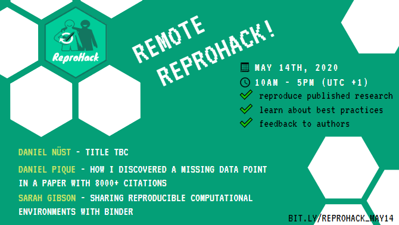
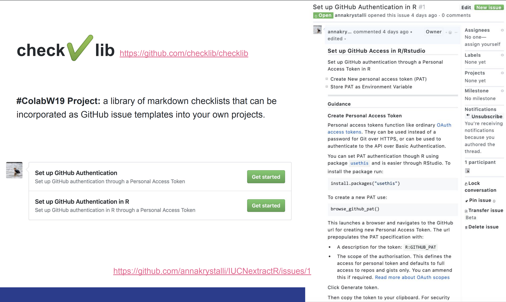

background-image: url(assets/user2020_title.png)
background-size: contain


```{r setup, include=FALSE}
knitr::opts_chunk$set(echo = FALSE,
                  out.width = "90%",
                  fig.height = 6,
                  dev = "svg",
                  message = FALSE,
                  warning = FALSE)
library(magrittr)
library(dplyr)
library(xaringanthemer)
```

```{r xaringan-themer, include = FALSE}
library(xaringanthemer)

#neg_color <- "#f25a22"
#pos_color <- "#03CC99"
neg_color <- "#fc8d62"
pos_color <- "#1b9e77"
text_font_google = google_font("Lato", "300", "300i")

#primary_color = "#2D896B"
#secondary_color = "#46CC97"
style_duo_accent(primary_color = pos_color, secondary_color = neg_color,
  header_font_google = google_font("Fira Sans", "700"),
  text_font_google   = text_font_google,
  code_font_google   = google_font("Source Code Pro"),
  title_slide_text_color = "#edf9f6",
  background_color = "#edf9f6",
  black_color = "#2a332c",
  title_slide_background_image = "assets/background.jpg",
  colors = c(
  red = "#f34213",
  purple = "#3e2f5b",
  orange = "#ff8811",
  darkgreen = "#2e6351",
  white = "#FFFFFF"
),
  outfile = "assets/css/user2020-xaringan-themer.css"
)
```

---


# `r emo::ji("wave")` Hello

### me: **Dr Anna Krystalli**

- **Research Software Engineer**, _University of Sheffield_
    + twitter **@annakrystalli**
    + github **@annakrystalli**
    + email **a.krystalli[at]sheffield.ac.uk**
    
- **Editor [rOpenSci](http://onboarding.ropensci.org/)**

- **Co-organiser:** [Sheffield R Users group](https://www.meetup.com/SheffieldR-Sheffield-R-Users-Group/)

---
layout: true

.left.footnote[`r icon::fa('twitter')` @annakrystalli]

---
class: inverse, center, middle

# Background


---
background-image: url(assets/boats.png)
background-size: cover


## .bg-white[Marine Biology]

---
background-image: url(assets/maps.png)
background-size: cover

.box[
## .bg-white[Marine Biology]
]


---
background-image: url(https://www.reactiongifs.com/r/O_o.gif)
background-size: cover
class: inverse


## .bg-white[ Quality Assurance ]
.bg-white[> #### _QA Auditor for a Contract Research Organisation subject to GLP regulation_

]


---
background-image: url(assets/ruchindra-gunasekara-GK8x_XCcDZg-unsplash.jpg)
background-size: cover


## .bg-white[Ultrasport]
.bg-white[
> #### _Brand coordinator for an extreme sports equipment distributor_

]


---
class: inverse, center, middle

# Back to science: 

---

.pull-left[

### Ooops, that's embarassing!
<br>


]

.pull-right[

]

---

# The paper is the advertisement

> “an article about a computational result is advertising, not scholarship. The **actual scholarship is the full software environment, code and data, that produced the result.**”

*John Claerbout paraphrased in [Buckheit and Donoho (1995)](https://statweb.stanford.edu/~wavelab/Wavelab_850/wavelab.pdf)*

--

### Why is our whole system geared towards **reviewing, publishing, distributing, archiving** the advertisement?

---

## Progress: calls for reproducibility as minimum standard

> #### **Reproducibility** has the potential to serve as a **minimum standard for judging scientific claims** when full independent replication of a study is not possible.

 <br>


.center[
```{r}
knitr::include_graphics("assets/repro-spectrum.jpg")
```
]
.img-attr[Reproducible Research in Computational Science
_ROGER D. PENG, SCIENCE 02 DEC 2011 : 1226-1227_
]
<br>

---
class: inverse, center, middle

.box[
## Benefit #1
]

## transparency as a means of verification

---
background-image: url("https://media1.giphy.com/media/BWTZOE4vnj3gs/giphy.gif?cid=790b761105c665c045cf431bde7e8419e02f3f6314ac0d32&rid=giphy.gif")
background-size: cover

.bg-white[
### There is a hidden superpower...
]


---
background-image: url("assets/repository-fork.png")

--

.pull-left[
<br>
<br>
<br>
<br>
<br>
<br>

## **Woah, It's evolution...**

]

.pull-right[
<br>
<br>
<br>
<br>
<br>
<br>

```{r}
knitr::include_graphics("https://media1.giphy.com/media/PA6ms60GXLPdm/giphy.gif?cid=790b76112b728da8d598df4643af00506237c35986b47f54&rid=giphy.gif")
```

]


---


> #### [**_Macroecological and macroevolutionary patterns emerge in the universe of GNU/Linux operating systems_**](https://doi.org/10.1111/ecog.03424)

.pull-left[

> doi:10.1111/ecog.03424

```{r}
knitr::include_graphics("assets/ecography_gnu.png")
```

]

--

.pull-right[

```{r, out.width="90%"}
knitr::include_graphics("assets/ecography_gnu_fig4.jpg")
```

]


---
background-image: url("assets/hanslibdata.png")
background-size: cover

## Example: **gapminder.org: 2006** 


### [liberating stories from data](https://youtu.be/hVimVzgtD6w?t=15m3s)


---
## Gapminder today

```{r, fig.show = "animate", message=FALSE, warning=FALSE, echo=TRUE}
library(ggplot2)

p <- ggplot(gapminder::gapminder, aes(gdpPercap, lifeExp, size = pop, color = continent, frame = year)) +
  geom_point() + scale_x_log10() + theme_bw()
```

```{r, message=FALSE, warning=FALSE, fig.height=4, echo=TRUE}
plotly::ggplotly(p)
```
---
class: inverse, center, middle


## Benefit #2


## transparency as a means of supercharging research cycle


---
class: center, middle

# So how are we doing?


```{r}
knitr::include_graphics("assets/repro-spectrum.jpg")
```


.img-attr[Reproducible Research in Computational Science
_ROGER D. PENG, SCIENCE 02 DEC 2011 : 1226-1227_
]


---
background-image: url(assets/annie-spratt-fallen-tree.jpg)
background-size: cover
class: center, middle

--

.bg-white[

# If a paper claims to be reproducible but nobody checks it, is it really reproducible?

]

---
class: center 

```{r, out.width="60%"}
knitr::include_graphics("assets/practice-sharon-mccutcheon-unsplash.jpg")
```

# Practice


***

--

### The less you do, the more you s**k

---

# Reprohack

#### One day reproducibility hackathons

***

--

- ### How reproducible are papers?

--

- ### How can we practice reproducibility?

---

# ReproHack History

#### OpenCon Satellite: Berlin, 2016

#### OpenCon Satellite: London, 2017

--
 
<br>

Inspired by Owen Petchey's [Reproducible Research in Ecology, Evolution, Behaviour, and Environmental Studies](https://github.com/opetchey/RREEBES) course, 

- Reproduce published results from raw data
- Over a few months and a number of sessions

--

### **ReproHack mission:  Reproduce paper in a day from code and data**

---

### Software Sustainability Institute Fellowship 2019


.pull-left[

]

--

.pull-right[

```{r}
knitr::include_graphics("assets/me-reprohack.png")
```

```{r}
knitr::include_graphics("https://github.com/reprohack/reprohack-2019-06-27/blob/master/CCmcrlogo.png?raw=true")
```

]


---

### ReproHackNL! - _Leiden_

.pull-left[

<blockquote class="twitter-tweet"><p lang="en" dir="ltr">This thing is really happening! <a href="https://t.co/d2xnHNo9z2">pic.twitter.com/d2xnHNo9z2</a></p>&mdash; ReproHack ♻️ (@ReproHack) <a href="https://twitter.com/ReproHack/status/1174998682879631360?ref_src=twsrc%5Etfw">September 20, 2019</a></blockquote> <script async src="https://platform.twitter.com/widgets.js" charset="utf-8"></script>

]

.pull-right[

.middle[
```{r, out.width="100%"}
knitr::include_graphics("assets/Hackathon.jpg")
```
]

]
---

## Reprohack Core Team formation

```{r, out.width="100%"}
knitr::include_graphics("assets/reprohack_core_team.png")
```

---


##  N8 CIR ReproHack Series!


.pull-left[

**<https://n8cir.org.uk/news/reprohacks/>**

```{r, out.width="70%"}
knitr::include_graphics("assets/reprohack-webad_N8-01.png")
```


]

--

.pull-right[

<blockquote class="twitter-tweet"><p lang="en" dir="ltr">‼️🚨 Manchester <a href="https://twitter.com/N8CIR?ref_src=twsrc%5Etfw">@N8CIR</a> <a href="https://twitter.com/ReproHack?ref_src=twsrc%5Etfw">@ReproHack</a> CANCELLED ‼️🚨 <br><br>Due to the changing situation with <a href="https://twitter.com/hashtag/COVID19?src=hash&amp;ref_src=twsrc%5Etfw">#COVID19</a> we&#39;ve decided that despite the low risk, it would be irresponsible to expose participants unnecessarily to it.<br><br>We&#39;ll either reschedule or explore a remote option. 🙏</p>&mdash; annakrystalli (@annakrystalli) <a href="https://twitter.com/annakrystalli/status/1238001705700265984?ref_src=twsrc%5Etfw">March 12, 2020</a></blockquote> <script async src="https://platform.twitter.com/widgets.js" charset="utf-8"></script>

]
---

```{r, out.width="75%"}

```


#### Much of the team made it!

#### People from a far were able to join:
 including Japan, Argentina, Netherlands, Sweden and the USA!

---
class: inverse, middle, center

# How does it work?

---

## Call for papers

.pull-left[


<blockquote class="twitter-tweet"><p lang="en" dir="ltr">✨Do you champion <a href="https://twitter.com/hashtag/reproducible?src=hash&amp;ref_src=twsrc%5Etfw">#reproducible</a> <a href="https://twitter.com/hashtag/research?src=hash&amp;ref_src=twsrc%5Etfw">#research</a>? <br>✨Do you have a reproducible paper with open code and data?<br><br>The <a href="https://twitter.com/SoftwareSaved?ref_src=twsrc%5Etfw">@SoftwareSaved</a> <a href="https://twitter.com/hashtag/ReproHack?src=hash&amp;ref_src=twsrc%5Etfw">#ReproHack</a> series needs you! 🚀<br><br>Help others learn &amp; engage with your work by submitting it to our 1-day Reproducibility hackathons!<a href="https://t.co/PssdXqwl8Z">https://t.co/PssdXqwl8Z</a></p>&mdash; annakrystalli (@annakrystalli) <a href="https://twitter.com/annakrystalli/status/1138769695513952260?ref_src=twsrc%5Etfw">June 12, 2019</a></blockquote> <script async src="https://platform.twitter.com/widgets.js" charset="utf-8"></script>
]

--

.pull-right.middle[

```{r, out.width="100%"}
knitr::include_graphics("assets/rh-paper_list.png")
```

]

---
background-image: url("assets/on_the_day-bg.jpg")
background-size: cover

# On the day


- ###  Select paper and form groups

- ### Work with materials and reproduce 

- ### Discuss 

- ### Feed back to authors

---
class: inverse, center, middle

# Tips for Reproducing & Reviewing


```{r, echo=FALSE, out.width="70%"}
knitr::include_graphics("assets/Hackathon.jpg")
```

---

## Selecting Papers

.pull-left[
- **Information submitted by authors:**

  - Languages / tools used
  
  - Why you should attempt the paper.
  
- **No. attempts `r icon::fa('recycle')`** No. times reproduction has been attempted

- **Mean Repro Score `r icon::fa('check-circle')`** Mean reproducibility score (out of 10)

    - lower == harder!
]


.pull-right[
```{r, echo=FALSE}
knitr::include_graphics("assets/ReprohackPickPapers.jpg")
```
]


---
# Review as an auditor `r emo::ji("bookmark_tabs")`

.center[

```{r, echo=FALSE, out.width="80%"}
knitr::include_graphics("assets/FAIRPrinciples.jpg")
```

]

---

.pull-left[

# Access

- How **easy** was it to **gain** access to the materials?

- Did you manage to download all the files you needed?

]


.pull-right[

# Installation

- How **easy / automated** was **installation**?

- Did you have any problems?

- How did you solve them?

]

---
--- 

.pull-left[


# Data

- Were **data clearly separated from code and other items**?

- Were **large data files deposited in a trustworthy data repository** and referred to using a **persistent identifier**?

- Were **data documented** ...somehow...

]


.pull-right[

# Documentation

Was there **adequate documentation** describing:
- how to **install** necessary software including non-standard dependencies?

- how to **use** materials to reproduce the paper?

- how to **cite** the materials, ideally in a form that can be copy and pasted?

]

---

.pull-left[

# Analysis

- **Were you able to fully reproduce** the paper? `r emo::ji("white_check_mark")`

- **How automated** was the process of reproducing the paper?

- **How easy was it to link** analysis **code** to:
   - the **plots** it generates
   - **sections in the manuscript** in which it is described and results reported
]

--

.pull-right[

<br>

### If the analysis was not fully reproducible `r emo::ji("no_entry_sign")`
 - Were there **missing dependencies?**
 
 - Was the **computational environment not adequately described** / captured?
 
 - Was there **bugs** in the code?
 
 - Did **code run but results (e.g. model outputs, tables, figures) differ** to those published? By **how much?**
]

---
class: center

# Review as a user `r emo::ji("video_game")`


.pull-left[

### New User

```{r, echo=FALSE, out.width="80%"}
knitr::include_graphics("https://25.media.tumblr.com/30906cccedfe97a3d5450a23359ca298/tumblr_ml72i2eL6t1rsudnqo1_500.gif")
```


]

--

.pull-right[

### Invested User

```{r, echo=FALSE, out.width="80%"}
knitr::include_graphics("https://media.giphy.com/media/9K2nFglCAQClO/source.gif")
```


]

---


## Feedback as a community member

.pull-left[

#### Acknowledge author effort

#### Give feedback in good faith

#### Focus on community benefits and system level solutions


```{r, echo=FALSE, out.width="100%"}
knitr::include_graphics("assets/1728_TURI_Book sprint_11 community_040619.jpg")
```

]

--

.pull-right[

> #### _Help build convention on what form a Reproducible paper should take and how we should be able to use it_


]

---
class: inverse, center, middle

# What did we learn?


```{r}
source(here::here("R/reprohack-feedback.R"))
feedback <- readr::read_csv(here::here("data", "reprohack_n8_feedback_raw.csv")) %>%
  recode_feedback()


feedback_long <- feedback %>%
    dplyr::mutate(paper_title = factor(.data$paper_title)) %>%
    dplyr::select(-.data$which_paper_did_you_attempt) %>%
    tidyr::pivot_longer(where(is.character) , names_to = "question", values_to = "text") %>%
    tidytext::unnest_tokens( word, text) %>%
    #tidytext::unnest_tokens( word, text, token = "ngrams", n = 2) %>%
    dplyr::anti_join(tidytext::stop_words) %>%
    #dplyr::mutate(num = !is.na(as.numeric(.data$word)))
    dplyr::filter(is.na(as.numeric(.data$word)))


neg_color <- "#f25a22"
pos_color <- "#03CC99"
```


---
## N8 CIR ReproHack Series Stats

- ### 38 papers submitted so far

- ### Total of ~ 70 participants

- ### 39 completed reviews over 27 papers


---

## Review Scores

```{r, fig.height=4, fig.width=6}
set.seed(20200701)

hist_data <- feedback %>%
  tidyr::pivot_longer(cols = contains("score"), 
                      names_to = "score_question", 
                      values_to = "score") %>%
  dplyr::group_by(score_question, paper_title) %>%
  dplyr::summarise(mean_score = mean(score)) %>%
  dplyr::ungroup() %>%
  dplyr::mutate(score_question = stringr::str_to_title(score_question) %>% 
                  stringr::str_replace("_score", "") %>%
                  factor(levels = c("Repro", "Docs", "Transparency", "Reuse")))
  

sum_stat_df <- hist_data %>%
  dplyr::group_by(score_question) %>%
  dplyr::summarise(
  mean = mean(mean_score),
  median = median(mean_score))


hist_data %>%
ggplot(aes(x = mean_score)) +
    geom_histogram(
      #color = neg_color, fill = pos_color, 
                   binwidth = 1)  +
  geom_vline(aes(xintercept = mean, group = score_question), 
             data = sum_stat_df, show.legend = TRUE) +
  facet_wrap(~score_question) +
  theme_minimal() +
  labs(title = NULL) +
    theme_xaringan()

```

---


## Positives vs challenges


```{r, fig.height=4, fig.width=6}
rh_diff_wordcloud(feedback_long, max_n = 40, title_size = 12)
```


---
## Trade-offs

.pull-left[
```{r}


ggplot(feedback, aes(x = repro_score, y = transparency_score)) +
  geom_point() +
  geom_smooth() +
    theme_xaringan()

```
]

.pull-right[
```{r}
ggplot(feedback, aes(x = repro_score, y = reuse_score)) +
  geom_point() +
  geom_smooth() +
    theme_xaringan()
```

]


```{r, eval=FALSE}
rh_wordcloud_comp_score(feedback_long, max_n = 40, text_font = text_font_google)
```


```{r, eval=FALSE}
rh_diff_byscore_wordcloud(feedback_long, max_n = 40, text_font = text_font_google)
```


---

## ReproHacks are fun

```{r}
knitr::include_graphics("assets/n8-reprohack_collage.gif")
```


---


.pull-left[

### Opportunity for peer skill sharing

- CCMcr: Contributing to open source

- Leiden: Synching GitHub repositories with Zenodo

- Remote Reprohack: Docker school
]

--


.pull-right[

## Fit for purpose

<blockquote class="twitter-tweet" data-conversation="none"><p lang="en" dir="ltr">On the way home, <a href="https://twitter.com/df3n5?ref_src=twsrc%5Etfw">@df3n5</a> said quite rightly, if all [code-producing/data-analysing] researchers would take part in at least one <a href="https://twitter.com/ReproHack?ref_src=twsrc%5Etfw">@ReproHack</a>, the code reproducibility and quality of documentation would generally soar!</p>&mdash; Durham University Advanced Research Computing (@ARC_DU) <a href="https://twitter.com/ARC_DU/status/1219897416536797185?ref_src=twsrc%5Etfw">January 22, 2020</a></blockquote> <script async src="https://platform.twitter.com/widgets.js" charset="utf-8"></script>

]

---
class: inverse, center, middle

# The Way Forward

---
.pull-left[
## Define

## Create

## Review
]

--

.pull-right[
# Practice
]
---
class: inverse, center, middle

# Define: Research Compendium
---

### The concept of a Research Compendium

>“
...We introduce the **concept of a compendium**
as both a **container for the different elements**
that make up the document and its computations (i.e. text, code, data, ...), and as a **means for distributing, managing and updating the
collection**."

[_Gentleman and Temple Lang, 2004_](https://biostats.bepress.com/bioconductor/paper2/)

--

#### Principles

- Stick with peer conventions

- Keep data, methods and outputs separate

- Specify the computations environment as clearly as possible

---
### Research compendia in R


**Ben Marwick, Carl Boettiger & Lincoln Mullen (2018)** [_Packaging Data Analytical Work Reproducibly Using R (and Friends)_](https://peerj.com/preprints/3192/)

>  R package structure is an excellent way for sharing research compendia.

--


### Convention `r emo::ji("right_arrow")` 

### Automation, templates and checklists `r emo::ji("sparkles")`


---
class: inverse, middle, center

# Create: `rrtools`

---
# `rrtools`: Creating Compendia in R

### "The goal of rrtools is to provide **instructions, templates, and functions** for making a **basic compendium** suitable for writing **reproducible research with R**."


#### Install [`rrtools`](https://github.com/benmarwick/rrtools) from GitHub
```{r, eval=FALSE, echo=TRUE}
# install.packages("devtools")
devtools::install_github("benmarwick/rrtools")
```


---
# Create compendium


```{r, eval=FALSE, echo=TRUE}
rrtools::create_compendium("~/Documents/workflows/rrcompendium")
```


```
✔ Setting active project to '/Users/Anna/Documents/workflows/rrcompendium'
✔ Creating 'R/'
✔ Creating 'man/'
✔ Writing 'DESCRIPTION'
✔ Writing 'NAMESPACE'
✔ Writing 'rrcompendium.Rproj'
✔ Adding '.Rproj.user' to '.gitignore'
✔ Adding '^rrcompendium\\.Rproj$', '^\\.Rproj\\.user$' to '.Rbuildignore'
✔ Opening new project 'rrcompendium' in RStudio
✔ The package rrcompendium has been created
✔ Opening the new compendium in a new RStudio session...

Next, you need to:  ↓ ↓ ↓ 
● Edit the DESCRIPTION file
● Use other 'rrtools' functions to add components to the compendium
```

---

## `DESCRIPTION` file

#### Package metadata

```yaml
Package: rrcompendiumDTB
Title: Partial Reproduction of Boettiger Ecology Letters 2018;21:1255–1267 with rrtools
Version: 0.0.0.9000
Authors@R:
    person(given = "Anna",
           family = "Krystalli",
           role = c("aut", "cre"),
           email = "annakrystalli@googlemail.com")
Description: This repository contains the research compendium of the partial 
    reproduction of Boettiger Ecology Letters 2018;21:1255–1267. The compendium 
    contains all data, code, and text associated with this sub-section of the 
    analysis.
```

---

# Prepare for sharing


```{r, eval=FALSE, echo=TRUE}
rrtools::use_readme_rmd()
```

.pull-left[

```

✔ Creating 'README.Rmd' from template.
✔ Adding 'README.Rmd' to `.Rbuildignore`.
● Modify 'README.Rmd'
✔ Rendering README.Rmd to README.md for GitHub.
✔ Adding code of conduct.
✔ Creating 'CONDUCT.md' from template.
✔ Adding 'CONDUCT.md' to `.Rbuildignore`.
✔ Adding instructions to contributors.
✔ Creating 'CONTRIBUTING.md' from template.
✔ Adding 'CONTRIBUTING.md' to `.Rbuildignore`.

```
]

.pull-right[

]


---
# Create analysis folder

```{r, eval=FALSE, echo=TRUE}
rrtools::use_analysis()
```


```
✔ Adding bookdown to Imports
✔ Creating 'analysis' directory and contents
✔ Creating 'analysis'
✔ Creating 'analysis/paper'
✔ Creating 'analysis/figures'
✔ Creating 'analysis/templates'
✔ Creating 'analysis/data'
✔ Creating 'analysis/data/raw_data'
✔ Creating 'analysis/data/derived_data'
✔ Creating 'references.bib' from template.
✔ Creating 'paper.Rmd' from template.

Next, you need to:  ↓ ↓ ↓ ↓ 
● Write your article/report/thesis, start at the paper.Rmd file
● Add the citation style library file (csl) to replace the default provided here, see https://github.com/citation-style-language/
● Add bibliographic details of cited items to the 'references.bib' file
● For adding captions & cross-referencing in an Rmd, see https://bookdown.org/yihui/bookdown/
● For adding citations & reference lists in an Rmd, see http://rmarkdown.rstudio.com/authoring_bibliographies_and_citations.html
```


---
# Capturing dependencies

```{r, eval=FALSE, echo=TRUE}
rrtools::add_dependencies_to_description()
```

```
Imports: 
    bookdown,
    ggplot2 (>= 3.0.0),
    ggthemes (>= 3.5.0),
    here (>= 0.1),
    knitr (>= 1.20),
    rticles (>= 0.6)
    
```

--

Paper using `renv` / `packrat` & docker: <https://github.com/joelnitta/pleurosoriopsis>

---
# Further Helpers


## `r emo::ji("package")` `rticles`

Contains a **suite of custom R Markdown templates for popular journals**, simplifying the creation of documents that conform to research paper submission standards. 

---

# `r emo::ji("package")` `citr` 

RStudio Add-in to **Insert Markdown Citations**


---
class: inverse, center, middle

## Is sharing this enough?

---

### Case Study: Sharing a Geospatial Analysis in R

***

#### On a computer without System Library `GDAL` `r emo::ji("x")`

.pull-left[


```r
package ‘rgdal’ successfully unpacked 
and MD5 sums checked

configure: gdal-config: gdal-config
checking gdal-config usability... ./configure: 
line 1353: gdal-config: command not found
no
*Error: gdal-config not found
...
*ERROR: configuration failed for 
package ‘rgdal’

```
]

.pull-right[
<br>
<br>


.img-attr[slide: [_Karthik Ram: rstudio::conf 2019 talk_](https://github.com/karthik/rstudio2019)]

]

---
# What are Docker containers?


> #### standardized units of software that **package up everything needed to run an application:** _code, runtime, system tools, system libraries_ and settings in a lightweight, standalone, executable package 

--

- #### **Dockerfile**: Text file containing recipe for setting up computation environment.

- #### **Docker Image**: Executable **built** from the **Dockerfile** with all required dependencies installed. Can have many images from the same `Dockerfile`.

- #### **Docker Container**: **Docker Images** become containers at **runtime**

.center[

```{r, out.width="55%"}
knitr::include_graphics("assets/docker_workflow.png")
```

]

---

# Rocker on DockerHub

#### using the `rocker/geospatial` Docker Image `r emo::ji("white_check_mark")`


***

.pull-left[


]

.pull-right[
<br>
<br>

```{r}
knitr::include_graphics("assets/reproducible-data-analysis_042.png")
```

.img-attr[slide: [_Karthik Ram: rstudio::conf 2019 talk_](https://github.com/karthik/rstudio2019)]

]


---
# Create Dockerfile w/ `rrtools`

```{r, eval=FALSE, echo=TRUE}
rrtools::use_dockerfile()
```

```r
✔ Creating 'Dockerfile' from template.
✔ Adding 'Dockerfile' to `.Rbuildignore`.
● Modify 
Next: 
 * Edit the dockerfile with your name & email
 * Edit the dockerfile to include system dependencies, such as linux libraries that are needed by the R packages you're using
 * Check the last line of the dockerfile to specify which Rmd should be rendered in the Docker container, edit if necessary
```

---
# `Dockerfile`

```{bash, eval= FALSE, echo=TRUE}
# get the base image, the rocker/verse has R, RStudio and pandoc
FROM rocker/verse:3.6.0

# required
*MAINTAINER Anna Krystalli <annakrystallil@googlemail.com>

COPY . /rrcompendiumDTB

# go into the repo directory
RUN . /etc/environment \
  # Install linux depedendencies here
  # e.g. need this for ggforce::geom_sina
  && sudo apt-get update \
  && sudo apt-get install libudunits2-dev -y \
  # build this compendium package
  && R -e "devtools::install('/rrcompendiumDTB', dep=TRUE)" \
  # render the manuscript into a docx, you'll need to edit this if you've
  # customised the location and name of your main Rmd file
* && R -e "rmarkdown::render('/rrcompendiumDTB/analysis/paper/paper.Rmd')"
```
---

# Docker + Travis

## Create `.travis.yml`

```{r, eval=FALSE, echo=TRUE}
rrtools::use_travis()
```

```r
✔ Creating '.travis.yml' from template.
✔ Adding '.travis.yml' to `.Rbuildignore`.
Next: 
 * Add a travis shield to your README.Rmd:
[](https://travis-ci.org/annakrystalli/rrcompendiumDTB)
 * Turn on travis for your repo at https://travis-ci.org/annakrystalli/rrcompendiumDTB
** To connect Docker, go to https://travis-ci.org/, and add your environment 
*variables: DOCKER_EMAIL, DOCKER_USER, DOCKER_PASS to enable pushing to the 
*Docker Hub
```
---
# `.travis.yml`

```bash
env:
  global:
  - REPO=$DOCKER_USER/rrcompendiumdtb

sudo: required

warnings_are_errors: false

language: generic

services:
  - docker

before_install:
* - docker build -t $REPO .
```
Create & build image using dockerfile, i.e. compile pkg and render Rmd to Word doc

---
# `.travis.yml`


Push our custom docker image to docker hub, env vars stored on travis-ci.org
```bash

after_success:
* - docker login -u $DOCKER_USER -p $DOCKER_PASS
  - export REPO=$DOCKER_USER/rrcompendiumdtb
  - export TAG=`if [ "$TRAVIS_BRANCH" == "master" ]; then echo "latest"; else echo $TRAVIS_BRANCH ; fi`
  - docker build -f Dockerfile -t $REPO:$COMMIT .
  - docker tag $REPO:$COMMIT $REPO:$TAG
  - docker tag $REPO:$COMMIT $REPO:travis-$TRAVIS_BUILD_NUMBER
* - docker push $REPO

```


#### Travis repository settings

```{r, out.width="60%"}
knitr::include_graphics("assets/travis_docker_settings.png")
```

---

# Travis build passes!


.center[
[](https://travis-ci.com/annakrystalli/rrcompendiumDTB)
]

---
# Image on Dockerhub

```{r}
knitr::include_graphics("assets/rrcompendiumDTB_dockerhub.png")
```


.center[

##### Docker Image: <https://hub.docker.com/repository/docker/akrystalli/rrcompendiumdtb>

##### Compendium Repository: <https://github.com/annakrystalli/rrcompendiumDTB>

]


---
class: inverse, middle, center

# On reproducible lab culture

---
# Documentation

### The heart of communities of practice

--

## Turing Way 

<https://the-turing-way.netlify.app/>

- Great source of general best practice.

--

### Needs to be translated to on-the-ground lab practice guidelines.

---

## Templates, checklists and automation in the lab

### Define and document lab level procedures & conventions.

- Clear and complete on-boarding.

- Guidance on creating and managing digital research outputs

- Clear off-boarding procedures including archiving of generated materials.

--

### Basics can be templated and provided in customisable formats

---

# Checklib 

```{r}

```


---
class: inverse, center, middle

# On the future of Reviewing

---
background-image: url(assets/imagine_review.png)
background-size: contain
class: middle, center

--

```{r, out.width="65%"}
knitr::include_graphics("assets/ropensci_icon_lettering_color.png")
```

---

## On the scope of reproducibility

.pull-left[
- #### Reproducibility _ad infinitum_ 

  + `r emo::ji("x")` **UNREALISTIC**

]

---

## On the scope of reproducibility

.pull-left[

- #### Reproducibility _ad infinitum_ 

  + `r emo::ji("x")` **UNREALISTIC**

- #### Reproducibility for 2-3 years post-publication 

  + `r emo::ji("white_check_mark")` **MORE REALISTIC**

  + Checked as part of publication process, e.g. CODE CHECK <https://codecheck.org.uk/> [](https://zenodo.org/record/3865491#.XwL4VZNKhfU)

]

.pull-right[

```{r, out.height="500"}
knitr::include_graphics("assets/codecheck.pdf")
```

]

---
## On the scope of reusability

### Openness can help:

- surface useful parts of code.

- facilitate user feedback and contribution

--

### MAINTENANCE?!

---
class: inverse, middle, center

...in the meantime

### take any opportunity to practice!

---
background-image: url(assets/reprohack_many_ways.png)
background-size: cover


---
background-image: url(assets/reprohack_hub.png)
background-size: cover

--

.center[
```{r, out.width="30%"}
knitr::include_graphics("assets/n8cir-logo-v1-cropped-224x63.png")
```

```{r}
knitr::include_graphics("assets/reprohack_hub_participate.png")
```

]

---
## Interested in ReproHacking?


### [reprohack/reprohack-hq](https://github.com/reprohack/reprohack-hq) GH repository

#### Chat to us:

[](https://reprohack-autoinvite.herokuapp.com/)


### Host your own event!

### Submit your own papers!

---

## td;lr

--

- ### Challenges remain to moving from theory to practice

--

- ### We need to clearly define our expectations of a research compendium

--

- ### This will allow to develop tools and templates

--

- ### ReproHacks provide great opportunities to practice

---
class: inverse, center, middle

## `r emo::ji("wave")` Thanks for `r emo::ji("eyes")`

<br>

# `r emo::ji("question")`

---

## Resources

- [**The Turing Way**](https://the-turing-way.netlify.com/introduction/introduction): a lightly opinionated guide to reproducible data science.

- [**Statistical Analyses and Reproducible Research**](https://biostats.bepress.com/bioconductor/paper2/): Gentleman and Temple Lang's introduction of the concept of Research Compendia

- [**Packaging data analytical work reproducibly using R (and friends)**](https://peerj.com/preprints/3192/): how researchers can improve the reproducibility of their work using research compendia based on R packages and related tools

- [How to Read a Research Compendium](https://arxiv.org/pdf/1806.09525.pdf): Introduction to existing conventions for research compendia and suggestions on how to utilise their shared properties in a structured reading process.

- [Reproducible Research in R with rrtools](https://annakrystalli.me/rrtools-repro-research/): Workshop: Create a research compendium around materials associated with a published paper (text, data and code) using `rrtools`.  
  - [**Example Compendium**](https://github.com/annakrystalli/rrcompendiumDTB): Demo Research compendium.


---

# Acknowledgements

Images throughout the slides watermarked with **Scriberia** were created by [Scriberia](https://www.scriberia.co.uk/) for The Turing Way community and is used under a CC-BY licence 
- _The Turing Way Community, & Scriberia. (2019, July 11). Illustrations from the Turing Way book dashes. Zenodo. http://doi.org/10.5281/zenodo.3332808_


<span>Photo on slide #24 by <a href="https://unsplash.com/@anniespratt?utm_source=unsplash&amp;utm_medium=referral&amp;utm_content=creditCopyText">Annie Spratt</a> on <a href="https://unsplash.com/s/photos/fallen-tree?utm_source=unsplash&amp;utm_medium=referral&amp;utm_content=creditCopyText">Unsplash</a></span>

<span>Photo on slide #25 <a href="https://unsplash.com/@sharonmccutcheon?utm_source=unsplash&amp;utm_medium=referral&amp;utm_content=creditCopyText">Sharon McCutcheon</a> on <a href="https://unsplash.com/s/photos/practice-instrument?utm_source=unsplash&amp;utm_medium=referral&amp;utm_content=creditCopyText">Unsplash</a></span>


